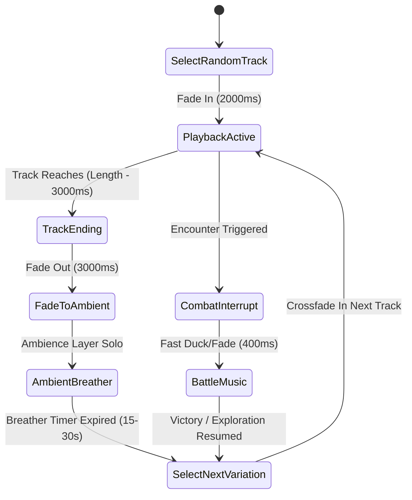

# Starborn — Dynamic Music Looping, Multi-Track Variations & Anti-Fatigue System

## 1. Executive Summary & Design Vision

In open-world narrative RPGs, playing a single audio track on an infinite, unbroken loop causes **ear fatigue** within 3–5 minutes. 

To achieve an organic, living soundtrack that feels **infinite, dynamic, and non-repetitive**, *Starborn* implements a **Multi-Track Suite & Stochastic Cycling Architecture**:
1. **Multi-Track Suites per Biome**: Each world and key hub features 2–3 distinct arrangement variations (Day/Exploration, Night/Atmospheric, Stripped Acoustic/Pad Stem).
2. **Dynamic Rest Intervals ("Breathers")**: Strategic, atmospheric quiet periods between tracks where only world ambients (wind, dripping stalactites, reactor hums) breathe before the next musical variation enters.
3. **Equal-Power Smart Crossfading**: Seamless multi-second transitions that eliminate abrupt cutoffs, jarring restarts, and volume dips.
4. **Contextual Interrupt & Return Memory**: If interrupted by combat or a mini-game, exploration music smoothly fades out and returns either at a new random variation or resumes from its natural rhythm.

---

## 2. Multi-Track Suite Matrix (Per-World & Activity Stems)

Each zone is assigned a **Track Suite** containing primary and secondary variations:

| Zone / Hub | Variation A (Primary Theme) | Variation B (Atmospheric / Stripped) | Variation C (Rhythmic / Deep Stem) | Breather Gap |
| :--- | :--- | :--- | :--- | :--- |
| **World 1: Homestead Crater** | `music_w1_homestead_a` (Full Slide Guitar + Harmonica) | `music_w1_homestead_b` (Solo Nylon Guitar + Tape Hiss) | `music_w1_homestead_c` (Deep Bass + Anvil Clink Groove) | 15s – 30s |
| **World 1: Deep Mine 04** | `music_w1_deep_mine_a` (Subterranean Drone + Drill Echoes) | `music_w1_deep_mine_b` (Eerie High Synth + Metallic Drops) | — | 20s – 40s |
| **World 2: Sector 9 Canopy** | `music_w2_sector9_a` (Pan Flutes + Warm Marimba + Synths) | `music_w2_sector9_b` (Rainforest Kalimba + Mellow Rhodes) | `music_w2_sector9_c` (Bioluminescent Pad Drone) | 15s – 30s |
| **World 3: Corporate Spire** | `music_w3_spire_a` (Cyberpunk Synthwave + Slap Bass) | `music_w3_spire_b` (Late Night Neon Darksynth Downtempo) | `music_w3_spire_c` (Rain Alley Rhodes + Street Flute) | 10s – 25s |
| **World 4: Molten Foundry** | `music_w4_foundry_a` (Industrial Metal Stomp + Horns) | `music_w4_foundry_b` (Pneumatic Machinery Rhythm + Low Moog) | — | 15s – 30s |
| **World 5: Void Ring** | `music_w5_void_a` (Deep Space Ambient Pads + Echo Harp) | `music_w5_void_b` (Celestial Drone + Radio Static Flutter) | — | 20s – 45s |
| **World 6: The Source** | `music_w6_source_a` (Full Sacred Choir + Pipe Organ) | `music_w6_source_b` (Delicate Celesta + Ethereal Strings) | `music_w6_source_c` (Memory Stair Acoustic Reprise) | 15s – 30s |
| **Astra Ship Lounge** | `music_astra_lounge_a` (Coffee & Rhodes + Slide Guitar) | `music_astra_lounge_b` (Late-Night Cassette Tape + Brush Drums)| — | 15s – 30s |
| **Fishing (Tideglass)** | `music_fishing_a` (Water Folk Picking + Kalimba) | `music_fishing_b` (Gentle Lake Wind Drone + Nylon Chords) | — | 10s – 20s |
| **Tinkering / Crafting** | `music_tinkering_a` (Mechanical Downtempo + Clinks) | `music_tinkering_b` (Mellow Study Beats + Tape Delay Plucks)| — | 10s – 20s |

---

## 3. Stochastic Cycling Engine & Anti-Fatigue Rules

### 3.1 Playback State Machine



### 3.2 Rules of the Cycling Engine:
1. **No Immediate Repeat (History Buffer)**: The engine stores the last 2 played track IDs per zone; a track cannot repeat until all other tracks in the suite have played.
2. **Dynamic Rest Periods ("Ear Resting")**: After a 90–120s music track ends, the music player gently fades out to **silence** for a randomized duration (e.g. 15 to 30 seconds), leaving the rich environmental soundscapes (vent hums, rain, wind, forest critters) audible. This makes the next music entry feel magical and intentional rather than monotonous.
3. **Player-Controlled Pace (Activity Sensitivity)**:
   - In high-stress or fast combat zones, breather gaps are reduced to **0s** (seamless looping).
   - In relaxed exploration hubs (Homestead, Astra Lounge, Fishing), breather gaps expand to **20s–45s** for maximum relaxation.

---

## 4. Seamless Looping & Crossfade Technical Standards

### 4.1 Crossfade Gain Equations
To avoid the "dip in loudness" caused by standard linear crossfades, Starborn uses an **Equal-Power Sine/Cosine Crossfade**:

$$\text{Outgoing Gain}(t) = \cos\left(\frac{\pi}{2} \cdot \frac{t}{T_{\text{fade}}}\right)$$
$$\text{Incoming Gain}(t) = \sin\left(\frac{\pi}{2} \cdot \frac{t}{T_{\text{fade}}}\right)$$

### 4.2 Standard Transition Timings:
| Transition Type | Fade-Out Duration ($T_{\text{out}}$) | Fade-In Duration ($T_{\text{in}}$) | Crossfade Overlap |
| :--- | :--- | :--- | :--- |
| **Exploration Suite Cycling** | 3000 ms | 2500 ms | 2000 ms |
| **Zone / Room Transition** | 1200 ms | 1500 ms | 800 ms |
| **Combat Encounter Start** | 400 ms (Rapid Duck) | 300 ms (Punchy Hit) | 200 ms |
| **Victory $\to$ Exploration Return** | 1000 ms | 2000 ms | 500 ms |
| **Mini-Game / Activity Open** | 1000 ms | 1200 ms | 600 ms |

---

## 5. Audio Catalog Schema Extension for Suites

To support Track Suites without breaking single-track bindings, `audio_catalog.json` and `audio_bindings.json` are extended to support **Suite Definitions**:

```json
{
  "suites": {
    "suite_w1_homestead": {
      "tracks": [
        "music_w1_homestead_explore_a",
        "music_w1_homestead_explore_b",
        "music_w1_homestead_explore_c"
      ],
      "shuffle": true,
      "breather_min_seconds": 15,
      "breather_max_seconds": 30,
      "fade_in_ms": 2000,
      "fade_out_ms": 2500
    },
    "suite_w2_sector9": {
      "tracks": [
        "music_w2_sector9_explore_a",
        "music_w2_sector9_explore_b"
      ],
      "shuffle": true,
      "breather_min_seconds": 20,
      "breather_max_seconds": 35,
      "fade_in_ms": 2000,
      "fade_out_ms": 2500
    }
  }
}
```

---

## 6. Generation Duration Standard for ElevenLabs `music_v2`

When composing new tracks with `music_v2`, use target durations based on functional category:

| Category | Recommended Generation Length | Justification |
| :--- | :--- | :--- |
| **Exploration Suite Stems** | **90,000 ms (90 seconds)** | Ideal balance between musical development and memory footprint (~2.1 MB per track). |
| **Boss Battle Themes** | **120,000 ms – 150,000 ms (2 – 2.5 min)** | Enables complete 3-phase progression (Intro $\to$ Phase 2 Intensity $\to$ Climax loop). |
| **Activities & Mini-Games** | **75,000 ms (1.25 min)** | Compact, engaging melodic loop. |
| **Narrative Tapes & Credits** | **150,000 ms – 180,000 ms (2.5 – 3 min)** | Full complete songs with vocal verses, chorus, and outro. |
| **Fanfares & Stingers** | **15,000 ms – 30,000 ms** | Short non-looping punchy resolutions. |
