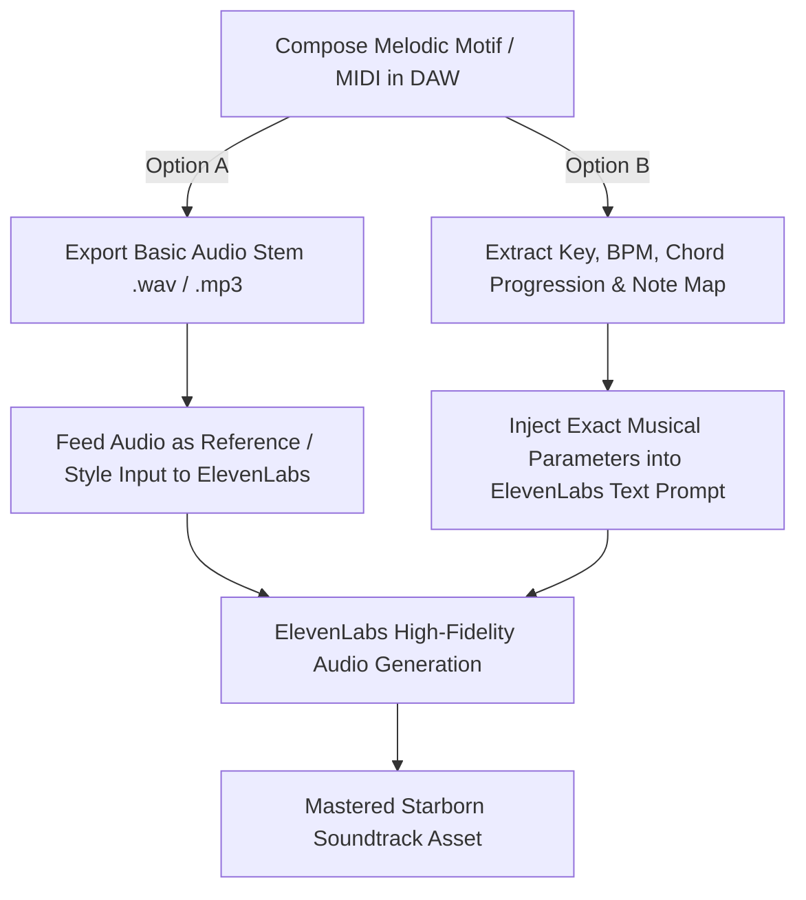

# Starborn ElevenLabs Music Generation Bible & Production Guide

## 1. Using ElevenLabs API & Working with MIDI

### Can You Pass MIDI Files Directly to ElevenLabs?
**How ElevenLabs Music Models Work**:
* The ElevenLabs Music Generation API primarily accepts **rich text prompts** and **audio reference conditioning (Audio-to-Audio / Style Prompts)**. It does not parse raw binary `.mid` files directly as input parameters.
* **However, you CAN seamlessly use your MIDI compositions in two powerful ways:**



#### Workflow Method 1: The "MIDI-to-Audio Reference" Pipeline (Best for Strict Melodic Control)
1. Write your character/location theme in any DAW (FL Studio, Ableton, Logic, Reaper) or MIDI editor using a simple clean instrument (e.g. solo piano or basic acoustic guitar).
2. Export the short 15–30 second melody as a high-quality `.wav` or `.mp3`.
3. Use ElevenLabs Audio-to-Audio / Remix endpoint, passing the audio clip along with the style prompt (e.g. *"Arrange this motif into an 80s analog tape lo-fi synthwave track with warm Fender Rhodes and tape hiss"*).

#### Workflow Method 2: The "Structural Music Prompting" Pipeline (Fastest & Pure API)
ElevenLabs music models are trained on music theory terminology. You can strictly dictate key signatures, tempo (BPM), chord progressions, instruments, and melodic intervals directly in the text prompt:
* Example: `Key: D Minor, Tempo: 92 BPM, Time Signature: 4/4. Progression: Dm - Bb - F - C. Melodic Lead: Ascending 4-note guitar riff (D-F-G-A) with tape chorus and warm analog reverb.`

---

## 2. ElevenLabs Music Prompting Formula

To achieve the signature **Starborn** sound across all generated tracks, every prompt should follow this 6-part anatomy:

```
[PRIMARY GENRE & MOOD] + [KEY SIGNATURE & BPM] + [LEAD INSTRUMENTATION & MOTIF] + [RHYTHM & BASS FOUNDATION] + [ANALOG TAPE & MIXING TEXTURE] + [DYNAMIC NARRATIVE ARC]
```

### Essential Starborn Aesthetic Tags:
* **Analog Vintage Tags**: `80s cassette tape saturation`, `analog tape flutter and warmth`, `lo-fi vinyl crackle`, `vintage Juno-106 synth pads`, `analog console preamp warmth`.
* **Atmospheric Spatial Tags**: `wide cinematic stereo field`, `lush plate reverb`, `retro futuristic soundscape`, `dynamic acoustic resonance`.

---

## 3. Ready-to-Generate Prompt Templates for All Tracks

---

### Category A: Core Themes & Ship Hub

#### Track 01: `music_title_theme` (*Starborn Main Title - The Spark in the Dark*)
* **Prompt**:
  ```
  Genre: Cinematic Sci-Fi Acoustic-Orchestral Synthwave. 
  BPM: 82. Key: D Minor resolving to D Major.
  Instrumentation: Resonant acoustic guitar playing an ascending 4-note hopeful motif, layered over warm Prophet-5 analog synth pads, soaring cello, and gentle electronic heartbeat percussion.
  Texture: 80s tape warmth, subtle vinyl grain, pristine cinematic mix.
  Mood: Expansive, nostalgic, emotional, wondrous exploration of the cosmos.
  ```

#### Track 02: `music_astra_common_room` (*The Astra Lounge - Coffee & Cassettes*)
* **Prompt**:
  ```
  Genre: Lo-Fi Chill Synthwave & Nostalgic Downtempo.
  BPM: 74. Key: G Major.
  Instrumentation: Warm Fender Rhodes electric piano with chorus, mellow acoustic slide guitar, dusty vinyl crackle, cozy tape hiss, deep analog sub-bass, soft brush drums.
  Texture: Vintage cassette tape sound, nostalgic analog saturation, intimate coffee-shop warmth.
  Mood: Safe, familial, peaceful, restful companion conversation.
  ```

#### Track 03: `music_astra_bridge` (*Flight Bridge - Navigating the Frontier*)
* **Prompt**:
  ```
  Genre: Ambient Space Synthwave & Electronic Downtempo.
  BPM: 88. Key: A Minor.
  Instrumentation: Pulsing sequencer synths, clean rhythmic delay electric guitar plucks, ethereal vocal pad swells, subtle retro radar blips.
  Texture: Wide stereo soundstage, crisp futuristic clarity, 80s sci-fi synth textures.
  Mood: Focused, navigational, expansive, charting a course through unknown space.
  ```

#### Track 04: `music_victory_standard` (*Victory Fanfare - Battle Won*)
* **Prompt**:
  ```
  Genre: 16-bit JRPG Victory Fanfare & Uplifting Rock Fusion.
  BPM: 124. Key: D Major.
  Instrumentation: Triumphant brass stabs, soaring electric guitar lead, punchy bass groove, bright synthesizer chimes, crisp rock drum kit.
  Texture: High energy, punchy 80s production, celebratory finish.
  Mood: Victorious, energetic, rewarding, heroic.
  ```

#### Track 05: `music_game_over` (*The Signal Fades - Defeat & Memory*)
* **Prompt**:
  ```
  Genre: Melancholy Ambient Piano & Ambient Tape Drone.
  BPM: 60 (Free Time). Key: D Minor.
  Instrumentation: Distant upright piano with felt muting, slow decaying reverb, low cello drone, fading radio static and cassette tape stop sound.
  Texture: Fragile, decaying tape loop, emotional stillness.
  Mood: Somber, reflective, poetic defeat, quiet determination to try again.
  ```

---

### Category B: World Exploration Suites

#### Track 06: `music_w1_homestead` (*The Pit & Miner's Shanty*)
* **Prompt**:
  ```
  Genre: Industrial Blues & Frontier Acoustic Slag-Rock.
  BPM: 90. Key: E Minor.
  Instrumentation: Resonator slide guitar, dusty blues harmonica, rhythmic clanging hammer and anvil percussion, gritty upright bass, low warm analog synth pad.
  Texture: Dusty cassette grain, industrial rustling, gritty working-class warmth.
  Mood: Weary, resilient, hard labor, blue-collar frontier community.
  ```

#### Track 07: `music_w1_deep_mine` (*Sub-Level 4 - Descent into Slag*)
* **Prompt**:
  ```
  Genre: Dark Industrial Ambient & Deep Sub-Bass Drone.
  BPM: 72. Key: C Minor.
  Instrumentation: Low subterranean bass hum, metallic clinking in deep reverb, rhythmic pneumatic valve releases, eerie high synth glissando, distant drill echoes.
  Texture: Claustrophobic, heavy reverb decay, dark analog grit.
  Mood: Ominous, oppressive, hazardous depths, dangerous mining shafts.
  ```

#### Track 08: `music_w2_crash_site` (*Jungle Canopy - Wreckage in Bloom*)
* **Prompt**:
  ```
  Genre: Organic Dark Folk & Shamanic World Ambient.
  BPM: 76. Key: A Minor (Dorian).
  Instrumentation: Wooden pan flute, bowed acoustic contrabass, atmospheric swamp water drips, organic wooden shaker percussion, lush vintage poly-synth sweeps.
  Texture: Humid atmospheric noise, vibrant acoustic textures, warm analog fidelity.
  Mood: Primal, mysterious, overgrown nature reclaiming advanced technology.
  ```

#### Track 09: `music_w2_ancient_gateway` (*Tideglass Shore & Stone Relics*)
* **Prompt**:
  ```
  Genre: Tribal Ambient & Ethereal Mystery Folk.
  BPM: 80. Key: F# Minor.
  Instrumentation: Resonant kalimba, deep taiko drum heartbeat, wind synth harmonics, singing bowls, eerie high violin tremolo.
  Texture: Ancient, shimmering water reverb, mystical resonance.
  Mood: Reverent, sacred, untamed wilderness, ancient ruins awakening.
  ```

#### Track 10: `music_w3_lower_city` (*Neon Rain & Night Market*)
* **Prompt**:
  ```
  Genre: Cyberpunk Synthwave & Dark Jazz-Noir.
  BPM: 106. Key: C# Minor.
  Instrumentation: Pulsing analog bassline, smoky tenor saxophone solo with slapback delay, 808 trap hi-hats and snares, neon synth leads, rain ambience.
  Texture: Rain-slicked cyber-noir atmosphere, tape delay, crisp punchy drums.
  Mood: Seductive, dangerous, crowded neon alleyways, underground deals.
  ```

#### Track 11: `music_w3_upper_city` (*The Glass Spire - Cloud District*)
* **Prompt**:
  ```
  Genre: Minimalist Cyber-Luxury & Glass Synthwave.
  BPM: 98. Key: Bb Minor.
  Instrumentation: Crystal synthesizer arpeggios, cold sterile string orchestra, deep sub-bass pulses, high glitch percussion, sterile corporate pads.
  Texture: Ultra-clean digital perfection contrasting with warm tape harmonics.
  Mood: Cold, opulent, authoritarian, untouchable corporate power.
  ```

#### Track 12: `music_w4_slag_pits` (*Slag Run & Conveyor Lines*)
* **Prompt**:
  ```
  Genre: Industrial Machine Techno & Chugging Slag Rhythms.
  BPM: 124. Key: D Minor.
  Instrumentation: Pounding hydraulic four-on-the-floor beat, distorted industrial synthesizer bass, clanging steel machinery, grinding metal loops.
  Texture: Blistering heat, heavy distortion, aggressive compression.
  Mood: Relentless, hazardous factory floor, blistering molten steel.
  ```

#### Track 13: `music_w4_power_core` (*The Deep Forge - Molten Heart*)
* **Prompt**:
  ```
  Genre: Dark Industrial Rock & Heavy Synth-Metal.
  BPM: 118. Key: B Minor.
  Instrumentation: Chugging 7-string distorted guitar riffs, screaming analog synth leads, massive acoustic rock drums, rumbling seismic sub-bass.
  Texture: Raw energy, sizzling overdrive, explosive dynamic hits.
  Mood: High-stakes danger, superheated reactor core, overwhelming industrial power.
  ```

#### Track 14: `music_w5_orbital_dock` (*Grand Concourse - Zero-G Window*)
* **Prompt**:
  ```
  Genre: Zero-G Ambient & Ethereal Space Neo-Classical.
  BPM: 64. Key: Eb Major.
  Instrumentation: Solo cello soaring over vast orchestral string pads, glass armonica, celestial synth shimmer, delicate acoustic harp plucks.
  Texture: Infinite space reverb, crystal-clear isolation, breathtaking panoramic stereo width.
  Mood: Awe-inspiring, solitary, vast beauty, looking down upon stars from orbit.
  ```

#### Track 15: `music_w5_security_hub` (*Silent Surveillance - Solar Array*)
* **Prompt**:
  ```
  Genre: Dark Minimalist Sci-Fi Electronica & Glitch Ambient.
  BPM: 84. Key: G# Minor.
  Instrumentation: Ticking clock percussion, pulsing square-wave bass, cold radar sweeps, filtered synth stabs, muted electric piano chords.
  Texture: Sterile, tense, surveillance camera clicks, spatial depth.
  Mood: Paranoid, calculated, stealthy, watching eyes in the dark.
  ```

#### Track 16: `music_w6_memory_stair` (*World-Fracture Landing - Fragments*)
* **Prompt**:
  ```
  Genre: Surreal Avant-Garde Ambient & Microtonal Synth.
  BPM: 56 (Dynamic). Key: Floating / Microtonal.
  Instrumentation: Fragmented music box melodies, reverse tape swells, ethereal choral humming, glass bell chimes, sub-harmonic bass rumbles.
  Texture: Dreamlike, shattered reality, ghostly echoes of earlier world themes fading in and out.
  Mood: Heartbreaking, disorienting, profound revelation, walking through memories.
  ```

#### Track 17: `music_w6_the_center` (*The White Shore - The Source Core*)
* **Prompt**:
  ```
  Genre: Transcendental Sacred Symphony & Choral Climax.
  BPM: 70. Key: D Major / Modal.
  Instrumentation: Full polyphonic choir singing celestial vowels, grand pipe organ, resonant brass section, shimmering harp glissandos, powerful modular synth bass.
  Texture: Overwhelming spiritual depth, cathedral acoustic resonance, divine clarity.
  Mood: Enlightenment, the dawn of a new era, breathtaking cosmic resolution.
  ```

---

### Category C: Combat & Boss Battle Themes

#### Track 18: `music_w1_combat` (*Mining Drill Skirmish*)
* **Prompt**:
  ```
  Genre: Fast Industrial Blues-Rock Battle Theme.
  BPM: 132. Key: E Minor.
  Instrumentation: Driving rock drums, gritty overdrive bass guitar, overdriven blues slide guitar riffs, clanging metal percussion, fast Juno synth arpeggios.
  Texture: Punchy, urgent, dusty action, live-band feel.
  Mood: Scrappy, energetic, fast tactical combat.
  ```

#### Track 19: `music_w1_boss_warden` (*The Iron Warden - Heavy Duty*)
* **Prompt**:
  ```
  Genre: Heavy Industrial Rock Boss Theme.
  BPM: 138. Key: C Minor.
  Instrumentation: Heavy distorted guitar power chords, pounding industrial anvil hits, screeching alarm synths, relentless double-kick drums, brass stabs.
  Texture: Aggressive, mechanical weight, colossal boss presence.
  Mood: Terrifying corporate enforcer, overwhelming physical threat.
  ```

#### Track 20: `music_w2_combat` (*Swamp Ambush*)
* **Prompt**:
  ```
  Genre: Tribal Shamanic Electro-Battle.
  BPM: 128. Key: A Minor.
  Instrumentation: Rapid taiko and djembe percussion, distorted bass synth wobble, frantic wooden flute trills, electric guitar staccato chugging.
  Texture: Dense organic percussion, humid adrenaline, sharp transients.
  Mood: Sudden jungle ambush, primal survival instinct.
  ```

#### Track 21: `music_w2_boss_guardian` (*Ruin Guardian - Ancient Harmonic Strike*)
* **Prompt**:
  ```
  Genre: Epic Orchestral World Boss Theme.
  BPM: 136. Key: D Minor.
  Instrumentation: Massive tribal war drums, soaring choir chants, heavy cello Ostinato, mystical synth arpeggios, explosive brass climaxes.
  Texture: Epic scale, ancient mythical power, massive low-end impact.
  Mood: Facing a thousand-year-old defense construct.
  ```

#### Track 22: `music_w3_combat` (*Spire Security Encounter*)
* **Prompt**:
  ```
  Genre: High-Octane Cyberpunk Darksynth.
  BPM: 135. Key: C# Minor.
  Instrumentation: Screaming saw-wave synth leads, heavy sidechained sub-bass, industrial electronic drum loops, glitching digital breakdowns.
  Texture: Fast, neon-streaked velocity, modern electronic punch.
  Mood: High-speed infiltration, dodging automated laser fire.
  ```

#### Track 23: `music_w3_boss_phantom` (*Phantom Prototype - Phase Blade Duel*)
* **Prompt**:
  ```
  Genre: Darkwave Synth-Metal Boss Theme.
  BPM: 144. Key: F# Minor.
  Instrumentation: Dual dueling electric guitars, blistering synth arpeggiators, aggressive slap bass, high-speed breakbeats, ghostly vocal chops.
  Texture: Razor-sharp precision, phase-shifting audio effects, hyper-kinetic duel.
  Mood: Sibling tragedy, high-speed blade combat against Gh0st's past.
  ```

#### Track 24: `music_w4_combat` (*Foundry Line Battle*)
* **Prompt**:
  ```
  Genre: Industrial Metal & Cyber Metal Groove.
  BPM: 140. Key: D Minor.
  Instrumentation: Down-tuned 8-string metal guitars, pneumatic hammer percussion, relentless double-bass drumming, harsh synth bassline.
  Texture: Crushing weight, industrial distortion, intense drive.
  Mood: Blistering combat in scorching metalworks.
  ```

#### Track 25: `music_w4_boss_titan` (*Titan Walker - Overheat Catastrophe*)
* **Prompt**:
  ```
  Genre: Colossal Industrial Metal Boss Symphony.
  BPM: 148. Key: B Minor.
  Instrumentation: Massive mechanical stomps, screaming guitar solos, blaring industrial horns, rapid synth sequencer, explosive metal drops.
  Texture: Massive colossal scale, molten fire effects, apocalyptic energy.
  Mood: Desperate battle against a multi-story walking forge.
  ```

#### Track 26: `music_w5_combat` (*Zero-G Skirmish*)
* **Prompt**:
  ```
  Genre: High-Tech Space Drum & Bass / Breakbeat Battle.
  BPM: 165. Key: E Minor.
  Instrumentation: Lightning-fast drum & bass breakbeats, floating ambient synth chords, deep Reese bassline, laser stabs, rhythmic vocal cuts.
  Texture: Fast, floating, zero-gravity kinetic velocity, slick modern mix.
  Mood: Precision maneuvering in orbital vacuum.
  ```

#### Track 27: `music_w6_boss_final` (*Ascended Vale - The Source Symphony*)
* **Prompt**:
  ```
  Genre: Full Symphonic Metal & Sacred Choral Masterpiece (Multi-Movement).
  BPM: 152. Key: C Minor transitioning through all character keys to D Major.
  Instrumentation: Full 60-piece orchestra, full operatic choir, soaring lead electric guitar, massive church organ, crushing industrial drums, all party leitmotifs interwoven.
  Texture: Ultimate cinematic climax, towering dynamic range, historic emotional resolution.
  Mood: The fate of the frontier, heartbreaking ideological clash, triumphant liberation.
  ```

---

### Category D: Narrative Endings & The Great Frontier Analog Tapes

#### Track 28: `music_cinematic_prologue` (*The Launch & The Fall*)
* **Prompt**:
  ```
  Genre: Emotional Cinematic Narrative Score.
  BPM: 78. Key: D Minor.
  Instrumentation: Solo acoustic guitar evolving into soaring French horn, rising orchestra, dramatic timpani rolls, abrupt transition to radio distortion.
  Texture: Storybook warmth giving way to chaotic space turbulence.
  Mood: Hopeful departure, sudden catastrophe, desperate survival.
  ```

#### Track 29: `music_cinematic_crash` (*Planetary Impact*)
* **Prompt**:
  ```
  Genre: Ambient Disaster Score & Deep Resonance.
  BPM: 50. Key: Low C Drone.
  Instrumentation: Deep sub-bass impact thump, descending string glissandos, screaming atmospheric entry synths, fading to gentle swamp rain.
  Texture: Ear-ringing ringing resonance, realistic organic textures.
  Mood: Shock, survival, silence after the storm.
  ```

#### Track 30: `music_elaras_song` (*Elara's Complete Song - Great Frontier Tape 08*)
* **Prompt**:
  ```
  Genre: 80s Vintage Lofi Folk-Pop Cassette Track (with Female Vocals).
  BPM: 86. Key: F# Major.
  Instrumentation: Fingerpicked acoustic guitar, delicate music box celesta, warm chorus bass, gentle cassette tape hiss and wow/flutter.
  Vocals: Soft, breathy, beautiful female soprano singing a nostalgic lullaby about starlight and brotherly love.
  Texture: Authentic 1980s analog 4-track cassette recording, tape warble, intimate vocal presence.
  Mood: Heart-melting nostalgia, deep love, bittersweet memory.
  ```

#### Track 31: `music_credits_ending` (*The Great Frontier - End Credits Suite*)
* **Prompt**:
  ```
  Genre: 80s Nostalgic Synth-Pop / Soft Rock Credits Anthem.
  BPM: 104. Key: D Major.
  Instrumentation: Punchy Simmons 80s electronic drum kit, chiming 12-string acoustic guitar, soaring saxophone solo, warm analog poly-synths, emotive bass groove.
  Texture: Authentic 80s movie credits warmth, joyful nostalgic celebration.
  Mood: Triumph, closure, journey's end, looking out towards the stars with friends.
  ```

#### Track 32: `music_epilogue` (*A New Orbit - Post-Game Reflection*)
* **Prompt**:
  ```
  Genre: Peaceful Ambient Guitar & Celestial Tape Loop.
  BPM: 68. Key: G Major.
  Instrumentation: Gentle acoustic guitar picking, Fender Rhodes piano notes echoing into infinite space reverb, warm subtle synth drone.
  Texture: Pristine peace, soft cassette flutter, meditative calm.
  Mood: Calm after the adventure, peaceful future, lasting companionship.
  ```

---

### Category E: Mini-Games, Crafting & Activity Screens

#### Track 33: `music_fishing_ambient` (*Tideglass Angler - Relaxing Fishing*)
* **Prompt**:
  ```
  Genre: Relaxing Acoustic Water Folk & Lofi Chill.
  BPM: 72. Key: C Major.
  Instrumentation: Fingerstyle acoustic nylon guitar, gentle wooden kalimba chimes, warm bass, atmospheric water ripples, soft ambient wind chime pad.
  Texture: Sunny, serene, peaceful lake breeze, seamless loop.
  Mood: Meditative, stress-free, peaceful fishing on the water.
  ```

#### Track 34: `music_arcade_cabinet` (*Hyperion 1986 - Arcade Cabinet Theme*)
* **Prompt**:
  ```
  Genre: 1980s Chiptune & Upbeat FM Synth Arcade Theme.
  BPM: 130. Key: F Major.
  Instrumentation: Bouncy 8-bit square-wave lead melody, punchy FM slap bass, 16-bit arcade snare and hi-hats, playful coin-op arpeggios.
  Texture: Authentic retro coin-op CRT speaker tone, high energy, seamless loop.
  Mood: Nostalgic, exciting, arcade high-score rush, retro fun.
  ```

#### Track 35: `music_tinkering_focus` (*Workstation Flow - Tinkering & Modding*)
* **Prompt**:
  ```
  Genre: Cozy Mechanical Downtempo & Lofi Study Beats.
  BPM: 80. Key: G Major.
  Instrumentation: Mellow electric piano chords, soft metallic clinks used as rhythm, muted bass groove, subtle tape delay guitar harmonics.
  Texture: Intimate workbench ambiance, warm analog pre-amp, seamless loop.
  Mood: Focused, satisfying, inventive, cozy tinkering at the bench.
  ```

#### Track 36: `music_cooking_kitchen` (*Mess Hall Stew - Cooking Mini-Game*)
* **Prompt**:
  ```
  Genre: Playful Acoustic Kitchen Swing & Django Jazz.
  BPM: 110. Key: Bb Major.
  Instrumentation: Upbeat gypsy jazz acoustic guitar, playful pizzicato strings, wooden spoon clacks, bouncy upright bass, bright accordion accents.
  Texture: Cheerful kitchen sizzle, warm acoustic room, seamless loop.
  Mood: Fun, culinary rhythm, appetizing, lighthearted.
  ```

#### Track 37: `music_shop_cozy` (*Wandering Trader - Market & Shops*)
* **Prompt**:
  ```
  Genre: Exotic Frontier Trade Groove & World Lofi.
  BPM: 88. Key: D Minor.
  Instrumentation: Middle-Eastern inspired oud or acoustic lute, gentle hand drums, warm Fender Rhodes chords, intriguing synth flute melody.
  Texture: Dusty marketplace vibe, cozy merchant chatter texture, seamless loop.
  Mood: Curious, welcoming, exotic wares, bargaining for rare gear.
  ```

