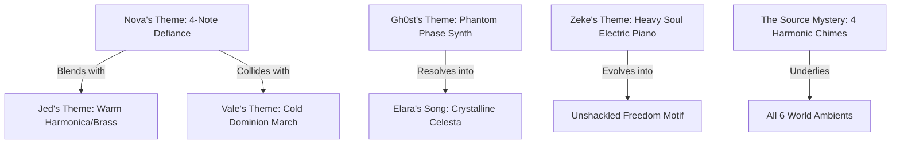

# Starborn Master Soundtrack & Narrative Audio Architecture

## 1. The Sonic Vision of Starborn

Music in **Starborn** is not background filler—it is the emotional spine of the narrative. The soundtrack blends 80s/90s analog tape nostalgia, futuristic synthesized soundscapes, organic world instrumentation, and classical leitmotif storytelling (in the tradition of Nobuo Uematsu, Austin Wintory, and Yasunori Mitsuda).

### Core Aesthetic Pillars:
1. **Analog Warmth & Cassette Grit**: All tracks feature subtle analog tape characteristics—warm harmonic saturation, gentle wow/flutter, and tape head presence—anchoring the game to the *Great Frontier* analog tape lore.
2. **Multi-Genre World Biomes**: Every world in the frontier possesses a distinct musical language and genre fusion reflecting its environment, society, and struggles.
3. **Dynamic Leitmotif Storytelling**: Character themes and regional melodies evolve, collide, and merge to tell the story through music.

---

## 2. Master Leitmotif & Character Theme Registry

A **leitmotif** is a short, memorable melodic phrase (3 to 6 notes) associated with a specific character, concept, or emotional relationship.



### The Core Leitmotifs:

| Theme Name | Associated Character / Force | Melodic DNA & Musical Signature | Emotional Arc Throughout Campaign |
|---|---|---|---|
| **Nova's Theme** (*The Spark*) | **Nova** (Protagonist) | **Key**: D Minor $\to$ D Major<br>**Motif**: Ascending 4-note leap (D4 - F4 - G4 - A4) with syncopated rhythm.<br>**Signature Instrument**: Resonant acoustic guitar & warm Juno-106 lead. | Starts lonely, raw, and hesitant in World 1; gains soaring electric brass in World 4; fully harmonizes with the Source Choir in World 6. |
| **Jed's Theme** (*The Fixer's Gift*) | **Jed** (Mentor / Father Figure) | **Key**: G Major<br>**Motif**: Gentle falling 5-note cadence (G - E - D - C - D).<br>**Signature Instrument**: Dusty harmonica, warm acoustic slide, and mellow French horn. | Heard when Nova is at the workbench or reviewing Jed's notes. Echoes painfully in World 1's climax, returning as a comforting, ghostly memory echo in World 6. |
| **Zeke's Theme** (*Unbroken Iron*) | **Zeke** (The Loyal Brawler) | **Key**: E Minor / Pentatonic<br>**Motif**: Stomping low bass riff followed by a soulful electric piano chord resolution.<br>**Signature Instrument**: Fender Rhodes, overdriven bass guitar, heavy hydraulic anvil percussion. | Starts heavy, strained, and mechanical (carrying the weight of Dominion labor); softens as he bonds with the party; explodes into triumphant blues-rock when he deletes his termination file. |
| **Gh0st's Theme** (*The Phantom Trace*) | **Gh0st** (The Phase Assassin) | **Key**: C# Minor<br>**Motif**: Rapid staccato arpeggio with subtle pitch-bend phase shifts.<br>**Signature Instrument**: Analog delay synthesizer, pizzicato strings, sub-bass glitch pulses. | Elusive, cold, and detached. Shifts between high-speed tension during stealth to vulnerability whenever mentions of his sister Elara arise. |
| **Elara's Song** (*The Pure Voice*) | **Elara** (Gh0st's Sister) | **Key**: F# Major<br>**Motif**: Delicate, lullaby-like 6-note melody.<br>**Signature Instrument**: Glass celesta, music box, and solo pure soprano vocal tone. | The emotional core of World 3 and World 6. Gh0st's synth theme constantly tries to harmonize with this melody. In World 6, the two themes combine seamlessly. |
| **Orion's Theme** (*Memory of Aethel*) | **Orion** (The Ancient Scholar) | **Key**: A Minor (Modal / Dorian)<br>**Motif**: Floating, modal woodwind melody with long sustain and natural reverb.<br>**Signature Instrument**: Wooden flute, harp, bowed strings, and soft choral pads. | Ancient, sacred, and serene. Reflects the burden of remembering an extinct civilization. |
| **Ollie's Theme** (*Scraprunner*) | **Ollie** (The Energetic Scout) | **Key**: C Major<br>**Motif**: Bouncy, upbeat staccato rhythm with playful percussion.<br>**Signature Instrument**: Marimba, toy piano, acoustic ukulele, playful synth plucks. | Lighthearted comic relief that brings warmth and levity to dark campaign moments. |
| **The Dominion Theme** (*Iron Mandate*) | **Chairman Vale / Dominion** | **Key**: C Minor<br>**Motif**: Rigid, mechanized march with descending brass stabs (C - B - Bb - A).<br>**Signature Instrument**: Heavy industrial brass, distorted synth bass, militaristic snare. | Dominant in corporate facilities, executive zones, and boss battles against Dominion authorities. |
| **The Source Mystery** (*Harmonic Quad*) | **The Source / The Architect** | **Key**: Microtonal / Suspended Chords<br>**Motif**: The fundamental 4-chime resonance (Lens, Anvil, Anchor, Key).<br>**Signature Instrument**: Glass armonica, Tibetan singing bowls, ethereal shimmer reverb, modular synth. | Present as a faint ambient hum in early worlds, growing louder and more cohesive as Nova collects each Source Art. |

---

## 3. World-by-World Genre Matrix & Sonic Palette

To ensure every world feels distinct and alive, each biome combines a primary genre foundation with complementary acoustic/synthesized layers.

```
┌──────────────────────────────────────────────────────────────────────────────────────────┐
│                                STARBORN GENRE MATRIX                                      │
├───────────────────────┬──────────────────────────────────────────────────────────────────┤
│ WORLD / BIOME         │ MUSICAL GENRE FUSION & INSTRUMENTATION                           │
├───────────────────────┼──────────────────────────────────────────────────────────────────┤
│ Astra Starship (Hub)  │ Lo-Fi Tape Synthwave, Warm Fender Rhodes, Acoustic Campfire      │
│ World 1: The Mines    │ Industrial Blues, Slag-Hammer Percussion, Acoustic Slide Guitar  │
│ World 2: Sector 9     │ Organic Dark Folk, Shamanic Drums, Ambient Swamp Synths         │
│ World 3: The Spires   │ Cyberpunk Synthwave, Dark Electro-Noir, Melancholy Sax, Glitch   │
│ World 4: The Foundry  │ Industrial Metal, Chugging Guitars, Pounding Hydraulic Drums     │
│ World 5: Orbital Void │ Ethereal Space Ambient, Zero-G Neo-Classical, Floating Choirs    │
│ World 6: The Source   │ Sacred Choral Harmonics, Avant-Garde Ambient, Climax Symphony    │
└───────────────────────┴──────────────────────────────────────────────────────────────────┘
```

---

### World-by-World Sonic Breakdown:

#### 1. The Astra (Home Base & Common Room)
* **Genre**: **Lo-Fi Cassette Nostalgia & Campfire Synthwave** (BPM: 70–85)
* **Instrumentation**: Fender Rhodes piano, muted acoustic guitar, warm Prophet-5 synthesizer pads, gentle vinyl crackle and cassette tape hiss.
* **Mood**: Safe, familial, reflective, and cozy. A place to unwind, tinker at the bench, listen to tapes, and talk with companions.

#### 2. World 1: The Mining Colony & The Pit
* **Genre**: **Industrial Blues & Frontier Slag-Rock** (BPM: 85–105)
* **Instrumentation**: Resonator slide guitar, clanging anvil and hammer percussion, harmonica, overdriven bass, gritty sub-synths.
* **Mood**: Grimy, exhausting, oppressive labor under corporate oversight, balanced with warm working-class camaraderie.

#### 3. World 2: Sector 9 (Overgrown Jungle & Bioluminescent Swamps)
* **Genre**: **Organic Dark Folk & Shamanic Ambient** (BPM: 65–85)
* **Instrumentation**: Wooden flutes, hand percussion (djembe, taiko), atmospheric water drops, bowed acoustic bass, lush analog synth sweeps.
* **Mood**: Primal, humid, mysterious, and alive. Nature reclaiming ancient high-tech ruins.

#### 4. World 3: The Ancient Spires (Lower City Neon & Upper City Luxury)
* **Genre**: **Cyberpunk Synthwave & Dark Jazz-Noir** (BPM: 100–120)
* **Instrumentation**: Analog synthesizer arpeggios, smoky tenor saxophone, 808 sub-bass, glitch percussion, muted electric guitar.
* **Mood**: Sleek, rain-slicked, neon-lit danger. The sharp contrast between rainy street markets and cold executive penthouses.

#### 5. World 4: The Foundry (Slag Pits & Deep-Core Forge)
* **Genre**: **Industrial Metal & Heavy Machine Techno** (BPM: 120–140)
* **Instrumentation**: Chugging distorted 7-string guitars, pounding hydraulic beats, industrial metal percussion, aggressive synthesizer leads.
* **Mood**: Relentless, blistering heat, adrenaline, danger, and molten power.

#### 6. World 5: The Orbital Void Ring (Zero-G Concourse & Solar Array)
* **Genre**: **Ethereal Space Ambient & Minimalist Neo-Classical** (BPM: 60–80)
* **Instrumentation**: Lush string orchestra, solo cello, glass armonica, wide reverb pads, zero-gravity synthesizer drones.
* **Mood**: Vast, lonely, breathtaking, sterile, and awe-inspiring. Looking down at the stars in silent isolation.

#### 7. World 6: The Source & The Singularity
* **Genre**: **Sacred Avant-Garde & Climax Symphonic Choral** (BPM: Dynamic / Free Time)
* **Instrumentation**: Full mixed choir (Latin/vocal vowels), pipe organ, crystalline bell textures, dynamic orchestral strings, modular synth swells.
* **Mood**: Transcendental, surreal, emotionally overwhelming, heartbreaking, and triumphant.

---

## 4. Thematic Mixing & Storytelling Matrix

Music in Starborn dynamically blends character motifs into environmental tracks to tell the narrative subconsciously.

### Narrative Mixing Moments:

| In-Game Narrative Beat | Primary Base Track | Injected Leitmotif | What the Music Communicates |
|---|---|---|---|
| **Nova at Jed's Workbench** (W1) | `music_w1_homestead_explore` (Dusty Blues) | **Jed's Theme** played softly on solo harmonica | Nova feels Jed's lingering presence and guidance through his tools. |
| **Zeke Breaking the Gate** (W2) | `music_w2_swamp_explore` (Dark Folk) | **Zeke's Theme** transitioning from heavy sludge to crisp electric piano | Zeke moving from a burdened laborer to a protective guardian for the crew. |
| **Gh0st Infiltrating the Archive** (W3) | `music_w3_spire_upper` (Dark Electro-Noir) | **Elara's Lullaby** pulsing faintly in the high-frequency synthesizer filter | Gh0st is driven by memories of his lost sister inside the cold corporate server core. |
| **Foundry Boss: Titan Walker** (W4) | `music_w4_boss` (Industrial Metal) | **Nova's Motif** played on screeching lead electric guitar over the industrial rhythm | Nova using the Anvil Source Art to fight back with raw industrial force. |
| **Orion's Memory of Aethel** (W5) | `music_w5_orbital_explore` (Zero-G Ambient) | **Orion's Theme** soaring on solo acoustic cello | Orion honoring the memory of his fallen people across the silence of the void. |
| **The Final Confrontation with Vale** (W6) | `music_w6_boss_vale` (Full Climax Symphony) | **Dominion March** clashing directly against **Nova + Party Harmony Suite** | The ideological clash between rigid Dominion order and the emotional bonds of the Starborn crew. |

---

## 5. Master Track Inventory Checklist

The complete soundtrack requires **32 bespoke musical tracks**:

### Category A: Core Themes & Ship Hub (5 Tracks)
* [ ] `music_title_theme`: *Starborn Main Title (The Spark in the Dark)*
* [ ] `music_astra_common_room`: *The Astra Lounge (Coffee & Cassettes)*
* [ ] `music_astra_bridge`: *Flight Bridge (Navigating the Frontier)*
* [ ] `music_victory_standard`: *Victory Fanfare (Battle Won)*
* [ ] `music_game_over`: *The Signal Fades (Defeat & Reflection)*

### Category B: World Exploration Suites (12 Tracks)
* [ ] `music_w1_homestead`: *The Pit & Miner's Shanty*
* [ ] `music_w1_deep_mine`: *Sub-Level 4 (Descent into Slag)*
* [ ] `music_w2_crash_site`: *Jungle Canopy (Wreckage in Bloom)*
* [ ] `music_w2_ancient_gateway`: *Tideglass Shore & Stone Relics*
* [ ] `music_w3_lower_city`: *Neon Rain & Night Market*
* [ ] `music_w3_upper_city`: *The Glass Spire (Cloud District)*
* [ ] `music_w4_slag_pits`: *Slag Run & Conveyor Lines*
* [ ] `music_w4_power_core`: *The Deep Forge (Molten Heart)*
* [ ] `music_w5_orbital_dock`: *Grand Concourse (Zero-G Window)*
* [ ] `music_w5_security_hub`: *Silent Surveillance (Solar Array)*
* [ ] `music_w6_memory_stair`: *World-Fracture Landing (Fragments)*
* [ ] `music_w6_the_center`: *The White Shore (The Source Core)*

### Category C: Combat & Boss Battles (10 Tracks)
* [ ] `music_w1_combat`: *Mining Drill Skirmish*
* [ ] `music_w1_boss_warden`: *The Iron Warden (Heavy Duty)*
* [ ] `music_w2_combat`: *Swamp Ambush*
* [ ] `music_w2_boss_guardian`: *Ruin Guardian (Ancient Harmonic Strike)*
* [ ] `music_w3_combat`: *Spire Security Encounter*
* [ ] `music_w3_boss_phantom`: *Phantom Prototype (Phase Blade Duel)*
* [ ] `music_w4_combat`: *Foundry Line Battle*
* [ ] `music_w4_boss_titan`: *Titan Walker (Overheat Catastrophe)*
* [ ] `music_w5_combat`: *Zero-G Skirmish*
* [ ] `music_w6_boss_final`: *Ascended Vale & The Source Symphony*

### Category D: Narrative Climaxes & Endings (5 Tracks)
* [ ] `music_cinematic_prologue`: *The Launch & The Fall*
* [ ] `music_cinematic_crash`: *Planetary Impact*
* [ ] `music_elaras_song`: *Elara's Complete Song (Cassette Tape 08)*
* [ ] `music_credits_ending`: *The Great Frontier (End Credits Suite)*
* [ ] `music_epilogue`: *A New Orbit (Post-Game Reflection)*

### Category E: Mini-Games, Crafting & Activity Screens (5 Tracks)
* [ ] `music_fishing_ambient`: *Tideglass Angler (Relaxing Multi-Biome Fishing)*
* [ ] `music_arcade_cabinet`: *Hyperion 1986 (Arcade Cabinet Gameplay & Attract)*
* [ ] `music_tinkering_focus`: *Workstation Flow (Tinkering & Mod Assembly)*
* [ ] `music_cooking_kitchen`: *Mess Hall Stew (Cooking Mini-Game)*
* [ ] `music_shop_cozy`: *Wandering Trader (Night Market & Frontier Shops)*

---

## 6. Looping Engineering Standards

### Seamless vs. One-Shot Classification:
* **Seamless Loops (`loop: true`)**:
  * **Scope**: All Exploration Suites, Combat Battles, Bosses, Ship Hub, Menu, and Mini-Games.
  * **Fade In**: `1000ms – 1500ms`
  * **Fade Out**: `800ms – 1200ms`
  * **Looping Rule**: Tracks must end on a harmonic resolution that connects seamlessly back to measure 1 without click, pop, or volume dip. The last measure should allow reverb tails to ring naturally into the head.
* **One-Shot Tracks (`loop: false`)**:
  * **Scope**: Victory Fanfares, Game Over stings, Cinematics, Epilogue, and Great Frontier Tapes.
  * **Fade Out**: Let natural audio decay finish (`fade_out_ms: 0` or natural release).

---

## 7. Master Audio Catalog Schema Reference

Every track in `audio_catalog.json` must adhere to this structure:

```json
{
  "id": "music_w1_homestead_explore",
  "type": "music",
  "loop": true,
  "fade_in_ms": 1200,
  "fade_out_ms": 1000,
  "gain": 0.85,
  "tags": ["world_1", "explore", "blues", "acoustic"]
}
```

