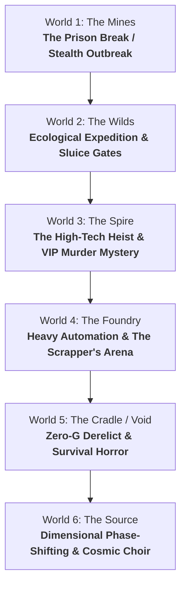

# Starborn: 16-Bit JRPG Puzzle & World Gameplay Quirks Master Playbook

> **The Golden Era Design Principle (*Lufia II*, *Golden Sun*, *Chrono Trigger*, *Super Mario RPG*, *Final Fantasy VI*):**
> Great 16-bit RPGs never relied on just random combat and dialogue. Every world offered a **distinct gameplay identity**, and every dungeon was a **tactile playground** filled with mechanical logic, secret rooms, and satisfying "Aha!" moments.

---

## Part 1: World-by-World Unique Gameplay Quirks & Subgenres

Each of *Starborn*'s six worlds should feel like stepping into a fresh gameplay subgenre with its own signature mechanics.



---

### World 1 (The Mines): The Great Prison Break & Industrial Escape
* **Thematic Subgenre:** *Stealth Outbreak / Industrial Escape Room* (Inspired by *Chrono Trigger*'s Prison Tower & *Final Fantasy VI*'s South Figaro infiltration).
* **The Gameplay Quirk:**
  * **Emergency Lockdown & Sirens:** The mine is an active cage. Entering certain corridors triggers alarm sirens that attract patrolling security drones unless Nova finds bypass switches or slips through side maintenance ducts.
  * **Minecart Track Switching:** Manipulating track levers to send runaway ore carts smashing through reinforced barricades or bridging collapsed railway chasms.
  * **Blackout Traversal:** Navigating pitch-dark shaft rooms by locating emergency breaker switches or hurling luminescent flare-slugs to illuminate floor hazards.
  * **Contraband Smuggling:** Passing key components through laundry chutes or pneumatic scrap tubes to bypass security checkpoints.

---

### World 2 (The Wilds / Sector 9): Ecological Archaeology & Water Sluice Gates
* **Thematic Subgenre:** *Ruins Expedition / Nature Manipulation* (Inspired by *Golden Sun*'s Mercury Lighthouse & *Zelda*'s Water Temple / Swamp Palace).
* **The Gameplay Quirk:**
  * **Water-Level & Sluice Gate Control:** Old drainage sluices across the Jungle Ruins and Sector 9 stream beds. Opening and closing sluice valves raises or lowers water levels, revealing submerged ancient pathways, floating debris bridges, or draining sunken vaults.
  * **Bioluminescent Spore Resonance:** Glowing flora reacts to specific vibrational frequencies. Harvesting different pollen pigments allows Nova to dissolve organic vine barriers or activate ancient plant-machinery.
  * **Relic Pedestal Matching:** Finding archaeological stone seals and placing them on matching celestial pedestals based on wall mural hints.

---

### World 3 (The Spire): The Grand Cyberpunk Heist & Upper City Murder Mystery
* **Thematic Subgenre:** *Ocean's Eleven Infiltration & Noir Whodunit* (Inspired by *EarthBound*, *Final Fantasy VI* Opera/Casino, and classic detective mysteries).
* **The Gameplay Quirks:**
  1. **The Multi-Stage Vault Heist (MQ11–MQ15):**
     * **Laser Grid Evasion:** Optical beams crisscrossing corridors that turn on/off on rhythm or must be redirected using reflective chrome plates.
     * **Party Splitting / Console Coordination:** Zeke sits at a master terminal feeding Nova security override codes, opening security airlocks, and blinding camera sweeps while Nova crawls through vents.
     * **Biometric Forgery:** Replicating supervisor clearance badges from discarded datapads in the corporate offices.
  2. **The Upper City Lounge Murder Mystery (Side Investigation):**
     * A high-ranking Dominion defector/informant is found poisoned in the VIP Skyline Lounge. The sector is placed on lockdown.
     * **The Investigation:** Nova and Zeke interrogate 4 suspects (the nervous bartender, the arrogant executive, the disgraced engineer, and the lounge singer).
     * **Forensic Evidence & Contradiction:** Checking the timestamp log on the lounge terminal reveals one suspect lied about their alibi. Presenting the evidence breaks their story and unlocks the hidden master bypass key!

---

### World 4 (The Foundry): Heavy Automation & The Scrapper's Crucible
* **Thematic Subgenre:** *Industrial Automation & The Gladiator Combat Arena* (Inspired by *Super Mario RPG*'s Booster Tower & *Chrono Trigger*'s Arena).
* **The Gameplay Quirks:**
  1. **The Scrapper's Crucible (Combat Arena Challenge):**
     * An underground, automated gladiatorial ring run by rogue welder units and eccentric pit-bosses.
     * **Wave Gauntlets with Modifiers:** Players take on 3-to-5 wave endurance trials with special battle rules:
       * *Overheat Round:* Fire/Burn damage is doubled; cooling items restore double vitality.
       * *Electromagnetic Surge:* Shield modules are disabled; pure kinetic and evasion tactics only.
       * *Timed Blitz:* Win each wave within 3 turns to earn rare master craft mods.
     * **Arena Hazard Manipulation:** Between waves, flipping arena switches deploys barrier walls or magnetic floor traps against incoming beasts.
  2. **Conveyor Belts & Magnetic Cranes:**
     * Conveyor belts that actively push Nova in specific directions unless reversed at junction boxes.
     * Magnetic crane puzzles: Shifting heavy iron slag containers across molten chasms to form bridges.

---

### World 5 (The Cradle / Void): Derelict Zero-G Ghost Ship & Survival Horror
* **Thematic Subgenre:** *Sci-Fi Survival Horror & Zero-G Physics* (Inspired by *Dead Space*, *Alien*, and *Lufia II*'s sliding mechanics).
* **The Gameplay Quirks:**
  * **Zero-G Inertial Sliding (The Sci-Fi "Ice Puzzle"):** In unpressurized zero-gravity hull breaches, kicking off a bulkhead sends Nova gliding endlessly in a straight vector until colliding with a debris crate, magnetic grapple point, or airlock rim.
  * **Life Support / Power Shunting Dilemma:** The drifting station's auxiliary generator has only 3 power cells. Nova must actively choose which subsystems receive power:
    * *Power to Lights & Scanners:* Reveals hidden hazards and container passcodes, but leaves gravity off.
    * *Power to Grav-Plates:* Restores normal footing, but plunges the deck into terrifying darkness.
    * *Power to Airlock Hydraulics:* Unlocks the forward bulkhead, but drains local oxygen scrubbers.
  * **Quarantine Forensic Audio Logs:** Reconstructing the tragedy of the derelict crew to find the deactivation code for the rogue defense AI.

---

### World 6 (The Source): Dimensional Phase-Shifting & The Harmonic Symphony
* **Thematic Subgenre:** *Cosmic Metaphysics & Time/Dimensional Echoes* (Inspired by *Chrono Trigger*'s Era Hopping & *Zelda: A Link to the Past*'s Light/Dark Worlds).
* **The Gameplay Quirks:**
  * **Reality Phase-Toggling:** Nova can strike harmonic tuning tuning pillars to oscillate the world between two states:
    * *The Shattered Reality:* Platforms are broken, barriers are collapsed, time is frozen.
    * *The Resonant Reality:* Energy bridges materialize, ancient mechanisms hum with light, but cosmic anomalies patrol the corridors.
    * *The Puzzle:* Move an obstacle in the Shattered Reality so its physical counterpart doesn't block the energy beam in the Resonant Reality.
  * **The 4-Hero Harmonic Choir Lock:** The final gates to the Source require Nova, Zeke, Orion, and Gh0st to each harmonize their unique vocal/relic frequencies simultaneously.

---

## Part 2: The Complete 16-Bit Sci-Fi Puzzle Taxonomy

Here are the 10 core puzzle categories and their tactile sci-fi implementations:

```
+-----------------------------------------------------------------------------------+
|                        16-BIT SCI-FI PUZZLE TAXONOMY                              |
+------------------------------------+----------------------------------------------+
| 1. Switches & Power Relays         | 2. Pressure, Weight & Ballast                |
|    • Multi-lever binary code       |    • Heavy battery contact plates            |
|    • Linked toggle switches        |    • Hydraulic balance scales                |
|    • Timed blast shutter run       |    • Loader drone baiting                    |
|    • Synchronized dual valves      |    • Magnetic polarity attraction            |
+------------------------------------+----------------------------------------------+
| 3. Spatial & Conveyance (Sokoban)  | 4. Lasers, Optics & Prisms                   |
|    • Reversible conveyor belts     |    • Mirror rotation & beam routing          |
|    • Magnetic crane block shifting |    • Colored light crystal filters           |
|    • Zero-G inertial sliding       |    • Photovoltaic sensor activation          |
|    • Rotating bridge crossways     |    • Laser grid beam cycle timing            |
+------------------------------------+----------------------------------------------+
| 5. Acoustic & Harmonic Resonance   | 6. Floor Tiles & Cryptographic Logic         |
|    • Steam valve pitch chord       |    • Step-once energized circuit paths       |
|    • Frequency counter-tuning      |    • Pattern memorization (Simon Says)       |
|    • Bioluminescent spore notes    |    • Disappearing floor panels               |
|    • Sonar echo pathfinding        |    • Keypad clues hidden in environment      |
+------------------------------------+----------------------------------------------+
| 7. Environmental Metroidvania Keys | 8. Investigation & Social Deduction          |
|    • Red/Blue/Gold keycards        |    • Contradictory alibi cross-examination   |
|    • Maintenance override fobs     |    • Logbook timestamp auditing              |
|    • One-way security shortcuts    |    • Forensic contraband inspection          |
|    • 3-Subsystem central door lock |    • Undercover disguise clearance           |
+------------------------------------+----------------------------------------------+
| 9. Companion Field Abilities       | 10. Dimensional & Reality Shifting           |
|    • Nova: Plasma cutter / relics  |    • Shattered vs Resonant phase toggles     |
|    • Zeke: Dominion terminal hack  |    • Holographic echo playback               |
|    • Orion: Heavy kinetic force    |    • Past-to-present causality mechanics     |
|    • Gh0st: Phase slip / stealth   |    • Gravity inversion (walking on ceiling)  |
+------------------------------------+----------------------------------------------+
```

---

## Part 3: How Starborn's Engine Executes These Puzzles

Every single puzzle above can be constructed using our existing architecture without writing massive new engines.

### 1. Multi-Switch Relays & Locks (Via `BlockedDirection`)
A door in Room C requires both Switch A in Room 1 and Switch B in Room 2:
```json
"blocked_directions": {
  "north": {
    "type": "lock",
    "requires": [
      { "room_id": "foundry_substation_east", "state_key": "breaker_engaged", "value": true },
      { "room_id": "foundry_substation_west", "state_key": "breaker_engaged", "value": true }
    ],
    "message_locked": "The blast door is dead. Both the East and West auxiliary power breakers must be engaged.",
    "message_unlock": "Power surges through both conduits. The central blast door slides open with a heavy hydraulic thud!"
  }
}
```

### 2. Levers & Switches (Via `ToggleAction`)
Interactive switches toggle boolean states and dynamically update room prose:
```json
{
  "name": "coolant bypass valve",
  "type": "toggle",
  "state_key": "coolant_flushed",
  "label_on": "Close Valve",
  "label_off": "Vent Coolant",
  "action_event_on": "w4_coolant_closed",
  "action_event_off": "w4_coolant_flushed"
}
```

### 3. Dynamic Environment Changes (Via `RoomDescriptionVariant`)
When a puzzle is solved or power restored, the room description updates automatically:
```json
"description_variants": [
  {
    "requires_state": { "breaker_engaged": true },
    "description": "Vibrant emerald conduits pulse across the ceiling. The auxiliary generators hum with steady power."
  }
]
```

### 4. Keycard Economy (Via `BlockedDirection.keyId`)
```json
"blocked_directions": {
  "south": {
    "type": "key",
    "key_id": "chief_engineer_fob",
    "consume": false,
    "message_locked": "Security clearance level 3 required. Present Chief Engineer's Fob.",
    "message_unlock": "The scanner chirps green. The security gate unlocks, creating a permanent shortcut back to the Lift!"
  }
}
```

### 5. Interactive Tuning & Frequency Sliders (Via `tuning_puzzles.json`)
Used for pitch chords, harmonic locks, pressure balances, and frequency sweep puzzles.

---

## Part 4: Implementation Roadmap & Showcase Dungeon Candidates

```
Phase 1: Pilot Showcase Dungeon (World 4 - The Foundry Sub-Level)
├── Implement 3-wing hub-and-spoke layout
├── Wing 1: Coolant valve puzzle (Linked toggles)
├── Wing 2: Chief Engineer Keycard hunt + shortcut unlock
└── Central Door: Powered by both wings -> leads to Titan Dock staging area

Phase 2: The Upper City Heist & Murder Mystery (World 3)
├── Infiltration laser grid timing & Zeke terminal hacking
└── Skyline Lounge murder mystery investigation (interrogate suspects, check logs, unlock vault)

Phase 3: The Scrapper's Crucible Combat Arena (World 4)
├── 3-wave combat gauntlets with environmental rules & wagers
└── Unique combat arena trophy & master gear rewards

Phase 4: Zero-G Survival Hull (World 5) & Water Sluice Temple (World 2)
├── World 2: Water drainage sluices & floating debris paths
└── World 5: Zero-G inertial sliding & power cell allocation dilemma
```
