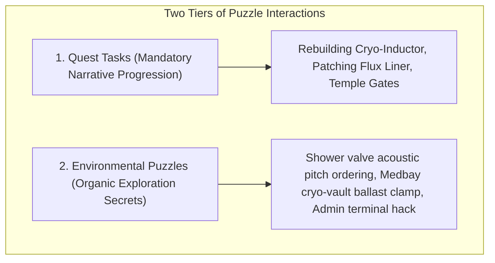
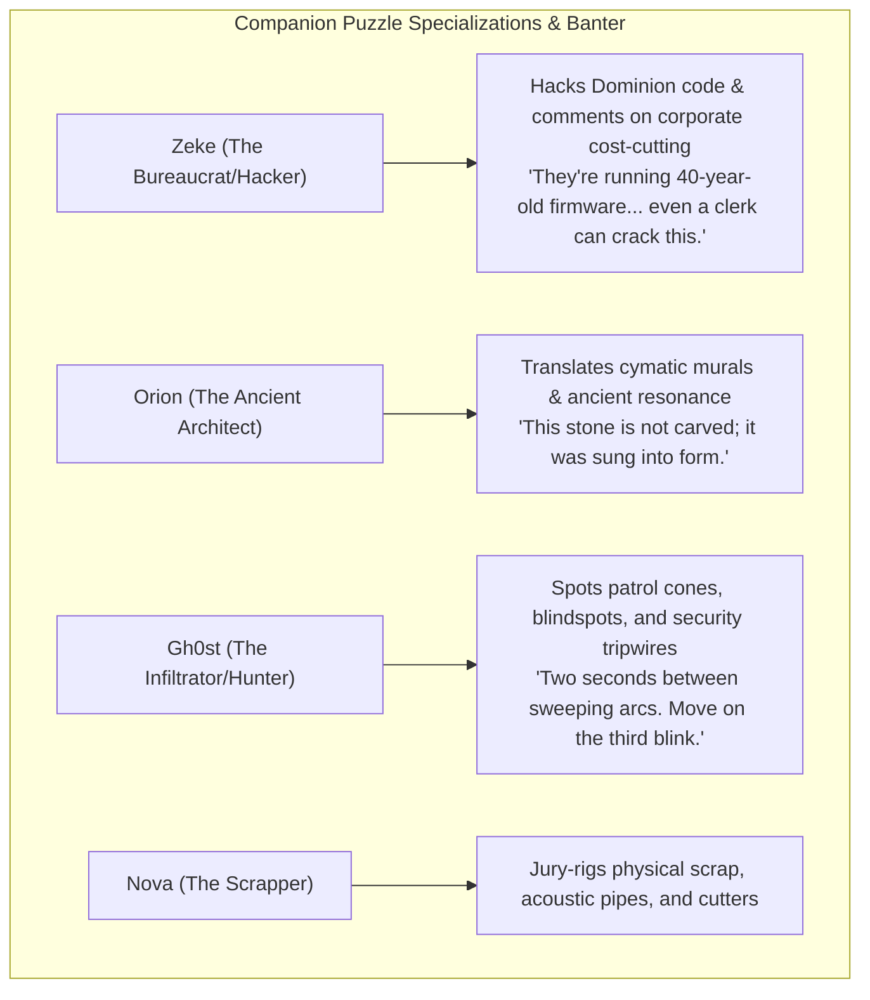
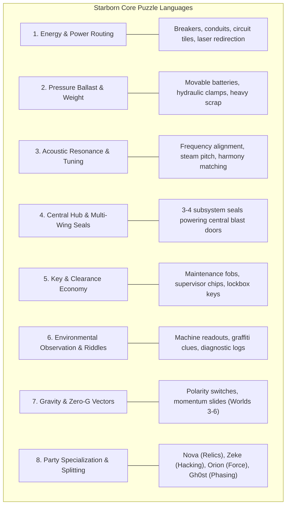

# Starborn: 16-Bit JRPG Puzzle Design Compendium & Progression Matrix

> **Core Philosophy (The *Lufia II* / *Golden Sun* Principle):**
> Don't invent 80 disconnected mechanics. Establish a **tight vocabulary of 6–8 core tactile puzzle systems**, teach the basic rules early, and progressively combine them into deeper, more inventive environmental scenarios across Worlds 1–6.

---

## Part 1: Exploration Philosophy — "A Puzzle Does Not Have to Be a Quest"

In classic 16-bit JRPGs (*EarthBound*, *Lufia II*, *Chrono Trigger*, *Super Mario RPG*), the most rewarding moments are **unlisted environmental secrets** embedded into the world:

* **Quest Puzzles**: Progress the main or side story (e.g. *w1_mq01* repairs or *w1_sq02* vent flush).
* **Environmental Puzzles**: Standalone mechanical objects in the room descriptions that reward observation:
  * *Communal Showers*: Aligning 3 shuddering steam pipes in descending pitch clears the scald mist and lets Nova fish out hidden worker scrip from the drain trap.
  * *Med-Bay Storage*: Placing a heavy battery on a floor contact closes the circuit to pop a sealed pharmaceutical vault.
  * *Admin Kiosk / Supervisor Desk*: Hacking executive terminals reveals Dominion reclamation memos, lore logs, and armory passcodes.
* **The Player Experience**: Players learn that every room is a tangible, interactive playground rather than static text to click past.

---

## Part 2: Narrative, Lore & Dialogue Integration

### 1. Reinforcing Core Starborn Lore
* **"The Source is Sound / Frequency"**:
  * Puzzles like shower valve harmonics (World 1), water sluice pitch alignment (World 2), and grand choir locks (World 6) teach the player that **the universe is built on acoustic resonance**.
  * When Nova counter-tunes the Tuning Fork in Sector 4, the frequency mechanics feel natural because the world has already trained the player's ear.
* **"The Dominion is the Machine of Silence"**:
  * Dominion puzzles use retinal scanners, biometric logging, multi-keycard fobs, and automated security lasers.
  * Solving Dominion puzzles feels like **sabotaging and outsmarting a heartless corporate spreadsheet**.

### 2. Companion Character Dynamics & Reactive Banter

Puzzles provide organic opportunities for party members to showcase their expertise through quick, in-character toasts:

---

## Part 3: The Core "Starborn Puzzle Vocabulary"

These are the recurring puzzle languages native to *Starborn*'s narrative, UI, and tactile room-interaction systems:

---

## Part 4: World-by-World Puzzle Signatures (Worlds 1–6)

| World | Thematic Setting | Primary Puzzle Languages Added | Signature Environmental Scenarios |
|---|---|---|---|
| **World 1: The Mines** *(The Cage)* | Underground Industrial Cage | • Power Breakers & Dual Relays • Pressure Ballast (Batteries) • Acoustic Steam Tuning • Keycards & Lockboxes | • Deep Mine Central Crusher Gate (2-Wing Relay) • Medbay Cryo-Vault Pressure Clamp • Shower Valve Acoustic Harmony |
| **World 2: The Wilds** *(The Ruin)* | Overgrown Alien Canopy & Ruins | • Elemental Interactions (Corrosive, Shock, Flame) • Water Drainage / Sluice Levels (#12) • Constellation / Ancient Pedestals (#62) • Bioluminescent Spore Matching (#17) | • Flooded Greenhouse Sluice Gates • Bioluminescent Spore Pitch Sequences • Relic Pedestal Matching |
| **World 3: The Foundry** *(The Machine)* | Molten Automated Factory | • Magnetic Polarity (#55) • Conveyor Belt Loops (#8) • Timed Heat Hazard Shutters (#37) | • Magnetic Crane Block Shifting • Molten Metal Flow Diversion • Synchronized Dual-Lever Coolant Purge |
| **World 4: The Spire** *(The Surveillance)* | High-Tech Dominion Seat | • Laser & Mirror Crystals (#13) • Security Cameras & Patrol Cones (#58) • Party Splitting (#35) / Zeke Remote Terminal Overrides | • Optical Laser Reflection Grid • Zeke at Master Console directing Nova through security airlocks • Floor Tile Code Sequences (#18) |
| **World 5: The Drift** *(The Void)* | Derelict Zero-G Space Hulk | • Zero-G Momentum Sliding (#7, #54) • Gravity Direction Switches (#53) • Airless Decompression Airlocks | • Flipping Room Gravity to walk on ceilings • Zero-G Inertial Block Pushing • Rotating Corridor Hubs (#52) |
| **World 6: The Source** *(The Symphony)* | Cosmic Harmonic Core | • Harmonic Choir Resonance (#49, #50) • Planetary Orbit & Star Alignments (#28, #29) • Dimensional / Past-Present Phase Switching (#70, #72) | • Grand Celestial Planetarium Alignment • Phasing between Ruined & Prismatic realities • 4-Hero Simultaneous Choir Lock Climax |

---

## Part 5: Complete 80 16-Bit JRPG Puzzle Styles Reference

### 1. Levers, Switches & Relays
1. **Multiple Lever Sequence**: Several levers control one door. Correct combination opens it; wrong combinations can reset the puzzle or trigger enemies.
2. **Linked Levers**: Pulling one lever also changes another. Player must find the net-zero state.
3. **Timed Switch**: Hit a switch and reach the door before it closes.
4. **Simultaneous Switches**: Two switches must be triggered within a few seconds of one another.
5. **Remote Door Control**: Character A stands at a control console while Character B navigates.

### 2. Pressure Plates & Weights
6. **Pressure Plates**: Push blocks/statues/boulders onto floor switches. All plates must be held down simultaneously.
7. **Party Pressure Plates**: Instead of blocks, party members stand on switches.
8. **Weight Puzzle**: Different blocks have different weights. Pressure plates require specific total weights.
9. **Balance Scales**: Place objects on two sides until weights balance to open a door/elevator.
10. **Monster-as-Puzzle**: Bait an enemy or loader onto a pressure plate or get it to destroy an obstacle.

### 3. Spatial, Block & Navigation Manipulation
11. **Block Pushing (Sokoban)**: Push blocks through a room into specific locations. Blocks cannot be pulled.
12. **Sliding Blocks**: Blocks continue moving until hitting a wall/object.
13. **Ice / Low-Friction Floors**: Characters slide in one direction until hitting an obstacle.
14. **Conveyor Belts**: Tiles automatically move the player or objects. Switches reverse or disable belts.
15. **Moving Platforms**: Activate platforms and ride them across gaps.
16. **Rotating Bridges**: Pull a switch to rotate a bridge 90 degrees to align paths.
17. **Raise/Lower Platforms**: Buttons change platform elevation across multi-tiered facilities.
18. **Arrow Tiles**: Stepping on an arrow forces movement in that direction.
19. **Teleport Pad Maze**: Pads transport the player between locations; find the route to the exit.
20. **One-Way Doors**: Doors that only open from one direction.
21. **Locked Shortcut Puzzle**: Long route unlocks a shortcut back to the entrance.

### 4. Energy, Lasers & Beams
22. **Power Routing**: Rotate circuit tiles/breakers until energy connects to the destination.
23. **Light Beam / Mirror Puzzle**: Rotate mirrors or crystals to redirect an energy beam to a receiver.
24. **Colored Crystal Switches**: Red switch opens red doors, blue opens blue doors; activating one color disables another.
25. **Laser Grid**: Lasers turn on/off based on switches or timers.
26. **Magnetic Polarity**: Switch between attraction and repulsion to move metal blocks across pits.

### 5. Acoustic & Harmonic Systems (Starborn Signature)
27. **Sound Puzzle**: Bells/chimes produce different notes; repeat a melody heard elsewhere.
28. **Echo Puzzle**: Emit an acoustic pulse to reveal resonant paths in the dark.
29. **Harmonic Phase Lock**: Counter-tune frequencies across phase, amplitude, and frequency sliders.

### 6. Floor & Tile Logic
30. **Pattern Repetition**: Room demonstrates a sequence (e.g. Red → Blue → Green) to repeat.
31. **Floor Tile Sequence**: Step on tiles in the correct order; incorrect resets the room.
32. **Safe Floor Path**: Only certain tiles are safe; clues elsewhere reveal the route.
33. **Disappearing Floor**: Tiles vanish after stepping on them; reach the other side without trapping yourself.
34. **Visit Every Tile Once**: Walk across every floor tile exactly once.
35. **Dungeon Loop**: Walking through identical hallways until spotting the anomaly.
36. **False Exit**: Taking the obvious exit resets the room; clues reveal the true path.

### 7. Astronomical, Cosmic & Dimensional Systems
37. **Push Statue Into Position**: Statues must face particular directions or occupy locations.
38. **Rotating Statues**: Rotate statues so they face a central object or intersect beams.
39. **Constellation Alignment**: Arrange stars/planets into the correct constellation.
40. **Planetary Orbit Puzzle**: Rotate concentric rings around a central star to align symbols.
41. **Moon Phase Puzzle**: Change moon symbols until phases match mural clues.
42. **Clock Puzzle**: Move clock hands to a particular time to alter dungeon power states.
43. **Rotating Room**: Rotate an entire room, shifting doors and gravity.
44. **Gravity Direction**: Switch gravity so the player walks on walls or ceilings.
45. **Zero-Gravity Push**: Push off a surface and drift until colliding with an object.
46. **Gravity Well Puzzle**: Objects pull the player or projectiles toward them.
47. **Room-State / Parallel Dimension**: Toggle between two versions of the same room (e.g. Pristine vs Decayed).
48. **Past / Present Puzzle**: Move an object in the past so that it exists in the present.
49. **Shadow / Light World**: Switch between light and dark versions with different platforms.
50. **Clone / Echo Recording**: Record a sequence of actions that a hologram repeats.

### 8. Environmental Observation & Investigation
51. **Elemental Switches**: Fire melts ice, shock powers circuitry, corrosive melts seals.
52. **Character Ability Puzzles**: Nova (Relics), Zeke (Hacking), Orion (Heavy Force), Gh0st (Phasing).
53. **Party Split Puzzle**: Divide party into groups operating switches for one another.
54. **Security Camera Puzzle**: Avoid scanning cones or disable cameras in proper order.
55. **Door Network**: Each console opens one door and closes another.
56. **Key Economy**: Several locked doors with limited keys; choose optimal opening order.
57. **Collect Missing Components**: Find three power cells to activate a central machine.
58. **Place Artifacts on Pedestals**: Collect objects and determine which pedestal each belongs on.
59. **Symbol Matching**: Match symbols on doors with symbols scattered across the area.
60. **Riddle + Environment**: Short inscriptions describing which statues/switches to activate.
61. **Environmental Observation**: Spotting the odd-one-out among objects (e.g. unpowered conduit).
62. **Count Objects**: Number of stars/windows provides a keypad combination.
63. **Directional Clue**: Inscription gives directions (e.g. North → East → East → South).
64. **Enemy Direction / Stealth**: Guards look in predictable directions; avoid lines of sight.
65. **Moving Enemy Obstacles**: Patrols follow fixed grid routes; time movement around them.
66. **Boulder Chase**: Run through a room while manipulating the environment ahead of a rolling hazard.
67. **Falling Boulder Switch**: Redirect a rolling object onto a switch or through a wall.
68. **Breakable Wall Clues**: Cracks and textures bypassable with the Mining Cutter.
69. **Hidden Passage**: Illusory walls concealing secret rooms.
70. **Invisible Bridge**: Walkable empty space revealed by dust or light.
71. **Reveal Hidden Path**: Activate a light source that temporarily renders invisible floors visible.
72. **Dark Room Puzzle**: Navigate unlit spaces by memory, flares, or restored breakers.
73. **NPC Positioning**: Direct NPCs so their positions hold open paths.
74. **Water-Level Puzzle**: Flood or drain rooms to create/block paths and float platforms.
75. **Torch / Light Source Sequence**: Light energy nodes in the correct order.
76. **Minecart Track Switching**: Flip track switches before or during cart movement.
77. **Elevator Floor Puzzle**: Elevator reaches different floors based on active power grids.
78. **Central Hub / Multiple Wings**: Complete 3–4 small puzzles in separate wings to unlock the central boss gate.
79. **Movement Recording**: Replaying an echo movement while performing a second action.
80. **Threat Clearance Lock**: Automated security barrier drops only when area threats are eliminated.
