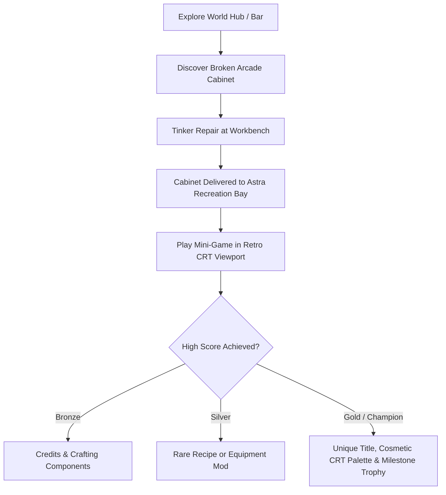

# Starborn Arcade Cabinets: Complete Mini-Game Design Specification

## 1. Executive Summary & Narrative Context

In the retro-futuristic world of **Starborn**, analog entertainment is a cherished relic of the pre-Dominion era. Scattered across the six campaign worlds are forgotten, damaged coin-op arcade cabinets originally manufactured by *Hyperion Amusements*. 

Players can discover these machines in regional hubs, repair them using the **Tinkering Workbench**, and have Ollie transport them back to the **Astra Recreation Bay**. Alongside the *Great Frontier Analog Tape Deck*, the Astra becomes a lively vintage arcade hub where players can compete for high scores, earn exclusive crafting recipes, weapon mods, and collector titles.

---

## 2. System Mechanics & The Astra Arcade Bay Loop



### Core Architecture Principles:
1. **Lightweight & Isolated**: Pure Kotlin state machines with high-performance 60 FPS Compose `Canvas` rendering. No heavy third-party game engines.
2. **Authentic Retro Presentation**: Custom virtual arcade cabinet bezel, CRT curvature/scanline shader overlays, tactile arcade button controls, and chiptune sound cues routed via `AudioCuePlayer`.
3. **Persisted High Scores**: High scores, coin credits, and reward claims persisted safely in `UserSettingsStore` / `SessionStore`.

---

## 3. The 6 World Arcade Cabinets

---

### Cabinet 1: *Deep Mine Asteroid Drill*
* **World**: World 1 (Mining Colony — The Pit)
* **Exact Room Location**: `pit_mess` (Title: *"Mess Hall"*) — sitting in the corner of the miner recreation cafeteria where Tyson and the workers take their breaks.
* **Astra Destination**: `astra_common_room` (Title: *"Astra Common Room"*) — Recreation Bay Arcade Corner.
* **Genre**: 2D Lunar Lander / Asteroid Thrust Miner
* **Theme**: Pilot a retro mining probe through crumbling mine shafts, managing fuel and thruster momentum to drill glittering ore crystals while avoiding falling slag stalactites.

#### Gameplay Rules:
* **Controls**: Left Thruster, Right Thruster, Main Boost, Drill Button.
* **Objective**: Land softly on designated mineral pads and hold the Drill button to extract high-value minerals before fuel expires.
* **Hazards**: Drifting space debris, laser barriers, falling slag boulders, gravity anomalies.
* **Scoring**: Fuel conservation bonus + Clean landing streak multiplier + Ore purity value.

#### Reward Tiers:
* **Bronze (5,000 pts)**: 500 Credits + 3x `scrap_metal` + 2x `wiring_bundle`.
* **Silver (15,000 pts)**: Weapon Mod: `recoil_dampener` (Reduces spread & recoil on rapid-fire weapons).
* **Gold / Champion (30,000 pts)**: Special Mod: `drill_bit_mod` (+15% Stagger damage against armored foes) + Milestone Title: *"Chief Driller"*.

---

### Cabinet 2: *Canopy Hopper*
* **World**: World 2 (Sector 9 Jungle & Swamp)
* **Exact Room Location**: `sector9_pod_interior` (Title: *"Escape Pod Interior"*) — salvaged from the crashed emergency survival pod electronics bay.
* **Astra Destination**: `astra_common_room` (Title: *"Astra Common Room"*) — Recreation Bay Arcade Corner.
* **Genre**: Frogger / River Raid / Timing Lane Jumper
* **Theme**: Guide a tiny bioluminescent bog hopper across treacherous swamp rivers, navigating rotating spore pads, dodging electric eels, and leaping past predatory vine traps.

#### Gameplay Rules:
* **Controls**: 4-Way D-Pad / Swipe lanes.
* **Objective**: Cross 5 distinct swamp flow layers to reach the ancient canopy nest before the poison fog closes in.
* **Hazards**: Submerging lilypads, speeding hover-skimmers, snapping razor-vines, electric shockwaves.
* **Power-Ups**: Glow Fireflies (Speed Boost & temporary shield), Golden Spore (+1,000 Bonus).

#### Reward Tiers:
* **Bronze (4,000 pts)**: 500 Credits + 3x `herb` + 2x `beast_meat`.
* **Silver (12,000 pts)**: Cooking Recipe: *Tideglass Delight* (Party-wide +15% Health regeneration for 3 battles).
* **Gold / Champion (25,000 pts)**: Special Tackle: `bioluminescent_lure` (Guarantees rare nocturnal fish spawns) + Milestone Title: *"Swamp Stalker"*.

---

### Cabinet 3: *Spire Gridrunner*
* **World**: World 3 (Ancient Spires & Upper City)
* **Exact Room Location**: `spire_exec_lounge_bar` (Title: *"Exec Lounge"*) — glowing behind the velvet curtain in the VIP lounge corner.
* **Astra Destination**: `astra_common_room` (Title: *"Astra Common Room"*) — Recreation Bay Arcade Corner.
* **Genre**: Cyberpunk Snake / Lightcycle ICE Matrix
* **Theme**: Infiltrate the Spire's central mainframe. Guide an overclocked data packet through high-density server grids, eating encryption nodes while avoiding security firewalls and your own expanding data tail.

#### Gameplay Rules:
* **Controls**: 4-Way Directional Touch / Swipe.
* **Objective**: Collect unencrypted data cores to grow multiplier length. Speed increases incrementally with every 5 nodes collected.
* **Special Mechanics**: Turbo Boost button allows temporary dashing through firewall corners with precise frame timing.
* **Hazards**: Moving ICE security sweeps, glitching corrupted tiles, perimeter laser borders.

#### Reward Tiers:
* **Bronze (6,000 pts)**: 750 Credits + 2x `circuit_board` + 2x `nano_filament`.
* **Silver (18,000 pts)**: Ammo Accessory: `phase_rounds` (Ignores 25% of robotic enemy armor).
* **Gold / Champion (35,000 pts)**: Headgear Accessory: `cyber_visor` (+10% Critical Hit Chance for Gh0st) + Milestone Title: *"ICE Breaker"*.

---

### Cabinet 4: *Slag Catcher*
* **World**: World 4 (The Foundry)
* **Exact Room Location**: `foundry_conditioning_observation` (Title: *"Observation Booth"*) — abandoned in the supervisory observation booth above the cooling vats.
* **Astra Destination**: `astra_common_room` (Title: *"Astra Common Room"*) — Recreation Bay Arcade Corner.
* **Genre**: Kaboom! / High-Speed Paddle Bucket Catcher
* **Theme**: Operate an emergency molten slag containment dolly beneath the malfunctioning Foundry crucible. Catch cooling white-hot metal ingots while deflecting volatile plasma bombs into cooling chutes.

#### Gameplay Rules:
* **Controls**: Analog Horizontal Slider / Rotary Touch Wheel.
* **Objective**: Catch consecutive descending metal ingots with matching container buckets (Iron, Titanium, Plasma).
* **Multiplier**: Consecutive catches build the "Overheat Multiplier" (up to 8x). Dropping an ingot resets the multiplier and heats the floor.
* **Hazards**: Volatile explosive canisters (must be deflected with side bumper shields, not caught in buckets).

#### Reward Tiers:
* **Bronze (7,500 pts)**: 750 Credits + 2x `hydraulic_fluid` + 2x `heavy_gear`.
* **Silver (20,000 pts)**: Weapon Mod: `thermal_clip` (Adds Burn effect to standard attacks).
* **Gold / Champion (40,000 pts)**: Armor Mod: `foundry_aegis_mod` (+20 Fire Resistance & immune to Overheat status) + Milestone Title: *"Master Smelter"*.

---

### Cabinet 5: *Orbital Defense 2000*
* **World**: World 5 (Orbital Void Ring)
* **Exact Room Location**: `orbital_customs_lounge` (Title: *"Customs Lounge"*) — positioned by the starview bay window in the passenger concourse.
* **Astra Destination**: `astra_common_room` (Title: *"Astra Common Room"*) — Recreation Bay Arcade Corner.
* **Genre**: Fixed Top-Down Wave Shmup (Space Invaders / Galaga)
* **Theme**: Pilot the legendary starfighter *Astra Mark I* to defend the orbital station against swarms of rogue drone fleets and massive dreadnought flagships.

#### Gameplay Rules:
* **Controls**: Left / Right Movement + Rapid Fire + Smart Bomb.
* **Objective**: Clear waves of incoming enemy formations with varying attack vectors and swooping diving patterns.
* **Power-Ups**: Dual Spread Laser, Plasma Shield Drone, Overclock Rapid Fire, EMP Shockwave.
* **Boss Fights**: Every 5th wave spawns a multi-segment Dreadnought Cruiser with breakable shield generators.

#### Reward Tiers:
* **Bronze (10,000 pts)**: 1,000 Credits + 2x `power_cell` + 2x `source_resin`.
* **Silver (30,000 pts)**: Weapon Mod: `void_clip` (Converts weapon damage to Void Element).
* **Gold / Champion (60,000 pts)**: Crafting Blueprint: `singularity_beam_blueprint` (Unlocks Tier-4 Ultimate Weapon) + Milestone Title: *"Ace of the Void"*.

---

### Cabinet 6: *Harmonic Resonance*
* **World**: World 6 (The Source)
* **Exact Room Location**: `source_memory_fragments` (Title: *"World-Fracture Landing"*) — a surreal, floating pre-war memory manifestation crystallized on the landing platform.
* **Astra Destination**: `astra_common_room` (Title: *"Astra Common Room"*) — Recreation Bay Arcade Corner.
* **Genre**: Multi-Tone Simon / Harmonic Rhythm Memory
* **Theme**: Reconstruct the forgotten melodies of the Source. Watch and listen to harmonic resonance pillars light up in sequence, then reproduce the chords with increasing speed and polyphonic complexity.

#### Gameplay Rules:
* **Controls**: 4 Harmonic Source Runes (Lens, Anvil, Anchor, Key).
* **Objective**: Memorize ascending pattern sequences. Later rounds introduce simultaneous chord presses and tempo shifts.
* **Audio Feedback**: Each rune corresponds to an authentic synth chord mapped to the *Starborn* musical scale.

#### Reward Tiers:
* **Bronze (10 Sequences)**: 1,000 Credits + 3x `source_resin`.
* **Silver (20 Sequences)**: Accessory: `focus_conduit` (+15 Max MP / Tech Points).
* **Gold / Champion (35 Sequences)**: Vanity Accessory: `starborn_ribbon` (+10% all stats across party) + Milestone Title: *"Architect of Sound"*.

---

## 4. Technical Architecture & File Structure

```
app/src/main/java/com/example/starborn/feature/arcade/
├── model/
│   ├── ArcadeGameType.kt              # Enum of all 6 cabinets + metadata
│   ├── ArcadeGameState.kt             # Generic score, lives, game-over, highscore state
│   ├── AsteroidDrillModels.kt         # Ship physics, fuel, ore vectors
│   ├── GridrunnerModels.kt            # Grid positions, snake tail, firewalls
│   └── ShmupModels.kt                 # Player ship, enemy waves, bullets, powerups
├── viewmodel/
│   ├── ArcadeViewModel.kt             # Game loop coordinator, high score persistence, reward granter
│   └── ArcadeViewModelFactory.kt
└── ui/
    ├── ArcadeScreen.kt                # Main screen container with cabinet selection
    ├── components/
    │   ├── ArcadeCabinetBezel.kt      # CRT curved frame, scanlines, marquee glow
    │   ├── ArcadeVirtualControls.kt   # Tactile joystick, d-pad, turbo buttons with haptics
    │   └── ArcadeLeaderboardOverlay.kt# High score tables & claimable reward banners
    └── games/
        ├── AsteroidDrillCanvas.kt     # Deep Mine Asteroid Drill 60fps renderer
        ├── CanopyHopperCanvas.kt      # Canopy Hopper 60fps renderer
        ├── GridrunnerCanvas.kt        # Spire Gridrunner 60fps renderer
        ├── SlagCatcherCanvas.kt       # Slag Catcher 60fps renderer
        ├── OrbitalDefenseCanvas.kt    # Orbital Defense 2000 60fps renderer
        └── HarmonicResonanceCanvas.kt # Harmonic Resonance 60fps renderer
```

---

## 5. UI / CRT Visual Styling

```
┌─────────────────────────────────────────────────────────────┐
│                    HYPERION AMUSEMENTS                      │
│   [ COIN-OP RECREATION BAY // CABINET 03: SPIRE GRIDRUNNER ]│
├─────────────────────────────────────────────────────────────┤
│  SCORE: 028,450         HIGH: 035,000         CREDITS: 04   │
│ ┌─────────────────────────────────────────────────────────┐ │
│ │  ▓▓▓▓▓▓▓▓▓▓▓▓▓▓▓▓▓▓▓▓▓▓▓▓▓▓▓▓▓▓▓▓▓▓▓▓▓▓▓▓▓▓▓▓▓▓▓▓▓▓▓▓▓ │ │
│ │  ▓                [ CRT SCANLINES ]                  ▓ │ │
│ │  ▓       ■──■──■──■──► [NODE]                        ▓ │ │
│ │  ▓       │                                           ▓ │ │
│ │  ▓       ■ [FIREWALL]                                ▓ │ │
│ │  ▓                                                   ▓ │ │
│ │  ▓▓▓▓▓▓▓▓▓▓▓▓▓▓▓▓▓▓▓▓▓▓▓▓▓▓▓▓▓▓▓▓▓▓▓▓▓▓▓▓▓▓▓▓▓▓▓▓▓▓▓▓▓ │ │
│ └─────────────────────────────────────────────────────────┘ │
│                                                             │
│         [ D-PAD ]                           ( TURBO ) ( B ) │
│            ▲                                     [O]   [O]  │
│         ◄  ●  ►                                             │
│            ▼                                 [ INSERT COIN ]│
└─────────────────────────────────────────────────────────────┘
```

---

## 6. Milestones & Achievements Integration

The following milestones will be registered in `milestones.json`:
* `ms_arcade_cabinet_01_repaired`: *"Deep Mine Restored"* (Repaired Cabinet 1).
* `ms_arcade_all_repaired`: *"Arcade Restoration Complete"* (Repaired all 6 cabinets).
* `ms_arcade_champion_all`: *"Hyperion Grand Master"* (Attained Gold Champion score on all 6 arcade machines).
