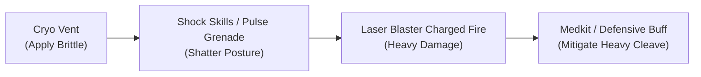

# World 1 Developer & Playtester Field Guide
**The Homestead, Logistics Concourse & Deep Mine (The Pit)**  
*Target Release:* `v1.3.73+ (versionCode 157+)`  
*Scope:* 100% Completionist Audit (Quests, Exploration, Lore, Audio/Visuals, Economy & Combat)

---

## 1. Executive Playtest Overview

This field guide is a **dual-purpose tool**: an optimal chronological completionist walkthrough and an adversarial QA checklist. It is designed to be kept open on a secondary display while you play on your physical device.

### Master Progression & Economy Benchmark Curve
Track your numbers at each phase transition. If your game state deviates significantly, note it in the Friction Log.

| Phase | Milestone Boundary | Target Level | Expected XP | Expected Credits | Key Gear & Consumables |
| :--- | :--- | :---: | :---: | :---: | :--- |
| **Start** | Nova wakes in bunk | **1** | 0 | 0 | Starter Cutter, Flux Liner, 0 Snacks |
| **Phase 1** | Post-Surge Test in Jed's Shop | **1–2** | ~170 | 20–40 | Functional Cryo-Inductor, Corrosive Rounds Mod, 2x Pulse Grenade, 2x Medkit I, 2x Ration |
| **Phase 2** | Deep Elevator Unlocked by Boggs | **2** | ~380 | 60–100 | Mine Access Badge, Heavy Gear, Circuit Board, 4x Medkit I |
| **Phase 3** | Before solving Tuning Fork Puzzle | **2–3** | ~500 | 120–180 | Recoil Dampener, Tuning Fork, 4–5x Medkit I, 1x Medkit |
| **Phase 4** | Escape Pod Launch (World 2 Entry) | **3** | ~750+ | 150–220 | Ghost Signal Cell ("Chime"), 1–2 Medkits remaining |

### Critical Points of No Return
> [!WARNING] **Point of No Return #1 (Deep Elevator Descent):**  
> Taking the lift from `admin_elevator` to `mine_landing` begins the deep descent. Ensure all Homestead and Concourse side quests (`w1_sq01`, `w1_sq02`, `w1_sq03`, `w1_sq04`) are turned in before going down!

> [!CAUTION] **Point of No Return #2 (The Tuning Fork Puzzle in The Heart):**  
> Interacting with the Tuning Fork in `echo_heart` triggers **Red Alert Lockdown**. All paths back to the colony and upper mines are sealed permanently. Complete `w1_sq05` (The Lost Shift) **before** touching the relic!

---

## 2. Phase 1: The Pit & The Homestead (Hub 1)

### Phase 1 Objective Summary
- Wake up, diagnose the suppressed conduit fault, and meet Jed (`w1_mq01`).
- Explore The Pit's starting rooms and discover the broken arcade cabinet.
- Head to Trade Row, meet Scrapper, and recover the rebel munitions cache (`w1_sq01`).
- Head to Med Bay, assist Doc, clear the ventilation toxins, and acquire the Corrosive Rounds mod (`w1_sq02`).
- Enter Jed's Workshop, defeat the Faulted Loader, craft the Functional Cryo-Inductor, patch the Flux Liner, and run the grounded surge test (`w1_mq01` climax).

---

### Phase 1 Verification Matrix

| Room & ID | Actions & Interactions | Expected Engine State & Rewards | Visual, Audio & UX Checks |
| :--- | :--- | :--- | :--- |
| **Nova's Bunk**<br>`pit_nova_bunk` | 1. Tap `bunk light`<br>2. Inspect `door control panel`<br>3. Inspect `bunk` (Rest) | Light toggles on.<br>Conduit fault flagged.<br>Quest `w1_mq01` starts. | • Lamp toggle sound & ambient lighting change.<br>• Confirm text does not clip bottom system bar.<br>• Rest prompt clears cleanly. |
| **Pod Row**<br>`pit_L2_corridor` | Inspect `sleeping pods` & `posters`. | Ambient lore displayed. | • Pod background perspective alignment. |
| **Supply Closet**<br>`pit_storage` | 1. Flip `emergency breaker`<br>2. Loot `loose floor panel` | Breaker toggles.<br>Secret stash looted:<br>`ms_w1_pit_storage_looted`. | • Verify toggle state persists if you re-enter. |
| **Lift Shaft**<br>`pit_shaft` | Inspect `ladder` and `pipe`. | Ambient lore. | • Steam particle overlay performance. |
| **Jed's Bunk**<br>`pit_jed_bunk` | 1. Talk to **Jed**<br>2. Loot `tool case` | Receives **Starter Kit** (Rations + Medkit I).<br>Looted: `ms_w1_jed_bunk_tools_looted`. | • Jed portrait clarity and color balance.<br>• Verify inventory counters increment immediately. |
| **Pit Landing**<br>`pit_L1_landing` | Inspect `bulkhead`. | Standard Dominion lockout message. | • Bulkhead locked message is informative. |
| **Mess Hall**<br>`pit_mess` | 1. Inspect `broken Hyperion cabinet`<br>2. Inspect `tables` | **Arcade Discovery**: Registers Deep Mine cabinet for Astra! | • Cabinet sprite and discovery banner styling.<br>• Rest prompt functioning. |
| **Ration Sink**<br>`pit_kitchen` | Inspect `thermal cooker` & `ingredient hopper`. | Ambient culinary lore. | • Text formatting and readability. |
| **Vent Crawl**<br>`pit_vents` | Inspect `maintenance crawl` and `grates`. | Secret cache looted:<br>`ms_w1_pit_vents_looted`. | • Audio cue for hidden discovery. |
| **Shared Showers**<br>`pit_showers` | Inspect `steam valves` & `drainage grate`. | Ambient plumbing lore. | • Steam ambiance loop check. |
| **Hub Map**<br>`hub_1_homestead` | Tap **Trade Row** site. | Hub transition triggers. | • Verify **Jed's Workshop** node label is flipped upward and NOT hidden behind bottom detail card! |
| **Trade Row Gate**<br>`trade_entrance` | Inspect `signs` & `archway`. | Market audio bed begins. | • Crowd murmur audio volume. |
| **Recyc Bar**<br>`trade_bar` | 1. Talk to **Miner Bill**<br>2. Inspect `jukebox` | Local gossip.<br>Country synth tune plays. | • Jukebox audio cue plays without distortion. |
| **Card Den**<br>`trade_den` | Inspect `dice table` & `card games`. | Ambient gambling color. | • Room background art quality. |
| **Pump Passage**<br>`trade_maint` | Inspect `tuning valve` on intake. | High-pressure acoustic lore. | • Mechanical thumping sfx loop. |
| **Market Strip**<br>`trade_strip` | Inspect `stalls` and `power cells`. | Market corridor color. | • Ambient market chatter. |
| **Scrapper's Stall**<br>`trade_scrapper` | 1. Talk to **Scrapper**<br>2. Open `Contraband` shop | Initiates **`w1_sq01`** (Scavenger's Stash).<br>Opens shop interface. | • Scrapper portrait rendering.<br>• Shop buy/sell prices follow 1.4x markup / 0.5x markdown. |
| **Cold Locker**<br>`trade_locker` | Inspect `security locker`. | Acoustic latch locked:<br>`ms_w1_trade_locker_unlocked`. | • Lock message clarity. |
| **The Hidden Stash**<br>`trade_stash` | Inspect `rebel cache` under netting. | Disarms security field.<br>Pries old rebel cache open. | • `w1_sq01` quest stage updates to "Return to Scrapper". |
| **Turn In: Scrapper**<br>`trade_scrapper` | Deliver cache proof to Scrapper. | Completes **`w1_sq01`**.<br>**Rewards:** **80 XP**, **Pulse Grenade x2**. | • XP bar animation and toast notifications. |
| **Hub Map**<br>`hub_1_homestead` | Tap **Med Bay** site. | Hub transition triggers. | • Med Bay node label alignment. |
| **Triage Hall**<br>`medbay_hall` | Inspect `bio-scanner`. | Fumes noted in hall. | • Flickering light effect smooth 60fps. |
| **Doc's Exam Room**<br>`medbay_exam1` | Talk to **Doc**. | Initiates **`w1_sq02`** (System Flush). | • Doc portrait expression and tone. |
| **Med Supply Closet**<br>`medbay_storage` | 1. Flip `emergency terminal`<br>2. Loot `cryogenic locker` | Terminal toggles.<br>Loot: **Medkit I** (`ms_w1_medbay_storage_looted`). | • Confirm Medkit added to inventory. |
| **Ventilation Hub**<br>`medbay_vents` | 1. ⚠️ **Combat: 2x Siren Skimmer**<br>2. Inspect `vent`<br>3. Reroute `fans`<br>4. Clear `toxic blockage` | Combat victory.<br>Vents reversed.<br>Toxins cleared. | • Skimmer attack animations.<br>• Arc Tether stun VFX.<br>• `w1_sq02` quest stage updates. |
| **Exhaust Mouth**<br>`medbay_exhaust` | Inspect `vent pipe` & `grate`. | View of canyon and rigs. | • Exterior wind ambient sfx. |
| **The Morgue**<br>`medbay_morgue` | Inspect `bio-containment canister`. | Dominion recycling lore. | • Chilling clinical tone. |
| **Turn In: Doc**<br>`medbay_exam1` | Deliver air quality report to Doc. | Completes **`w1_sq02`**.<br>**Rewards:** **90 XP**, **Mod: Corrosive Rounds**. | • Mod appears in equipment/mod inventory. |
| **Hub Map**<br>`hub_1_homestead` | Tap **Jed's Workshop** site. | Transition to workshop yard. | • Re-verify Jed's Workshop label flip behavior. |
| **Scrap Yard**<br>`workshop_yard` | 1. Inspect `loader diagnostic strip`<br>2. ⚠️ **Combat: Faulted Loader** | Identifies Shock relay.<br>Victory over Faulted Loader. | • Shock-weakness indicator in combat UI.<br>• First combat victory fanfare and rewards. |
| **Jed's Office**<br>`workshop_office` | Inspect `diagnostic bench drawer`. | Jed's design notes. | • Text clarity. |
| **Parts Loft**<br>`workshop_loft` | Loot `mod bench`. | Secret parts looted:<br>`ms_w1_workshop_loft_looted`. | • Item pop-up alert. |
| **Tool Shed**<br>`workshop_shed` | Loot `toolbox` on low shelf. | Tools looted:<br>`ms_w1_workshop_shed_looted`. | • Low-shelf loot prompt. |
| **Flooded Basement**<br>`workshop_basement` | 1. Flip `workbench power switch`<br>2. Loot `components chest` | Power turns on.<br>Chest looted:<br>`ms_w1_workshop_basement_looted`. | • Blue water reflection lighting. |
| **Loading Dock**<br>`workshop_dock` | Inspect `loader`, `cargo rail`, and `scrap`. | Setup for future logistics. | • Industrial soundscape. |
| **Back Alley**<br>`workshop_back` | Loot `salvage dolly`. | Scrap looted:<br>`ms_w1_workshop_back_looted`. | • Alley background depth. |
| **Jed's Shutter**<br>`workshop_floor` | 1. Open Tinkering: craft `repair_cryo_inductor`<br>2. Patch `Flux Liner`<br>3. Confirm `mining cutter` bypass<br>4. Trigger `live cutter test` | **Functional Cryo-Inductor** crafted (unlocks **Cryo Vent**).<br>Suit grounded.<br>Surge cinematic plays!<br>Completes **`w1_mq01`** (**50 XP**).<br>Starts **`w1_mq02`**. | • Tinkering craft UI responsiveness.<br>• Cryo Vent skill card unlocked in menu.<br>• Surge screen flash and audio breaker pop.<br>• Jed dialogue transition after power trip. |

---

### ⚡ Phase 1 Adversarial & Edge-Case Tests
- [ ] **Premature Bulkhead Exit:** In `pit_L1_landing`, tap `bulkhead` before speaking to Jed. Verify it refuses entry gracefully without an error.
- [ ] **Crafting Order Inversion:** In `workshop_floor`, try to run the `live cutter test` before crafting the inductor or patching the liner. Verify the game prevents bypass without components.
- [ ] **Dialogue Re-query:** Talk to Doc in `medbay_exam1` while the toxic blockage is active. Verify his reminder dialogue accurately tells you to clear the vents.
- [ ] **Combat Retreat:** In `medbay_vents` (vs Siren Skimmers), tap Retreat. Verify you return to `medbay_hall` safely and can re-engage with preserved HP.

### 💾 Phase 1 Save/Resume Checkpoint
- [ ] In `workshop_floor`, perform a **Save Game** to Slot 1 and tap **Quick Save**.
- [ ] Force close the app, relaunch, and tap **Load Game**. Verify:
  - Nova spawns in `workshop_floor` with the Cryo-Inductor crafted.
  - Completed quests (`w1_mq01`, `w1_sq01`, `w1_sq02`) remain in the Completed log.

---

## 3. Phase 2: Checkpoint & Logistics Concourse (Hub 2)

### Phase 2 Objective Summary
- Travel through the Transit Checkpoint, experience mandatory retirement flagging, and obtain Zeke's forged pass (`w1_mq02`).
- Report to Foreman Boggs in the Concourse Lobby and accept the Deep Mine assignment (`w1_mq03`).
- Complete Boggs' mandatory Guard Break certification drill in the Security Post (`w1_sq03`).
- Infiltrate the Server Room, thaw the frozen console, and apply the rebel protocol override (`w1_sq04`).
- Secure Foreman Boggs' lift authorization.

---

### Phase 2 Verification Matrix

| Room & ID | Actions & Interactions | Expected Engine State & Rewards | Visual, Audio & UX Checks |
| :--- | :--- | :--- | :--- |
| **Shift Queue**<br>`checkpoint_queue` | Inspect `contraband bin`. | Secret cache looted:<br>`ms_w1_checkpoint_queue_looted`. | • Bin lock interaction. |
| **Search Bay**<br>`checkpoint_bay` | Talk to **Guard Hank**. | Scanner flashes red rejection!<br>Hank refuses passage. | • Red flash alert styling.<br>• Hank dialogue delivery. |
| **Zeke's Booth**<br>`checkpoint_booth` | Talk to **Zeke** through window. | Retirement flag revealed.<br>Select forged excuse.<br>Temporary badge printed. | • Zeke dialogue portrait & expressions.<br>• Choice buttons are clearly tap-friendly. |
| **Holding Cell**<br>`checkpoint_cell` | Inspect `mortar seam` under bench. | Wall stash looted:<br>`ms_w1_checkpoint_cell_looted`. | • Bench graffiti readability. |
| **Blast Door A**<br>`checkpoint_door` | Action `console`. | Badge accepted.<br>Door cycles open. | • Heavy door sliding sfx. |
| **Transit Tunnel**<br>`checkpoint_tunnel` | Walkway transit north. | Completes **`w1_mq02`**.<br>**Rewards:** **75 XP**, Mine Access Badge, 2x Medkit I, 2x Ration.<br>Starts **`w1_mq03`**. | • Transition animation and toast alerts. |
| **Concourse Lobby**<br>`admin_lobby` | Talk to **Foreman Boggs**. | Boggs routes Nova to Sector 4.<br>Initiates **`w1_sq03`** (Required Training). | • Boggs portrait and authoritative voice cue. |
| **Observation Deck**<br>`admin_deck` | Inspect `railings` & `kiosks`. | Colony quota overview lore. | • Pit panoramic background scale. |
| **Foreman's Office**<br>`admin_office` | Loot `shipment_log` on desk. | Adds shipment log to inventory. | • Desk datapad interaction. |
| **Information Kiosk**<br>`admin_kiosk` | Inspect `terminal` & `screen`. | Corporate propaganda flavor. | • Terminal scanline shader check. |
| **Staff Lounge**<br>`admin_lounge` | Inspect `executive dispenser` & `datapad`. | High-tier colony life lore. | • Corporate chime sound effect. |
| **Customer Service**<br>`admin_window` | Inspect `booths`. | Bureaucratic flavor. | • Glass booth reflection art. |
| **Security Post**<br>`admin_security` | ⚠️ **`w1_sq03` Combat Drill:**<br>**Acoustic Bulwark (Trainer)** | Use **Guard Break** / Arc Tether to break barrier.<br>Defeat Trainer. | • Guard Break tutorial prompt appears.<br>• Barrier shatter particle effect.<br>• `w1_sq03` updates to complete. |
| **Turn In: Boggs**<br>`admin_lobby` | Report certification to Boggs. | Completes **`w1_sq03`**.<br>**Rewards:** **100 XP**, **Hydraulic Fluid**, **Heavy Gear**.<br>Deep Elevator unlocked! | • Boggs approval dialogue.<br>• Elevator key clearance toast. |
| **Hub Map**<br>`hub_2_logistics` | Tap **Server Room** site. | Transition to server array. | • Hub 2 map labels and artwork scaling. |
| **Air-Lock Entrance**<br>`server_airlock` | Inspect `emergency locker`. | Locker looted:<br>`ms_w1_server_airlock_locker_looted`. | • Chilling sub-zero atmospheric sfx. |
| **Crawlspace 4**<br>`server_crawl` | Inspect `service junction`. | Bundled cable routing lore. | • Low electrical hum loop. |
| **Aisle 01**<br>`server_aisle1` | ⚠️ **Combat: 2x Resonance Buoy** | Combat victory.<br>Clears path north. | • Drone targeting outlines.<br>• Pulse attack telegraphed cleanly. |
| **Cooling Unit B**<br>`server_cooling` | Inspect `bypass valve` & `thermal case`. | Thermal case looted:<br>`ms_w1_server_cooling_looted`. | • Condensation/frost screen overlay. |
| **The Core Hub**<br>`server_hub` | 1. Inspect `console`<br>2. Inspect `terminal` | Initiates & advances **`w1_sq04`** (Protocol Override).<br>Thaws console.<br>Uploads rebel spoof! | • Terminal keyboard typing sfx.<br>• Rebel spoof confirmation message. |
| **Backup Storage**<br>`server_backup` | 1. Flip `backup breaker box`<br>2. Loot `archive terminal` | Breaker engaged.<br>Loot: `data_logs` (`ms_w1_server_backup_looted`). | • Archive drives spinning sfx. |
| **Admin Office**<br>`server_office` | 1. Inspect `audit datapads`<br>2. Loot `admin_badge` | Datapads read:<br>`ms_w1_server_office_datapads_read`.<br>Loot: **Admin Badge**. | • Office interior background clarity. |
| **Auto Turn-In**<br>`server_hub` | Re-check terminal. | Completes **`w1_sq04`**.<br>**Rewards:** **110 XP**, **Circuit Board**. | • Side quest completion toast. |

---

### ⚡ Phase 2 Adversarial & Edge-Case Tests
- [ ] **Dialogue Branching at Zeke's Booth:** When Zeke offers an excuse for your flagged file, test tapping each option (*Grid Instability*, *Badge Demagnetization*, *Administrative Error*) on separate test profiles. Verify all three yield a valid temporary pass.
- [ ] **Premature Lift Access:** Try to enter `admin_elevator` and ride down to `mine_landing` *before* completing Boggs' shield drill. Verify the lift refuses entry with a clear authorization prompt.
- [ ] **Server Room Backtracking:** Leave `server_hub` after thawing the console without uploading the spoof, exit to the Hub, and re-enter. Verify the thawed state remains saved and does not lock you out.

### 💾 Phase 2 Save/Resume Checkpoint
- [ ] In `admin_lobby` with Boggs' lift authorization active, save to Slot 2.
- [ ] Restart app, load Slot 2, and confirm your inventory includes **Heavy Gear**, **Circuit Board**, and the **Mine Access Badge**.

---

## 4. Phase 3: Deep Mine Descent & The Architect Ruins

### Phase 3 Objective Summary
- Ride the Deep Elevator down to Sector 4 and discover the drain pool fishing spot (`mine_landing`).
- Defeat the Echo Borers in Main Tunnel Alpha.
- Activate the Cavern Junction generator to restore power to the entire lower mine network (`mine_junction`).
- Investigate Side Shunt 4, recover the missing shift's datapad, and read the final letter (`w1_sq05`).
- Push through the upper mines: explore Riot Control Post, Toxic Pocket, and Ore Sifter.
- Cross the Ancient Threshold into the silent Architect Ruins.
- Solve the three-slider Tuning Fork counter-tune puzzle in The Heart (`w1_mq03` climax).

---

### Phase 3 Verification Matrix

| Room & ID | Actions & Interactions | Expected Engine State & Rewards | Visual, Audio & UX Checks |
| :--- | :--- | :--- | :--- |
| **Elevator Lobby**<br>`admin_elevator` | Swipe badge at scanner. Ride lift down. | Starts descent sequence into Sector 4. | • Elevator cable groaning and descent audio. |
| **Elevator Landing**<br>`mine_landing` | 1. Inspect `drain pool`<br>2. Inspect `beacons` & `machinery` | **Fishing Spot Discovery**: Can test starter rod and lures! | • Water ripple effects in drain pool.<br>• Fishing minigame launcher responsiveness. |
| **Main Tunnel Alpha**<br>`mine_alpha` | ⚠️ **Combat: 2x Echo Borer** | Combat victory.<br>Burrowing threat neutralized. | • Echo Borer underground emergence animation.<br>• Physical damage impact audio. |
| **Cavern Junction**<br>`mine_junction` | Action `junction breaker box`. | **Mine Power Restored!** (`ms_mine_power_on`).<br>Emergency lights turn bright white. | • Power-up audio swell and lights brightening. |
| **Side Shunt 4**<br>`mine_shunt` | 1. Inspect `crew datapad`<br>2. Read `final letter`<br>3. Inspect `resonant vein` | Initiates & completes **`w1_sq05`** (The Lost Shift).<br>**Rewards:** **120 XP**, **Recoil Dampener**. | • Poignant narrative letter text display.<br>• Resonant vein crystal shader shimmer. |
| **Conveyor Belt**<br>`mine_conveyor` | Inspect `conveyor belt` & `motor`. | Heavy tread marks and ore dust flavor. | • Ambient conveyor rumble. |
| **Ore Sifter**<br>`mine_sifter` | Inspect `machinery` & `strobes`. | Loud deafening rock-sorting flavor. | • Dust particle overlay in strobe light. |
| **Deep Shoring**<br>`mine_shoring` | Inspect `support beams` & `debris`. | Unstable metal beams groaning. | • Tension building audio cue. |
| **Riot Control Post**<br>`mine_checkpoint` | ⚠️ **Combat: Acoustic Bulwark + Dominion Dampener** | Combat victory.<br>Silencing field disrupted. | • Focus on Dampener first.<br>• Silence status icon readable in party UI. |
| **Toxic Pocket**<br>`mine_gas` | 1. Inspect `pipe`<br>2. Loot ground stash | Loot: **Medkit I**. | • Yellow gas visual effect. |
| **Ancient Threshold**<br>`mine_threshold` | Inspect `geometry` & `walls`. | Drilled rock meets seamless alien stone. | • Dramatic ambient music shift from industry to alien silence. |
| **The Long Slope**<br>`mine_slope` | Inspect `pillar` at bottom. | Architect pillar glowing white. | • Unnatural cold fog overlay. |
| **Echo Antechamber**<br>`mine_antechamber` | Inspect `ceiling` & `stone`. | Vast ceiling lost in darkness. | • Reverberation echo on footstep sfx. |
| **Geometric Gap**<br>`echo_gap` | Inspect `line` & `stone`. | Straight boundary line where drill scoring halts. | • Contrast between yellow floor paint and black stone. |
| **Silent Walkway**<br>`echo_walkway` | Inspect `walls` & `fractals`. | Acoustically dead corridor; shimmering fractals. | • Shimmering fractal wall shader effect. |
| **The Harmonic Well**<br>`echo_well` | Inspect `mist`. | White glow and copper taste in air. | • Sub-bass hum audio loop. |
| **Signal Alcove**<br>`echo_memory` | Inspect `walls` & `static`. | Suit clock drops half-second and resumes. | • Visor static flicker visual effect. |
| **The Heart**<br>`echo_heart` | Inspect `tuning fork` cradle.<br>Launch Tuning Puzzle. | Opens **Counter-Tune the Fork** UI. | • Puzzle interface layout, sliders, and audio feedback. |

---

### The Tuning Fork Puzzle (Exact Solution & Tuning Guidance)
The puzzle interface presents three tactile frequency sliders. Match the target values precisely:

```
[Slider 1] Phase Sweep (frequency)  : Set to  87 kHz  (Initial: 52 | Range: 40–120 | Tolerance: ±2)
[Slider 2] Cold Loop (coolant)      : Set to  68%     (Initial: 35 | Range: 0–100  | Tolerance: ±3)
[Slider 3] Ground Phase (phase)     : Set to 180°     (Initial: 0  | Range: 0–360  | Tolerance: ±6)
```

- When all three sliders are in their green harmonic tolerance windows, tap **Confirm Lock**.
- **Success Event:** Triggers `w1_mq03_touch_relic`.
- **Completion:** Completes **`w1_mq03`** -> **Rewards:** **150 XP**, **Tuning Fork**, 2x Medkit I, 2x Ration.
- 🚨 **CRITICAL NARRATIVE TRANSITION:** Red strobe alarms fire, sirens wail through the alien stone, and **`w1_mq04`: Red Alert** begins!

---

### ⚡ Phase 3 Adversarial & Edge-Case Tests
- [ ] **Power Gate Dependency:** Before flipping the breaker in `mine_junction`, enter `mine_shunt`. Verify Side Shunt 4 is dark and the datapad is unreadable without power.
- [ ] **Tuning Puzzle Deliberate Failure:** Enter incorrect slider values and tap Confirm. Verify the failure hint text (*"The signals beat against each other and the cold loop climbs"*) displays correctly without freezing the puzzle.
- [ ] **In-Puzzle Cancel:** Exit the puzzle without confirming. Verify you can re-engage the tuning fork cradle smoothly.

### 💾 Phase 3 Save/Resume Checkpoint
- [ ] In `echo_walkway` immediately before entering `echo_heart`, perform a manual save.
- [ ] Verify reloading puts you in the hallway with all side quests marked complete.

---

## 5. Phase 4: Lockdown & The Launch (Point of No Return)

### Phase 4 Objective Summary
- Escape through the Emergency Exit into the maintenance conduits under full lockdown (`w1_mq04`).
- Ambush the Siren Skimmer and Echo Borer in Maintenance Access.
- *(Optional Secret)* Take the gantry detour to loot the high-value supply stash in Refueling Bay.
- Reach the Cargo Lift, fight alongside Jed, and witness Jed's sacrifice as he gives Nova the Chime (`w1_mq04` climax).
- Breach Security Checkpoint B and enter the Pod Bay (`w1_mq05`).
- **Defeat the World 1 Climax Boss: The Iron Warden**.
- Splice the Chime into the pod navigation console and launch through the planetary shield into World 2.

---

### Phase 4 Verification Matrix

| Room & ID | Actions & Interactions | Expected Engine State & Rewards | Visual, Audio & UX Checks |
| :--- | :--- | :--- | :--- |
| **Emergency Exit**<br>`echo_exit` | Inspect `maintenance tunnel`. | Lockdown alarms echo from above. | • Red emergency alarm strobe lighting. |
| **Maintenance Access**<br>`launch_access` | ⚠️ **Combat: Siren Skimmer + Echo Borer** | Combat victory.<br>Path north open. | • High-intensity combat battle theme. |
| **Gantry Level 1**<br>`launch_gantry` | Inspect `gantries` & `drums`. | Stacked volatile fuel drums. | • Shaking gantry vibration sfx. |
| **Refueling Bay**<br>`launch_fuel` | Loot propellant ground stash. | **High-Value Stash Looted:**<br>**Medkit x1**, **Medkit I x1**, **Ration x1**! | • Verify consumables populate combat tray. |
| **Cargo Lift**<br>`launch_lift` | 1. ⚠️ **Combat: Acoustic Bulwark + Resonance Buoy**<br>2. Rest at `cargo lift`<br>3. Speak to **Jed** | Victory.<br>Party restored.<br>Jed forces override.<br>Jed gives Nova **Ghost Signal Cell**.<br>Completes **`w1_mq04`** (**150 XP**).<br>Starts **`w1_mq05`**. | • Rest animation.<br>• Jed dialogue emotional pacing.<br>• Chime key item receipt toast. |
| **Checkpoint B**<br>`launch_checkpoint` | ⚠️ **Combat: Dominion Dampener + Resonance Buoy** | Combat victory.<br>Loot: Medkit I x1, Ration x1. | • Focus Dampener to restore skills. |
| **Pod Bay**<br>`launch_bay` | 1. Dialogue: The Warden & Zeke<br>2. ⚠️ **BOSS FIGHT: The Iron Warden** | **World 1 Climax Boss Defeated!** | • Warden boss introduction banner.<br>• Full health bar rendering.<br>• Boss phase animations and cleaves. |
| **The Pod Core**<br>`launch_pod` | 1. Dialogue with **Zeke**<br>2. Action `navigation console` | Chime spliced into sub-light drive.<br>Launch countdown starts! | • Zeke dialogue portrait synchronization.<br>• Pod cockpit interior artwork. |
| **Launch Rail**<br>`launch_rail` | Watch launch cinematic. | Completes **`w1_mq05`** (**250 XP**).<br>Pod breaks planetary shield.<br>Seamless handoff to **World 2**! | • Launch SFX crescendo.<br>• Shield breach particle effects.<br>• World 2 title card presentation. |

---

### Boss Mechanics Deep-Dive: The Iron Warden



- **Boss Stats:** HP: 280 | Stability: 120 | Element: Physical/Shock
- **Vulnerabilities:** Weak to **Brittle** status and **Shock** damage (-50%).
- **Core Tactic:**
  1. Open immediately with **Cryo Vent** (unlocked in Phase 1) to inflict **Brittle**, increasing all subsequent damage taken by 30%.
  2. Throw **Pulse Grenades** (awarded in `w1_sq01`) to devastate the Warden's posture and trigger a Guard Break stun.
  3. When the Warden charges his heavy cleave, ensure Nova is at 60%+ HP or use a **Medkit I**.
  4. Follow up during the recovery window with Nova's primary Laser Blaster strikes.

---

### ⚡ Phase 4 Adversarial & Edge-Case Tests
- [ ] **Defeat Recovery:** Allow the Iron Warden to defeat Nova once. Verify the game smoothly shows the Defeat screen and reload/retry options without corrupting your save or crashing.
- [ ] **Inventory Check Before Launch:** In `launch_pod`, open your character sheet before hitting the console. Confirm all 5 side quest rewards (`mod_corrosive_rounds`, `hydraulic_fluid`, `heavy_gear`, `circuit_board`, `recoil_dampener`) and the **Ghost Signal Cell** are present in your bag.
- [ ] **Cinematic Skip:** Tap during the launch rail cinematic to verify skip/tap-through controls behave gracefully.

---

## 6. Master Bestiary & Tactical Combat Strategies

Every enemy in World 1 features distinct posture metrics, element resistances, and attack telegraphs. Audit their behaviors against this table:

| Enemy | Tier & Role | HP / Stability | Element & Weaknesses | Key Abilities | Tactical Counter-Strategy |
| :--- | :--- | :---: | :--- | :--- | :--- |
| **Siren Skimmer** | Standard<br>Controller | **35** / 33 | Acid<br>**Freeze: -100%**<br>Physical: +50% | `sonic_shriek`<br>`volatile_swell` | High agility flyer that applies **Blind**. Do not waste physical shots; cast **Cryo Vent** to collapse its steam sac in a single strike. |
| **Faulted Loader** | Elite<br>Striker | **85** / 65 | Physical<br>**Shock: -100%**<br>Physical: +25% | `hydraulic_slam`<br>`fault_arc` | Industrial loader with exposed circuits. Open with **Arc Tether** to instantly trigger a posture shatter, then execute with basic blaster fire. |
| **Echo-Borer** | Standard<br>Striker | **45** / 42 | Physical<br>**Burn: -100%**<br>**Freeze: -50%**<br>Shock: +50% | `subterranean_strike`<br>`chitin_burrow` | Burrowing creature with tough armor. Use **Corrosive Rounds** or **Cryo Vent**; avoid relying purely on electric/shock abilities. |
| **Resonance Buoy** | Standard<br>Support | **35** / 24 | Shock<br>**Shock: -100%**<br>Acid: +50% | `resonance_buoy_emp_burst`<br>`static_burst` | **Priority Kill.** Calls reinforcements and fires static bursts. Low HP and stability; drop immediately with Arc Tether or a Pulse Grenade. |
| **Acoustic Bulwark** | Elite<br>Tank | **110** / 145 | Physical<br>**Shock: -50%**<br>Physical: +40% | `acoustic_shield`<br>`seismic_slam` | Heavy riot drone with regenerating barrier. Must be broken using **Guard Break** or Arc Tether stun before health damage registers. |
| **Dominion Dampener** | Elite<br>Controller | **60** / 40 | Tech<br>**Physical: -50%**<br>Shock: +30% | `suppression_field`<br>`silence_pulse` | **High Priority Threat.** Emits an acoustic dampening field that silences active character skills. Focus with rapid kinetic blaster shots first. |
| **The Iron Warden** | Boss<br>Bruiser | **280** / 120 | Heavy Tech<br>**Shock: -50%**<br>**Brittle: +30% Dmg** | `warden_cleave`<br>`lockdown_burst`<br>`shield_overcharge` | World 1 Climax Boss. Apply Brittle with Cryo Vent, break posture with Pulse Grenades, and punish during recovery windows. |

---

## 7. NPC Roster, Dialogues & Trade Directory

World 1 features 8 distinct NPCs across the colony and deep sectors. Test their dialogue trees, branching choices, and trade interfaces:

| NPC & ID | Location | Primary Role & Quests | Key Interactions & Dialogue Branches |
| :--- | :--- | :--- | :--- |
| **Jed**<br>`jed` | `pit_jed_bunk`<br>`workshop_floor`<br>`launch_lift` | Mentor & Mechanic<br>`w1_mq01`, `w1_mq04` | • Gives Starter Kit in bunk.<br>• Guides Cryo-Inductor crafting and cutter surge test.<br>• Overrides cargo lift controls during lockdown and bequeaths the **Ghost Signal Cell** ("Chime"). |
| **Zeke**<br>`zeke` | `checkpoint_booth`<br>`launch_bay`<br>`launch_pod` | Smuggler & Transit Clerk<br>`w1_mq02`, `w1_mq05` | • Interrogates Nova through booth window on mandatory retirement.<br>• **Branching Choices:** Choose excuse (*Grid Instability*, *Badge Demagnetization*, or *Admin Error*) to print forged pass.<br>• Prepares pod navigation console in Pod Bay and co-pilots launch into World 2. |
| **Scrapper**<br>`scrapper` | `trade_scrapper` | Black Market Merchant<br>`w1_sq01` | • Offers `w1_sq01` (Scavenger's Stash) to recover contraband cache.<br>• Operates **Scrapper's Contraband** shop. |
| **Doc**<br>`doc` | `medbay_exam1` | Colony Physician<br>`w1_sq02` | • Offers `w1_sq02` (System Flush) to clear toxic ventilation blockage.<br>• Rewards Nova with the **Corrosive Rounds** weapon mod. |
| **Foreman Boggs**<br>`foreman_bogs` | `admin_lobby` | Concourse Administrator<br>`w1_mq03`, `w1_sq03` | • Assigns deep mine assignment to Sector 4.<br>• Administers mandatory Guard Break training drill in `admin_security`.<br>• Grants **Mine Access Badge** and unlocks Deep Elevator. |
| **Guard Hank**<br>`guard_hank` | `checkpoint_bay` | Dominion Enforcer | • Scans Nova's badge and initiates mandatory retirement lockdown alert. |
| **Miner Bill**<br>`miner_bill` | `trade_bar` | Veteran Miner | • Ambient world-building and lore on deep mine tremors and strange harmonics. |
| **The Warden**<br>`the_warden` | `launch_bay` | Colony Commander | • Confronts Nova and Zeke at the pod gantry; climax boss encounter. |

### Shop Catalog: Scrapper's Contraband (`trade_scrapper`)
- **Pricing Rules:** 1.4x Sell Markup / 0.5x Buy Markdown
- **Accepted Trade Types:** Consumables, Weapons, Armor, Accessories, Components, Mods.

| Item Stock | Category | Base Value | Purchase Cost | Stock Notes & Mechanical Utility |
| :--- | :--- | :---: | :---: | :--- |
| `medkit_i` | Consumable | 25c | **35c** | Restores 75 HP to one ally. Core survival staple. |
| `medkit` | Consumable | 25c | **35c** | Field trauma kit. Restores 75 HP to one ally. |
| `ration_pack` | Consumable | 35c | **49c** | Restores 35 HP to entire squad. |
| `pulse_grenade` | Consumable | 60c | **84c** | High EMP blast; shatters enemy barriers and shields. |
| `battery_pack` | Component | 10c | **14c** | General power cell component. |
| `scrap_metal` | Component | 10c | **14c** | Core crafting ingredient for weapon and suit mods. |
| `wiring_bundle` | Component | 18c | **25c** | Insulated copper harness for electrical tinkering. |

---

## 8. Secrets, Hidden Caches & Fishing Compendium

Audit every hidden cache, secret discovery, and optional mechanic across World 1:

### 1. Arcade Cabinet Discovery (The Astra Mini-Game Link)
- **Location:** Mess Hall (`pit_mess`).
- **Interaction:** Inspect the broken Hyperion arcade cabinet on the north wall.
- **Engine State:** Registers the Deep Mine cabinet with the *Astra* game library. When you reach the ship in World 2, this cabinet will be fully playable in the Astra Common Room!

### 2. Secret Floor Stashes & Wall Lockers
- **Supply Closet Stash (`pit_storage`):** Flip the breaker, then tap the loose floor panel to loot hidden credits and salvage (`ms_w1_pit_storage_looted`).
- **Vent Crawl Cache (`pit_vents`):** Crawl into maintenance conduit to claim hidden parts (`ms_w1_pit_vents_looted`).
- **Jed's Bunk Tool Case (`pit_jed_bunk`):** Inspect tool chest under bunk (`ms_w1_jed_bunk_tools_looted`).
- **Trade Row Security Locker (`trade_locker`):** Acoustic security locker containing high-grade wire (`ms_w1_trade_locker_unlocked`).
- **Holding Cell Mortar Seash (`checkpoint_cell`):** Tap loose brick beneath bunk to claim hidden contraband (`ms_w1_checkpoint_cell_looted`).
- **Cryogenic Med Locker (`medbay_storage`):** Sub-zero locker containing emergency **Medkit I** (`ms_w1_medbay_storage_looted`).
- **Parts Loft Mod Bench (`workshop_loft`):** Secret workbench loot (`ms_w1_workshop_loft_looted`).
- **Tool Shed Low Shelf (`workshop_shed`):** Hidden toolbox (`ms_w1_workshop_shed_looted`).
- **Flooded Basement Chest (`workshop_basement`):** Waterlogged components chest (`ms_w1_workshop_basement_looted`).
- **Back Alley Dolly (`workshop_back`):** Salvage dolly scrap (`ms_w1_workshop_back_looted`).
- **Shift Queue Contraband Bin (`checkpoint_queue`):** Stashed goods in confiscation bin (`ms_w1_checkpoint_queue_looted`).
- **Server Airlock Locker (`server_airlock`):** Emergency thermal suit locker (`ms_w1_server_airlock_locker_looted`).
- **Server Cooling Case (`server_cooling`):** Sub-zero component case (`ms_w1_server_cooling_looted`).
- **Server Backup Archives (`server_backup`):** Archive data logs (`ms_w1_server_backup_looted`).
- **Admin Office Slate (`server_office`):** Admin badge and data slate (`ms_w1_server_office_datapads_read`).
- **Toxic Pocket Medical Stash (`mine_gas`):** Hidden ground cache behind ruptured pipe (Loot: **Medkit I**).
- **Refueling Bay Volatile Cache (`launch_fuel`):** Optional gantry detour before the cargo lift. Yields **Medkit x1**, **Medkit I x1**, and **Ration x1**!

### 3. Colony Pit Drain Fishing Hole (`mine_landing`)
In `mine_landing`, interact with the runoff drain pool to launch the fishing minigame:
- **Zone ID:** `colony_pit_drain`
- **Catch Table:**
  - `raw_glowfish` (Common - 48% weight | Gentle Wobble behavior)
  - `stellarium_eel` (Uncommon - 24% weight | Blind Drift behavior)
  - `resonance_carp` (Uncommon - 16% weight | Steady Pull behavior)
  - `old_boot` (Junk - 12% weight | Gentle Wobble behavior)
  - `scrap_metal` (Common - 8% weight | Steady Pull behavior)
  - `wiring_bundle` (Common - 3% weight | Steady Pull behavior)

---

## 9. Master Item, Gear & Mod Catalog (World 1)

Comprehensive audit catalog of every item acquirable throughout World 1:

| Item ID | Display Name | Category | Base Value | Acquisition Location | Stat Buffs, Mechanics & In-Game Utility |
| :--- | :--- | :--- | :---: | :--- | :--- |
| `starter_cutter` | **Starter Mining Cutter** | Weapon | 0c | Nova's Bunk (`pit_nova_bunk`) | Nova's default weapon. Fast plasma beam strikes. |
| `flux_liner` | **Flux Liner** | Armor | 0c | Nova's Bunk (`pit_nova_bunk`) | Basic work suit. Patched during Phase 1 surge test. |
| `functional_cryo_inductor`| **Functional Cryo-Inductor** | Component | 45c | Jed's Workshop (`workshop_floor`) | Crafted during `w1_mq01`. Unlocks **Cryo Vent** ability. |
| `mine_access_badge` | **Mine Access Badge** | Key Item | 0c | Concourse Lobby (`admin_lobby`) | Granted by Foreman Boggs. Unlocks deep elevator descent. |
| `tuning_fork` | **The Tuning Fork** | Key Item | 0c | The Heart (`echo_heart`) | Architect Echo #1. Solves `w1_mq03`. Resonates with alien stone. |
| `ghost_signal_cell` | **Ghost Signal Cell** ("Chime") | Key Item | 0c | Cargo Lift (`launch_lift`) | Bequeathed by Jed. Ancient brass chime needed for World 2. |
| `mod_corrosive_rounds` | **Corrosive Rounds** | Weapon Mod | 250c | Med Bay Exam (`medbay_exam1`) | Reward for `w1_sq02`. Coats shots in acid to melt armor. |
| `recoil_dampener` | **Recoil Dampener** | Weapon Mod | 210c | Side Shunt 4 (`mine_shunt`) | Reward for `w1_sq05`. Tames weapon recoil and tightens spread. |
| `pulse_grenade` | **Pulse Grenade** | Consumable | 60c | Scrapper's Shop / Stash (`w1_sq01`) | AoE EMP detonation; deals heavy shield and posture damage. |
| `medkit_i` | **Medkit I** | Consumable | 25c | Lockers / Drops / Shops | Restores 75 HP to target ally. |
| `medkit` | **Medkit** | Consumable | 25c | Drops / Refueling Bay | Restores 75 HP to target ally. |
| `ration_pack` | **Ration Pack** | Consumable | 35c | Kitchen / Drops / Shops | Restores 35 HP to all squad members. |
| `power_cell` | **Power Cell** | Component | 30c | Trade Row / Server Room | Charged cell used in field electronics. |
| `battery_pack` | **Battery Pack** | Component | 10c | Server Room / Drops | Basic chemical battery for electrical tools. |
| `scrap_metal` | **Scrap Metal** | Component | 10c | Scrap Yard / Drops / Shops | Essential alloy for tinkering and repairs. |
| `wiring_bundle` | **Wiring Bundle** | Component | 18c | Vents / Drops / Shops | Insulated wire harness for electronics. |
| `circuit_board` | **Circuit Board** | Component | 10c | Server Room (`w1_sq04`) | Populated control board awarded by rebel override. |
| `hydraulic_fluid` | **Hydraulic Fluid** | Component | 40c | Security Post (`w1_sq03`) | Industrial lubricant awarded by Boggs' shield drill. |
| `heavy_gear` | **Heavy Gear** | Component | 60c | Security Post (`w1_sq03`) | Machined gear awarded by Boggs' shield drill. |
| `admin_badge` | **Admin Badge** | Key Item | 0c | Server Office (`server_office`) | High-tier Dominion security keychit. |
| `shipment_log` | **Shipment Log** | Lore Item | 0c | Foreman's Desk (`admin_office`) | Logistics slate detailing rerouted Architect relics. |

---

## 10. Playtester Friction Log Template

Copy this section or jot down notes in this format as you play. Bring this log back when you complete the world:

```markdown
### World 1 Playtest Findings

| Timestamp / Room ID | Category | Severity | Description of Friction or Bug |
| :--- | :--- | :--- | :--- |
| e.g. `pit_mess` | [UI/Visual] | Low | Monitor text slightly cramped on right edge |
| e.g. `admin_security` | [Balance] | Medium | Shield Trainer guard recovery was slightly faster than telegraph |
| e.g. `launch_fuel` | [Audio] | Low | Volatile drums didn't play a sound effect on tap |
| e.g. `echo_heart` | [Pacing] | Minor | Would love an extra line of dialogue from Nova after the echo vision |
```
*(Severity scale: Critical Blocker -> High Friction -> Medium Bug -> Low Polish)*

