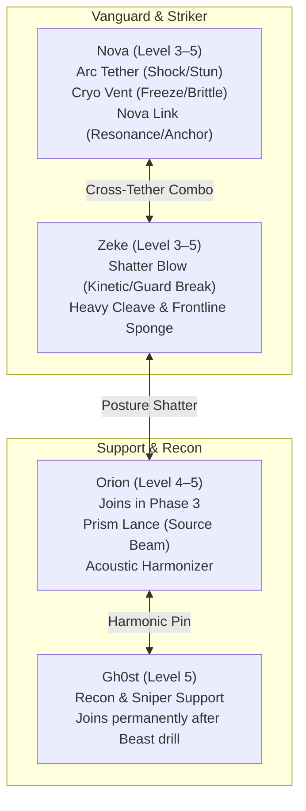
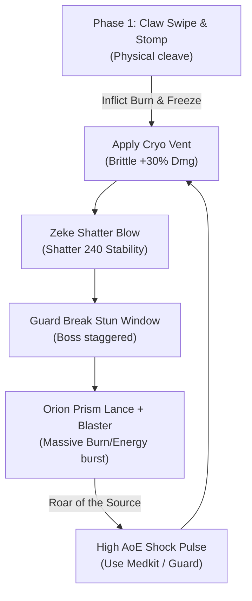

# World 2 Developer & Playtester Field Guide
**Sector 9: Jungle Ruins, Canopy Ridge, Sanctuary Facility & The Sky**  
*Target Release:* `v1.3.74+ (versionCode 158+)`  
*Scope:* 100% Completionist Audit (Quests, Exploration, Lore, Audio/Visuals, Economy & Combat)

**September 30 refinement:** Read [the current World 2 interaction and recovery notes](../../WORLD2_REFINEMENT_PASS.md) before using this older field guide. Stasis now requires decisions, a separate Orion conversation, and Bridge recovery; the Source Gate and optional mural/vent consoles require choices. Departure requires confirmation and follows a low service airlane beneath the Shield. Sky rooms are grounded flight-plan previews. The XP/equipment benchmarks below are estimates, not verified arrival budgets.

---

## 1. Executive Playtest Overview

This field guide is a **dual-purpose tool**: an authoritative 100% completionist walkthrough and an adversarial QA verification checklist for **World 2: Sector 9**. It tracks the narrative journey from the emergency pod crash in the bioluminescent jungle through the awakening of the ancient Tuner, Orion, the confrontation with the mutated apex stalker on Canopy Ridge, and the reactivation and launch of the starship *Astra*.

Keep this document open on a secondary screen while running the game on a physical test device or emulator.

### Master Progression & Economy Benchmark Curve
Track your party status at each major milestone boundary. If your party levels, credits, or key items deviate substantially without deliberate testing deviations, log the anomaly in the Friction Log.

| Phase | Milestone Boundary | Target Level | Expected XP | Expected Credits | Active Party | Key Gear & Consumables |
| :--- | :--- | :---: | :---: | :---: | :--- | :--- |
| **Start** | Wake at Pod Wreckage | **3** | ~750 | 150–220 | Nova, Zeke | Starter Cutter, Flux Liner, Ghost Signal Cell ("Chime"), 2x Medkit I, 2x Ration |
| **Phase 1** | Glow-Water Coast & Beach Explored | **3–4** | ~1,000 | 250–350 | Nova, Zeke | Chime, Focus Conduit, Raw Glowfish, 2x Beast Meat, 2x Herb |
| **Phase 2** | Temple Gate Unsealed via Chime | **4** | ~1,350 | 400–550 | Nova, Zeke | Thermal Cutter (Repaired), Schematic: Source Resin, 2x Pulse Grenade |
| **Phase 3** | Orion Awakened in Stasis Chamber | **4–5** | ~1,750 | 600–800 | Nova, Zeke, Orion | Bridge Echo (`bridge_relic`), Prism Lance, Source Resin, 2x Medkit I |
| **Phase 4** | The Beast Defeated & Link Drilled | **5** | ~2,300 | 950–1,250 | Nova, Zeke, Orion, Gh0st | Unlocked `nova_link`, Rapid Capacitor Mod, 1x Source Resin Mod |
| **Phase 5** | Astra Liftoff (World 3 Transition) | **5–6** | ~2,850+ | 1,400–1,800+ | Full Squad | Phase-Cutter Arrays, Reconnected Bridge, Full Consumables |

---

### Critical Points of No Return
> [!WARNING] **Point of No Return #1 (The Temple Gate Seal):**  
> Slotting the Chime into `sector9_temple_gate` triggers the acoustic bypass stinger and warps the party directly into `sector9_hall_of_echoes` in Hub 4. Ensure you have foraged the perimeter, investigated the Tide Pools, and caught your first fish before breaching the gate! *(Note: The gate remains bi-directionally traversable after unlocking, but narrative pacing shifts permanently).*

> [!WARNING] **Point of No Return #2 (The Source Gate Acoustic Bypass):**  
> Resolving the four harmonic bypass components at `sector9_source_gate` drops the ancient barrier and transitions into `sector9_hangar_bay`. Complete all maintenance vent sweeps (`w2_sq05`) and archive crystal calibrations (`w2_sq04`) before initiating final ship systems bypass.

> [!CAUTION] **Point of No Return #3 (Astra Orbital Launch):**  
> Activating `w2_mq05_launch` at `sector9_hangar_lock` disengages launch clamps, ignites sub-light drives, punches through the Mesosphere Storm, and warps the party to **World 3: The Spire** (`spire_sewers_landing`). All uncompleted Sector 9 side quests will be permanently locked out!

---

### ⚡ Playtest OP Mode & Instant Victory Verification Tools
Introduced in **Release 1.3.74 (versionCode 158)**, the Combat Stage Backdrop features on-screen playtest controls to accelerate QA runs:
- `[ ⚡ OP ]` / `[ ⚡ OP: ON ]`: **Real-Time OP Mode Toggle**. Instantly grants the party invulnerability, sets outgoing basic and skill damage to 9,999, guarantees critical hits, bypasses ability cooldowns, and shatters enemy guard barriers on first touch.
  - *Usage Guideline:* Use OP Mode when testing exploration flow, dialogue tree continuity, and room transitions to bypass routine trash encounters in seconds.
  - *Balancing Guideline:* **Disable OP Mode** during designated combat audit checkpoints (e.g., Ruin-Guardian in `sector9_foyer_left_gallery` and the climax boss fight against **The Source Beast** on Canopy Ridge) to assess true ATB pace, telegraph clarity, and guard break balance.
- `[ 💥 Win ]`: **Insta-Win Kill Switch**. Immediately wipes all active enemy combatants and triggers the victory fanfare and rewards screen. Perfect for clearing test encounters without waiting for animation frames.

---

## 2. Recommended Party Progression, Skills & Tuning

### Party Roles in Sector 9


- **Nova (Tactical Vanguard):** Opens with `nova_arc_tether` against robotic sentinels and `nova_cryo_vent` against biological targets to apply **Brittle** (+30% damage vulnerability). Unlocks `nova_link` after defeating The Beast.
- **Zeke (Kinetic Striker):** Primary frontline tank. Use `zeke_shatter_blow` to obliterate enemy stability gauges (crucial against Ruin-Guardians and The Beast).
- **Orion (Source Specialist):** Joins in `w2_mq03`. Uses `orion_prism_lance` for heavy piercing energy damage that bypasses physical armor.
- **Gh0st (Covert Sniper):** Provides long-range overwatch throughout Canopy Ridge and maintenance vents; formally joins the party at the conclusion of `w2_mq04`.

---

## 3. Phase 1: Crash Site & The Glowing Shore (Hub 3: Jungle Ruins)

### Phase 1 Objective Summary
- Wake at the pod crash site, stabilize Zeke, inspect the pod console, recover the Chime (`ghost_signal_cell`), and follow the glowing stream (`w2_mq01`).
- Explore the surrounding perimeter, Overgrown Glade, and Pod Fragment.
- Follow the stream east into Mist Pools, Resonant Sedge, Crystalline Flats, and Resonant Falls.
- Discover Tideglass Beach and the fishing hole in Tide Pools (`sector9_beach_pools`).
- Forage swamp herbs and beast meat, cook **Tideglass Delight** (`w2_sq03`), and scan plants for Zeke's survey (`w2_sq01`).
- Solve the Bioluminescent Prism puzzle in the Hidden Grotto (`sector9_beach_grotto`) to obtain the **Focus Conduit**.

---

### Phase 1 Verification Matrix

| Room & ID | Actions & Interactions | Expected Engine State & Rewards | Visual, Audio & UX Checks |
| :--- | :--- | :--- | :--- |
| **Crash Site**<br>`sector9_crash_site` | 1. Talk to **Zeke**<br>2. Inspect `navigation console`<br>3. Inspect `stabilize zeke`<br>4. Action `scan moss` (`w2_sq01`) | `w2_mq01` begins.<br>Console examined (`ms_w2_pod_examined`).<br>Zeke stabilized (`ms_w2_zeke_stabilized`).<br>**Ghost Signal Cell** recovered!<br>Plant #3 scanned (`ms_w2_flora_moss_scanned`). | • Pod wreckage smoke particles & dripping moss visuals.<br>• Ambient ozone & jungle audio bed.<br>• Verify Chime appears in inventory under Key Items. |
| **Pod Interior**<br>`sector9_pod_interior` | Inspect `cockpit`, `harnesses`, and `flight log`. | Ambient crash lore. | • Cockpit spark VFX loop.<br>• Text clarity on small mobile displays. |
| **Overgrown Glade**<br>`sector9_landing_glade` | Action `forage herbs` (`w2_forage_herb_glade`) | Stash looted: **Herb x1** (`ms_w2_herb_glade_foraged`). | • Foraging sparkle indicator fades cleanly on pickup. |
| **Security Perimeter**<br>`sector9_landing_perimeter` | Inspect `perimeter sensors` & `barrier posts`. | Dominion crash detection lore. | • Blinking warning beacon lighting. |
| **Scorched Brush**<br>`sector9_landing_brush` | Action `forage herbs` (`w2_forage_herb_landing`) | Stash looted: **Herb x1** (`ms_w2_herb_landing_foraged`). | • Ground foliage contrast check. |
| **Pod Fragment**<br>`sector9_landing_drop` | Inspect `sheared thruster module`. | Note severed power conduits for Phase 5. | • Metallic groan audio cue on inspection. |
| **Stream Bank**<br>`sector9_landing_stream` | Action `explore stream` | Advances **`w2_mq01`**.<br>Completes **`w2_mq01`** (**150 XP**).<br>Starts **`w2_mq02`** (The Signal). | • Water glow shader shimmer.<br>• Quest complete banner animation. |
| **Mist Pools**<br>`sector9_stream_pools` | ⚠️ **Combat: Siren Skimmer** | Skimmer defeated.<br>Loot: *Vial of Venom*, *Ration Pack*. | • Skimmer airborne idle animation.<br>• Cryo Vent freeze reaction. |
| **Resonant Sedge**<br>`sector9_stream_wetlands` | 1. ⚠️ **Combat: Spore-Spitter**<br>2. Action `forage herbs` (`w2_forage_herb_reeds`) | Combat victory.<br>Loot: **Herb x1** (`ms_w2_herb_reeds_foraged`). | • Acid projectile telegraph trail.<br>• Water splash sfx. |
| **Crystalline Flats**<br>`sector9_stream_flats` | Inspect `resonant crystals` in creek. | Lore on crystal resonance. | • Crystalline reflection highlight. |
| **Cavern Entrance**<br>`sector9_stream_cave_entrance` | Inspect `cave mouth` & `dripping stalactites`. | Transition north into cavern. | • Cave acoustics reverb on footsteps. |
| **Glow-Moss Cavern**<br>`sector9_stream_cave_depths` | 1. ⚠️ **Combat: Echo-Borer**<br>2. Action `forage meat` (`w2_forage_meat_cave`) | Borer defeated.<br>Loot: **Beast Meat x1** (`ms_w2_meat_cave_foraged`). | • Underground darkness and bioluminescent moss shader. |
| **Waterlogged Tunnel**<br>`sector9_stream_sunken_passage` | 1. Inspect `drowned console`<br>2. Inspect `submerged ruins`<br>3. Toggle `ancient sluice wheel` | Wheel toggle drains floodwaters (`ms_w2_sluice_drained`), unsealing southern stairs to Submerged Vault! | • Caustic reflections.<br>• Heavy hydraulic sluice gate opening audio cue.<br>• Tunnel description updates dynamically to drained state. |
| **Submerged Aethel Vault**<br>`sector9_sunken_aethel_vault` | 1. Inspect `living coral`<br>2. Open `precursor reliquary` | Reliquary looted: **Tidal Resonator Mod** (`tidal_resonator_mod`), **Astral Thread**, **Bioluminescent Lure**. | • Domed coral architecture visuals.<br>• Water drainage grate ambience. |
| **Resonant Falls**<br>`sector9_stream_falls` | Action `Rest at Camp` (`w2_camp_stream_falls`) | **Party Restored to 100% HP**.<br>Reward: **Painkillers x1**.<br>Campfire dialogue plays. | • Waterfall roar volume balance.<br>• Rest banner notification. |
| **Beach Transition**<br>`sector9_stream_tidepools` | Walkway north onto coast. | Ambient ocean swell soundscape. | • Seamless audio crossfade from river to ocean waves. |
| **Tide Pools**<br>`sector9_beach_pools` | 1. Action `scan weeds` (`w2_sq01`)<br>2. Action `forage meat` (`w2_forage_meat_tidepool`)<br>3. Inspect `fishing pool` (`fish_tideglass`) | Plant #2 scanned (`ms_w2_flora_weeds_scanned`).<br>Loot: **Beast Meat x1**.<br>Launches **Fishing Minigame**! | • Verify fishing cast & tension bar responsiveness.<br>• Catch **Raw Glowfish** & **Chime Minnow**. |
| **Sandy Cove**<br>`sector9_beach_cove` | Inspect `driftwood` & `tide line`. | Ambient coastal lore. | • Sand footsteps audio check. |
| **Beach Cliffs**<br>`sector9_beach_cliffs` | Inspect `canyon overlook`. | Overview of sector coastline. | • Cliffside wind audio effect. |
| **Beached Cargo Wreck**<br>`sector9_beach_cargo` | Loot `cracked storage container`. | Loot: **Scrap Metal x2**, **Wiring Bundle x1**. | • Container hatch creak sfx. |
| **Star-Sand Dunes**<br>`sector9_beach_dunes` | Action `forage meat` (`w2_forage_meat_dunes`) | Loot: **Beast Meat x1** (`ms_w2_meat_dunes_foraged`). | • Sparkling dune texture shaders. |
| **Sea Cavern**<br>`sector9_beach_cave` | Inspect `hollow grotto entrance`. | Tunnel leads to Hidden Grotto. | • Tidal surge audio echo. |
| **Sunken Obelisk**<br>`sector9_beach_pillar` | Inspect `ancient obelisk`. | Cymatic glyphs glowing in salt water. | • Carved glyph light pulsation. |
| **Hidden Grotto**<br>`sector9_beach_grotto` | Inspect `Bioluminescent Prism`.<br>Launch **Calibrate Bioluminescent Prism** UI. | Solves `w2_biolum_matrix_tune`.<br>**Rewards:** **Focus Conduit** (Accessory), **150 XP**! | • Tactical slider puzzle audio ticks.<br>• Green crystal illumination effect on solve. |

---

### The Aethel Drainage Sluice & Submerged Vault Mechanic (Water Temple Feature)
Located deep within the subterranean runoff tunnel at `sector9_stream_sunken_passage`:
- **Flooded State:** Heavy swamp runoff churns violently over the southern archway. Attempting to step South alerts the player: *"A churning surge of dark swamp runoff completely submerges the southern archway. You cannot dive through without drowning in the undertow."*
- **Sluice Activation:** Interact with the `ancient sluice wheel` toggle action. Nova turns the heavy brass spokes, activating the hydraulic Precursor valves.
- **Engine Effects:**
  1. Triggers event `w2_sluice_drained`, setting room state `sluice_drained: true` and registering milestone `ms_w2_sluice_drained`.
  2. Room dynamic description activates, describing the receding waters and drained silt walkways.
  3. Directional lock on `south` dissolves with an unlock chime: *"The water level recedes with a heavy hydraulic groan, revealing a stone stairway descending south!"*
- **Sunken Vault Rewards:** Stepping South enters `sector9_sunken_aethel_vault` ([6, 2]), where the dry central dais houses the **Precursor Reliquary**:
  - **Tidal Resonator Mod** (`tidal_resonator_mod`): Aethel acoustic dampener module (+4 DEF, +25 HP, +3 VIT, +3 FOC).
  - **Astral Thread** (`astral_thread`): Rare crafting fiber.
  - **Bioluminescent Lure** (`bioluminescent_lure`): Premium fishing lure for Tide Pools.
- Releasing the sluice wheel floods the passage again, proving state bidirectional persistence.

---

### The Hidden Grotto Prism Puzzle (Exact Solution)
Interact with the crystal pedestal in `sector9_beach_grotto`:

```
[Slider 1] Refraction Angle (angle) : Set to 135°    (Initial: 45 | Range: 0–360 | Tolerance: ±5°)
[Slider 2] Lux Intensity (lux)      : Set to  64%    (Initial: 20 | Range: 0–100 | Tolerance: ±4%)
[Slider 3] Crystal Freq (freq)      : Set to  92 kHz (Initial: 40 | Range: 20–150| Tolerance: ±3 kHz)
```
- Tap **Confirm Lock** when all three sliders glow in their harmonic green windows.
- **Reward:** Unlocks the ancient reliquary container holding the **Focus Conduit** accessory (+Focus, +ATB Regen).

---

### ⚡ Phase 1 Adversarial & Edge-Case Tests
- [ ] **Premature Stream Exploration:** Try exploring `sector9_landing_stream` before stabilizing Zeke. Verify the game prevents sequence progression with a prompt instructing Nova to tend to Zeke first.
- [ ] **Fishing Minigame Zero-Lure Test:** Attempt to fish at `sector9_beach_pools` without equipped lures. Verify the game notifies the player gracefully without crashing.
- [ ] **Grotto Slider Boundary Overflow:** Drag all three sliders to min and max extremes. Verify values clamp cleanly without text wrapping or slider handle displacement.
- [ ] **OP Mode Toggle in Water:** Turn `[ ⚡ OP ]` ON during the Siren Skimmer fight in `sector9_stream_pools`. Verify the Skimmer dies in one hit, rewards are granted properly, and turning OP OFF in the next room restores normal balance.

### 💾 Phase 1 Save/Resume Checkpoint
- [ ] At `sector9_stream_falls` campfire, perform a **Save Game** to Slot 1.
- [ ] Force quit the application, relaunch, and tap **Load Game**. Verify:
  - Nova and Zeke spawn by the falls with full HP.
  - Completed milestones (`ms_w2_pod_examined`, `ms_w2_zeke_stabilized`, `ms_w2_flora_moss_scanned`, `ms_w2_flora_weeds_scanned`) remain registered.
  - The **Focus Conduit** remains in the equipment inventory.

---

## 4. Phase 2: Razor-Vine Wilds & The Temple Gate

### Phase 2 Objective Summary
- Push south from Crash Site into the treacherous Razor-Vine Path (`sector9_canopy`).
- Scan Plant #1 (crystalline ferns) and Plant #4 (spores) for `w2_sq01`.
- Discover the fallen patrol scout in `sector9_wilds_thickets` and accept `w2_sq02: Lost Patrol`.
- Battle Razor-Vines and Shard-Hounds.
- Triangulate Distress Beacons: Alpha (`sector9_wilds_thickets`), Beta (`sector9_wilds_hollow`), and Gamma (`sector9_ridge_sniper_perch`).
- Infiltrate Burned Glade (`sector9_wilds_clearance`), defeat the stalker vines, and recover the **Damaged Thermal Cutter** and transceiver.
- Rest at Hunter's Blind (`sector9_wilds_lookout`) and repair the **Thermal Cutter** at the tinkering workbench (`repair_thermal_cutter`).
- Climb the windy ledges to Sanctuary Outlook (`sector9_ridge_plateau`).
- Browse the **Sentinel Scraps** shop run by Sentinel-3 in `sector9_temple_lock_chamber`.
- Slot the Chime into `sector9_temple_gate` to open the way into the ancient Aethel facility (`w2_mq02` climax).

---

### Phase 2 Verification Matrix

| Room & ID | Actions & Interactions | Expected Engine State & Rewards | Visual, Audio & UX Checks |
| :--- | :--- | :--- | :--- |
| **Resonant Canopy**<br>`sector9_canopy` | 1. ⚠️ **Combat: Stalker-Vine**<br>2. Action `scan ferns` (`w2_sq01`) | Combat victory.<br>Plant #1 scanned (`ms_w2_flora_ferns_scanned`). | • Stalker-Vine nature heal VFX.<br>• Giant fern scan overlay. |
| **Spore Thickets**<br>`sector9_wilds_thickets` | 1. ⚠️ **Combat: Razor-Vine**<br>2. Action `scan spores` (`w2_sq01`)<br>3. Inspect **Dead Soldier**<br>4. Action `trace beacon alpha` | Plant #4 scanned (`ms_w2_spores_scanned`).<br>Initiates **`w2_sq02`** (Lost Patrol).<br>Beacon Alpha traced (`ms_w2_beacon_alpha_traced`). | • Purple spore cloud ambient particle drift.<br>• Audio ping on beacon triangulation. |
| **Hound Nest**<br>`sector9_wilds_nest` | 1. ⚠️ **Combat: Shard-Hound x2**<br>2. Action `forage meat` (`w2_forage_meat_nest`) | Pack defeated.<br>Loot: **Beast Meat x2** (`ms_w2_meat_nest_foraged`). | • Shard-Hound pounce animations.<br>• Blood-stained den artwork. |
| **Poison Hollow**<br>`sector9_wilds_hollow` | Action `trace beacon beta` (`w2_sq02`) | Beacon Beta decoded (`ms_w2_beacon_beta_traced`). | • Acid pool bubbling audio effect. |
| **Patrol Graveyard**<br>`sector9_wilds_grave` | Inspect `abandoned gear` & `dog tags`. | Dominion expedition fate lore. | • Broken helmets and equipment flavor. |
| **Canopy Edge**<br>`sector9_wilds_overlook` | Inspect `vast canopy below`. | Dizzying panoramic overlook. | • Parallax scrolling background layers. |
| **Hanging Root Bridge**<br>`sector9_wilds_canopy_walk` | Inspect `ancient swaying roots`. | Creaking vine bridge crossing flavor. | • Creaking wood/vine tension audio. |
| **Architect Gateway**<br>`sector9_wilds_archway` | ⚠️ **Combat: Shard-Hound** | Hound defeated. Path clear. | • Ancient carved archway architecture. |
| **Beast Run**<br>`sector9_wilds_dense_brush` | Inspect `claw gouges on stone`. | Massive predator trail foreshadowing. | • Heavy claw gouge decal sharpness. |
| **Burned Glade**<br>`sector9_wilds_clearance` | Action `recover transceiver` (`w2_sq02`) | Recovered: **Damaged Thermal Cutter**, **Schematic**, **Wiring Bundle**, **Scrap Metal**, **Mod: Corrosive Rounds**! | • Burned clearing visual contrast.<br>• Quest inventory toast explosion. |
| **Hunter's Blind**<br>`sector9_wilds_lookout` | 1. Action `Rest at Camp` (`w2_camp_wilds_lookout`)<br>2. Open Tinkering Bench:<br>Craft `repair_thermal_cutter` | Restores party HP.<br>Receives **Painkillers x1**.<br>**Thermal Cutter repaired**!<br>Completes **`w2_sq02`** (**100 XP**)! | • Tinkering UI craft button responsiveness.<br>• Cutter edge ignition sound effect. |
| **Vine Climb**<br>`sector9_ridge_climb` | Action `forage herbs` (`w2_forage_herb_ridge`) | Loot: **Herb x1** (`ms_w2_herb_ridge_foraged`). | • Vertical cliff climbing perspective. |
| **Windy Ledges**<br>`sector9_ridge_ledges` | ⚠️ **Combat: Echo-Borer** | Borer defeated. | • Howling mountain wind audio bed. |
| **Beast Lair Approach**<br>`sector9_ridge_overhang` | Inspect `crushed bones` & `scent markers`. | Strong musk and ozone odor lore. | • Deep guttural roar sound effect in distance. |
| **Shield Viewpoint**<br>`sector9_ridge_viewpoint` | Inspect `Planetary Shield horizon`. | Violet shimmering energy barrier lore. | • Shimmering sky shader performance. |
| **Sniper Lookout**<br>`sector9_ridge_sniper_perch` | Action `trace beacon gamma` (`w2_sq02`) | Beacon Gamma confirmed (`ms_w2_beacon_gamma_traced`). | • Gh0st spent shell casings discovery lore. |
| **High Pass**<br>`sector9_ridge_crevice` | Inspect `narrow rock crevice`. | Chilled mountain air passage. | • Wind funneling acoustic resonance. |
| **Sanctuary Outlook**<br>`sector9_ridge_plateau` | Action `Rest at Camp` (`w2_camp_ridge_plateau`) | Restores party HP.<br>Receives **Painkillers x1**. | • Plateau scenic view of temple entrance. |
| **Stone Courtyard**<br>`sector9_temple_plaza` | ⚠️ **Combat: Spore-Spitter** | Combat victory. Courtyard secure. | • Carved stone courtyard layout. |
| **Outer Guard Post**<br>`sector9_temple_vestibule` | Inspect `inactive defense turret`. | Ancient power depletion lore. | • Dormant turret model texture details. |
| **Resonator Chamber**<br>`sector9_temple_lock_chamber` | 1. Talk to **Sentinel-3**<br>2. Open **Sentinel Scraps** shop | Opens shop trade menu.<br>Can buy components & ingredients. | • Sentinel-3 portrait rendering.<br>• Audio static voice effect. |
| **Left Tuner Column**<br>`sector9_temple_left_wing` | Inspect `cymatic frequency rod`. | Left harmonic pillar lore. | • Low acoustic hum loop. |
| **Right Tuner Column**<br>`sector9_temple_right_wing` | Inspect `cymatic frequency rod`. | Right harmonic pillar lore. | • High acoustic harmonic loop. |
| **Temple Gate**<br>`sector9_temple_gate` | Action `insert chime` (`w2_mq02_use_chime`) | **Gate Unlocks!**<br>Completes **`w2_mq02`** (**200 XP**).<br>Warp to `sector9_hall_of_echoes`!<br>Starts **`w2_mq03`** (Sleeping Giant). | • `sfx_w2_chime_gate` audio crescendo.<br>• Massive stone door parting animation.<br>• Smooth screen warp to Facility Hub 4. |

---

### Sentinel Scraps Shop Inventory (`sector9_temple_lock_chamber`)
- **Vendor:** Sentinel-3
- **Pricing:** 1.15x Sell Markup / 0.45x Buy Markdown
- **Stock:**
  - `painkillers` (Consumable - 35c)
  - `scrap_metal` (Component - 15c)
  - `wiring_bundle` (Component - 20c)
  - `beast_meat` (Cooking Ingredient - 25c)
  - `herb` (Tinkering/Cooking - 15c)

---

### ⚡ Phase 2 Adversarial & Edge-Case Tests
- [ ] **Unordered Beacon Scans:** Trigger Beacon Beta in `sector9_wilds_hollow` before touching Beacon Alpha in `sector9_wilds_thickets`. Verify the quest stage updates cleanly without getting wedged.
- [ ] **Premature Transceiver Recovery:** Visit `sector9_wilds_clearance` before finding all 3 beacons. Verify the damaged cutter is locked or hidden until the triangulated vector is calculated.
- [ ] **Cutter Crafting Material Deficit:** Attempt to craft `repair_thermal_cutter` without `wiring_bundle`. Confirm the crafting modal displays missing ingredients in red and disables the Craft button.
- [ ] **Chime Insertion without Clearance:** In `sector9_temple_gate`, verify the gate cannot be activated if the canopy encounter was bypassed through illegal noclip.

### 💾 Phase 2 Save/Resume Checkpoint
- [ ] In `sector9_temple_lock_chamber` outside the gate, save to Slot 2.
- [ ] Reload Slot 2 and verify the Thermal Cutter is in your quest inventory and Sentinel-3's shop opens without delay.

---

## 5. Phase 3: Sanctuary Facility & The Sleeping Giant (Hub 4)

### Phase 3 Objective Summary
- Arrive inside the pristine Architect ruins of Sanctuary Grand Hall and Hall of Echoes (`sector9_hall_of_echoes`).
- Examine the shifting light murals to learn the history of the Architects and initiate `w2_mq03`.
- Meet Orion's projection and accept `w2_sq04: Ancient Echoes`.
- Infiltrate the three facility wings to recover resonance crystals:
  - Western Wing Crystal in Left Reliquary (`sector9_foyer_left_gallery`) after defeating the **Ruin-Guardian**.
  - Eastern Wing Crystal in Tuning Matrix (`sector9_archive_tuning_bay`).
  - Acoustics Lab Crystal in Acoustics Lab (`sector9_hall_acoustics_lab`).
- Calibrate the murals in Hall of Echoes to complete `w2_sq04` and claim the **Focus Conduit**.
- South to the Stasis Chamber (`sector9_stasis_chamber`) to scan Plant #5 (ancient root lattice) and complete `w2_sq01: Botanist`.
- Perform the 3-point stasis override:
  1. Inspect the stasis pod (`w2_mq03_inspect_pod`).
  2. Read the mural overview in Observation Deck (`w2_mq03_read_mural_overview`).
  3. Stabilize coolant lines (`w2_mq03_stabilize_coolant`).
- Align the Stasis Rings in Ring Array (`sector9_stasis_ring_array`) to awaken **Orion**!
- Orion joins the party with `orion_prism_lance` and surrenders the **Bridge Echo** (`bridge_relic`).

---

### Phase 3 Verification Matrix

| Room & ID | Actions & Interactions | Expected Engine State & Rewards | Visual, Audio & UX Checks |
| :--- | :--- | :--- | :--- |
| **Sanctuary Grand Hall**<br>`sector9_foyer_grand_hall` | Inspect `grand pillars` & `vault arches`. | Pristine Architect stone flavor. | • Vast interior echo audio reverb. |
| **Left Reliquary**<br>`sector9_foyer_left_gallery` | 1. ⚠️ **Combat: Ruin-Guardian (Elite)**<br>2. Action `retrieve west crystal` (`w2_sq04`) | Guardian defeated.<br>Loot: *Armor Plate*, *Scrap Metal*.<br>West Crystal seated (`ms_w2_crystal_west_seated`). | • Guardian barrier shield glow.<br>• Shock vulnerability visual feedback.<br>• Crystal pickup glow. |
| **Right Archives**<br>`sector9_foyer_right_gallery` | Inspect `data crystal pedestals`. | Ancient star charts lore. | • Holographic projection flickers. |
| **Dominion Outpost**<br>`sector9_foyer_security_hub` | Loot `discarded field chest`. | Loot: **Battery x1**, **Medkit I x1**. | • Human military clutter contrast against alien stone. |
| **Hangar Portal**<br>`sector9_foyer_vault_door` | Inspect `sealed blast bulkhead`. | Sealed route to Hangar Bay lore. | • Heavy magnetic seal visual indicator. |
| **Maintenance Conduit**<br>`sector9_conduit_crawlspace` | Inspect `cable trunks` & `service pipes`. | Narrow maintenance corridor flavor. | • Cramped camera framing and metal footsteps. |
| **T-Junction Wiring**<br>`sector9_conduit_junction` | ⚠️ **Combat: Sentinel Orb** | Orb destroyed.<br>Loot: *Wiring Bundle*, *Battery*. | • Drone shock arc animation. |
| **Breaker Deck**<br>`sector9_conduit_breaker_room` | Inspect `auxiliary relays`. | Power grid routing lore. | • Low frequency transformer hum. |
| **Access Shaft**<br>`sector9_conduit_access_shaft` | Inspect `vertical service ladder`. | Ladder leads up toward High Gantry. | • Vertical perspective art. |
| **Hall of Echoes**<br>`sector9_hall_of_echoes` | 1. Action `inspect murals` (`w2_mq03`)<br>2. Action `calibrate murals` (`w2_sq04_complete`) | Murals read (`ms_w2_murals_read`).<br>Advances `w2_mq03`.<br>Completes **`w2_sq04`** (**150 XP**)!<br>Reward: **Focus Conduit**. | • Murals of light shimmer and animate.<br>• Three-chord harmonic chime on completion. |
| **Echo Alcoves**<br>`sector9_hall_echo_alcoves` | Inspect `resonant alcove walls`. | Sound wave reflection lore. | • Subtle auditory echo when walking. |
| **Acoustics Lab**<br>`sector9_hall_acoustics_lab` | 1. ⚠️ **Combat: Spore-Spitter**<br>2. Action `retrieve north crystal` (`w2_sq04`) | Combat victory.<br>North Crystal seated (`ms_w2_crystal_north_seated`). | • Glass resonator apparatus visuals. |
| **Cymatic Basin**<br>`sector9_hall_reflection_pool` | Inspect `cymatic liquid pool`. | Geometric standing wave patterns. | • Water surface wave ripples. |
| **Archive Vault**<br>`sector9_archive_vault` | Inspect `crystal archive racks`. | 20,000-year history lore. | • Blue crystalline glow lighting. |
| **Interface Console**<br>`sector9_archive_reading_room` | Inspect `holographic reader`. | Architect language translation lore. | • Glyphs translating into readable text. |
| **Tuning Matrix**<br>`sector9_archive_tuning_bay` | Action `retrieve east crystal` (`w2_sq04`) | East Crystal seated (`ms_w2_crystal_east_seated`). | • Crystalline chime audio stinger. |
| **Hidden Reliquary**<br>`sector9_archive_secret_stash` | Action `decode bridge record` (`w2_sq04`) | Secret lore recorded (`ms_w2_bridge_record_decoded`). | • Secret room unsealing sound effect. |
| **Stasis Chamber**<br>`sector9_stasis_chamber` | 1. Action `scan roots` (`w2_sq01`)<br>2. Action `inspect stasis pod` (`w2_mq03`) | **`w2_sq01` Completed!** (**100 XP**).<br>Pod inspected (`ms_w2_stasis_pod_read`). | • Massive central cryo pod model.<br>• Root lattice glowing green. |
| **Observation Deck**<br>`sector9_stasis_observation` | Action `read mural overview` (`w2_mq03`) | Stasis mural overview read (`ms_w2_stasis_overview_read`). | • Glass railing overlook down into stasis chamber. |
| **Coolant Lines**<br>`sector9_stasis_coolant_lines` | Action `stabilize coolant` (`w2_mq03`) | Coolant flow stabilized (`ms_w2_coolant_stabilized`). | • Cryogenic hiss and frost particles. |
| **Ring Array**<br>`sector9_stasis_ring_array` | Action `align stasis rings` (`w2_mq03_align_complete`) | **Orion Awakened!**<br>**Orion Joins Party!**<br>Receives **Bridge Echo** (`bridge_relic`).<br>Completes **`w2_mq03`** (**250 XP**)!<br>Starts **`w2_mq04`** (The Hunter). | • Stasis rings spinning into alignment cinematic.<br>• Pod unsealing steam blast.<br>• Orion portrait and voice introduction.<br>• `orion_prism_lance` skill card awarded. |

---

### Elite Combat Breakdown: Ruin-Guardian (`sector9_foyer_left_gallery`)
- **HP:** 130 | **Stability:** 187 | **Role:** Defensive Tank
- **Resistances:** Weak to **Shock** (-50%), resistant to Physical (+30%).
- **Mechanics:** Channels `barrier_field` to soak kinetic damage, then strikes with heavy `relic_strike`.
- **Optimal Rotation:**
  1. Open with Nova's **Arc Tether** to exploit the -50% shock vulnerability and stall the barrier cast.
  2. Follow immediately with Zeke's **Shatter Blow** to rip through the guardian's massive 187 stability bar.
  3. Once guard broken, unleash standard blaster strikes and pulse grenades for instant elimination.

---

### ⚡ Phase 3 Adversarial & Edge-Case Tests
- [ ] **Premature Ring Array Override:** Attempt to trigger `w2_mq03_align_complete` in `sector9_stasis_ring_array` before stabilizing the coolant lines or reading the mural overview. Verify the array refuses to align with informative diagnostic feedback.
- [ ] **Crystal Seating Out of Order:** Retrieve the North Crystal before the West Crystal. Confirm both inventory items register and the mural pedestal in Hall of Echoes accepts them regardless of pickup order.
- [ ] **Botanist Turn-In Verification:** Scan the ancient roots in `sector9_stasis_chamber` as the 5th and final plant. Verify `w2_sq01` marks as complete immediately in the quest log with 100 XP awarded without requiring a manual turn-in walk back to Zeke.

### 💾 Phase 3 Save/Resume Checkpoint
- [ ] In `sector9_stasis_chamber` with Orion newly in your party, save to Slot 1.
- [ ] Restart app, reload, and verify the party roster shows 3 active characters: **Nova**, **Zeke**, and **Orion**, with Orion's skills unlocked.

---

## 6. Phase 4: Apex Hunt on Canopy Ridge & Maintenance Infiltration

### Phase 4 Objective Summary
- Gh0st reaches out: the facility's high maintenance ventilation grid is compromised by Dominion surveillance (`w2_sq05: Stolen Tech`).
- Infiltrate High Gantry (`sector9_vents_gantry`) and hack the security grid timing.
- Bypass guard systems at Infiltration Hatch (`sector9_vents_access_grate`).
- Recover the Dominion transmitter core at Transmitter Site (`sector9_vents_tech_alcove`) and assemble the **Rapid Capacitor** (`mod_rapid_capacitor`) to complete `w2_sq05`.
- Travel to high Canopy Ridge (`sector9_canopy_ridge`) for `w2_mq04: The Hunter`.
- Confront Gh0st in the high blind (`w2_mq04_confront`).
- **WORLD 2 CLIMAX BOSS FIGHT: The Mutated Source Beast (`the_beast`)**.
- Defeat The Beast, conduct the grounded Anchor Drill with Orion, unlock `nova_link`, and welcome Gh0st into the party.

---

### Phase 4 Verification Matrix

| Room & ID | Actions & Interactions | Expected Engine State & Rewards | Visual, Audio & UX Checks |
| :--- | :--- | :--- | :--- |
| **High Gantry**<br>`sector9_vents_gantry` | 1. ⚠️ **Combat: Sentinel Orb**<br>2. Action `hack security grid` (`w2_sq05`) | Drone destroyed.<br>Grid timing hacked (`ms_w2_grid_hacked`). | • Security scan cone laser lines.<br>• Terminal hacking sound effect. |
| **Infiltration Hatch**<br>`sector9_vents_access_grate` | Action `bypass guard systems` (`w2_sq05`) | Guard sweep timed (`ms_w2_guards_bypassed`). | • Steaming ventilation fan blades.<br>• Crawlspace lighting transitions. |
| **Transmitter Site**<br>`sector9_vents_tech_alcove` | 1. Action `search tech alcove`<br>2. Open Tinkering Bench:<br>Craft `mod_rapid_capacitor` | Loot: **Dominion Transmitter Core**, **Schematic**, **Wiring**, **Scrap Metal**.<br>Assembles **Rapid Capacitor**!<br>Completes **`w2_sq05`** (**150 XP**)! | • Hidden alcove cache container.<br>• Rapid Capacitor mod equip confirmation toast. |
| **Canopy Ridge**<br>`sector9_canopy_ridge` | 1. Action `confront stalker`<br>2. ⚠️ **BOSS ENCOUNTER:**<br>**The Mutated Source Beast**<br>3. Action `anchor drill` (`w2_mq04_anchor_drill`) | Gh0st dialogue triggered.<br>**The Source Beast Defeated!**<br>Cinematic `scene_anchor_drill` plays.<br>**Gh0st joins party!**<br>**Nova Link skill unlocked!**<br>Completes **`w2_mq04`** (**300 XP**)!<br>Starts **`w2_mq05`** (Liftoff). | • Sudden thunderous boss roar entry.<br>• Boss health bar full scale render.<br>• Gh0st sniper muzzle flash.<br>• Orion cutter grounding sparks in cinematic.<br>• System tutorial overlay: `link_unlock`. |

---

### Boss Mechanics Deep-Dive: The Source Beast (`the_beast`)



- **Boss Stats:**
  - **HP:** 520 | **Stability:** 240 | **Speed:** 10
  - **Weaknesses:** **Burn: -100%** (Takes double damage!), **Shock: -50%** (Takes 1.5x damage!).
  - **Abilities:** `claw_swipe` (Heavy single-target physical), `seismic_stomp` (Front-row stun), `roar_of_the_source` (Charge-up AoE shockwave).
- **Tactical Strategy:**
  1. **Status Priming:** Open with Nova's **Cryo Vent** to trigger **Brittle**, amplifying all subsequent damage by 30%.
  2. **Exploiting Weaknesses:** Because The Beast takes -100% Burn and -50% Shock, throw **Corrosive Rounds** or fire-augmented strikes while Nova connects with **Arc Tether**.
  3. **Posture Shatter:** Use Zeke's **Shatter Blow** on cooldown. The Beast's stability bar will crack after two clean rotations, triggering a 4-second Guard Break stun.
  4. **The Big Burst:** During the Guard Break window, fire Orion's **Prism Lance** through the exposed core.
  5. **Roar Mitigation:** When the telegraph displays *"The Beast channels the raw resonance of the mountain"*, tap Guard with Zeke and use **Painkillers** or a **Medkit I** on injured allies.

---

### ⚡ Phase 4 Adversarial & Edge-Case Tests
- [ ] **OP Mode Boss Audit:** First test defeating The Beast with `[ ⚡ OP ]` enabled. Confirm the 9,999 damage hit kills the boss in 1 turn, drops `source_resin`, triggers `w2_mq04_victory`, and seamlessly launches the Anchor Drill dialogue.
- [ ] **Standard Balancing Audit:** On a fresh test profile, defeat The Beast with OP Mode disabled. Verify the battle takes between 1.5 and 2.5 minutes, that Zeke's Shatter Blow breaks posture reliably, and that no untelegraphed one-shot wipes occur.
- [ ] **Cinematic Skip Verification:** During `scene_anchor_drill`, tap the screen to verify skip/fast-forward prompts appear and dismiss cleanly without cutting off the subsequent quest grant.

### 💾 Phase 4 Save/Resume Checkpoint
- [ ] On Canopy Ridge immediately after the Anchor Drill completes, save to Slot 2.
- [ ] Reload Slot 2 and verify that **Nova Link** is visible in Nova's skill inventory and `w2_mq05` is active and tracked.

---

## 7. Phase 5: Source Gate Resolution, Astra Hangar & Liftoff

### Phase 5 Objective Summary
- Move from Stasis Chamber into the massive Source Gate complex (`sector9_source_gate`).
- Resolve the 4-part acoustic and electrical puzzle blocking access to the hangar:
  1. Stabilize the Harmonic Horn (`sector9_gate_emitter_left`).
  2. Ground the Resonance Cup (`sector9_gate_emitter_right`).
  3. Map the pressure gauge at the Source Dynamo (`sector9_power_turbine`).
  4. Starve the breaker circuits at Generator Controls (`sector9_power_breaker_deck`).
- Trigger `w2_mq05_bypass_gate` to drop the barrier and warp into **Hangar Bay** (`sector9_hangar_bay`).
- Inspect the dormant, dark hull of the starship *Astra* (`w2_mq05_inspect_astra`).
- Travel back to the Pod Fragment (`sector9_landing_drop`) near the Crash Site to recover salvage **Power Conduits**.
- Return to Hangar Bay, install the Bridge Echo, splice the conduits, and authenticate Orion with the Chime (`w2_mq05_reboot`).
- Ascend the hangar scaffolding to the Launch Blast Shield (`sector9_hangar_lock`) and trigger **Liftoff** (`w2_mq05_launch`).
- Blast through the Mesosphere Storm and break into orbital space toward **World 3: The Spire**!

---

### Phase 5 Verification Matrix

| Room & ID | Actions & Interactions | Expected Engine State & Rewards | Visual, Audio & UX Checks |
| :--- | :--- | :--- | :--- |
| **Source Gate**<br>`sector9_source_gate` | 1. Inspect `resonator lock`<br>2. Action `bypass source gate` | Diagnostic on discordant tones.<br>**Barrier Drops!**<br>Warp to `sector9_hangar_bay`! | • Massive vibrating barrier energy shader.<br>• Barrier dissipation particle wave. |
| **Harmonic Horn**<br>`sector9_gate_emitter_left` | Action `stabilize horn` (`w2_mq05`) | Horn stabilized (`ms_w2_source_horn_stabilized`). | • Acoustic horn glow and steady frequency tone. |
| **Resonance Cup**<br>`sector9_gate_emitter_right` | Action `ground cup` (`w2_mq05`) | Cup grounded (`ms_w2_source_cup_grounded`). | • Electrical grounding spark VFX. |
| **Source Dynamo**<br>`sector9_power_turbine` | 1. Inspect `massive turbine`<br>2. Action `read pressure gauge` | Pressure mapped (`ms_w2_source_pressure_mapped`). | • Massive rotating turbine animation.<br>• Deep mechanical hum audio bed. |
| **Distribution Manifold**<br>`sector9_power_manifold` | Action `Rest at Camp` (`w2_camp_power_manifold`) | Restores party HP.<br>Receives **Painkillers x1**. | • Heat plate camp visual setup. |
| **Generator Controls**<br>`sector9_power_breaker_deck` | Action `overload breakers` (`w2_mq05`) | Breakers starved (`ms_w2_source_breakers_starved`). | • Breaker flip audio snaps and arcing sparks. |
| **Purge Valve**<br>`sector9_power_valve` | Inspect `emergency steam release`. | High pressure steam purge lore. | • Steam vent audio hiss. |
| **Hangar Bay**<br>`sector9_hangar_bay` | 1. Action `inspect astra`<br>2. Action `reboot bridge relic` | Astra inspected (`ms_w2_astra_inspected`).<br>Requires power conduits.<br>**Bridge Mounted & Rebooted!** (`ms_w2_bridge_installed`). | • Dramatic first reveal of the *Astra* on launch pad.<br>• Bridge lighting up with interior gold and blue lights. |
| **Maintenance Catwalks**<br>`sector9_hangar_scaffolding` | Inspect `high gantries`. | High angle view of the starship. | • Scaffolding shadow and depth. |
| **Freight Lift**<br>`sector9_hangar_staging` | Inspect `heavy cargo lifter`. | Pre-launch supplies staging lore. | • Cargo lift machinery flavor. |
| **Control Console**<br>`sector9_hangar_tower` | Inspect `flight control terminal`. | Pre-flight telemetry checks. | • Terminal radar sweeps. |
| **Fuel Intake Lines**<br>`sector9_hangar_fuel_lines` | Inspect `sub-light propellant feeds`. | Fuel lines pressurized lore. | • Fuel line liquid pulse glow. |
| **Launch Blast Shield**<br>`sector9_hangar_lock` | Action `launch ship` (`w2_mq05_launch`) | **The Astra Launches!**<br>Warp to `sector9_the_sky` -> `spire_sewers_landing`!<br>Completes **`w2_mq05`** (**350 XP**).<br>World 2 Complete! Starts **`w3_mq11`**! | • Launch clamp release mechanical thud.<br>• Thruster ignition roar audio stinger.<br>• Screen shake and whiteout transition. |
| **The Sky**<br>`sector9_the_sky` | View launch cinematic through clouds. | Flying high above cloud layer. | • Atmospheric cloud rush animation. |
| **Mesosphere Storm**<br>`sector9_sky_mesosphere` | View storm turbulence. | Ion lightning dancing on the Astra's shields. | • Ion lightning particle arcs. |
| **Shield Threshold**<br>`sector9_sky_shield_threshold` | Inspect `Planetary Shield rift`. | Breaching the planetary barrier into orbit. | • Violet shield fracture visual effect. |

---

### The 4-Part Source Gate Bypass Sequence
To lower the barrier at `sector9_source_gate`:
1. Enter `sector9_gate_emitter_left` -> Tap **Harmonic Horn** -> Select **Stabilize Frequency**.
2. Enter `sector9_gate_emitter_right` -> Tap **Resonance Cup** -> Select **Ground Energy Discharge**.
3. Travel east from Coolant Lines into `sector9_power_turbine` -> Tap **Turbine Gauge** -> Select **Map Pressure Differential**.
4. Move south into `sector9_power_breaker_deck` -> Tap **Breaker Deck** -> Select **Overload & Starve Circuit**.
5. Return to `sector9_source_gate` -> Tap **Acoustic Barrier Console** -> Select **Initiate Phase Bypass**.
   - *Result:* Gate collapses permanently, granting unhindered access to the Hangar.

---

### ⚡ Phase 5 Adversarial & Edge-Case Tests
- [ ] **Gate Bypass Prerequisite Validation:** Attempt to trigger `w2_mq05_bypass_gate` with only 3 of the 4 components completed. Confirm the console reports which specific subsystem (Horn, Cup, Pressure, or Breaker) remains uncalibrated.
- [ ] **Conduit Scavenge Backtrack:** After inspecting the Astra in `sector9_hangar_bay`, confirm the path back to the Crash Site (`sector9_landing_drop`) remains open and free of blockers, and that the Pod Fragment item pickup populates `power_conduits` into inventory immediately.
- [ ] **Launch Without Authentication:** Verify that Nova cannot trigger `w2_mq05_launch` before completing the Bridge reboot sequence with Orion and the Chime.
- [ ] **Orbital Transition Save Test:** Allow the launch sequence to complete and deposit the party in `spire_sewers_landing` (World 3). Perform an immediate save/load and confirm the quest log shows `w2_mq05` in Completed Quests and `w3_mq11` as active.

---

## 8. Master Bestiary & Tactical Combat Strategies (Sector 9)

Every enemy encountered throughout Sector 9 possesses distinct elemental affinities, posture tolerances, and behavioral roles. Audit their parameters and combat pacing against this directory:

| Enemy | Tier & Role | HP / Stability | Element & Weaknesses | Key Abilities | Tactical Counter-Strategy |
| :--- | :--- | :---: | :--- | :--- | :--- |
| **Siren Skimmer** | Standard<br>Controller | **35** / 33 | Acid<br>**Freeze: -100%**<br>Physical: +50% | `sonic_shriek`<br>`volatile_swell` | High agility flyer. Casts `sonic_shriek` to inflict **Blind**. Cast **Cryo Vent** immediately; the freezing blast collapses its steam sac in one hit. |
| **Shard-Hound** | Standard<br>Striker | **65** / 38 | Physical<br>**Burn: -50%**<br>Shock: +30% | `gnaw`<br>`pounce` | Agile pack hunter. Pounces quickly to interrupt cast gauges. Exploit its **Burn** vulnerability using fire attacks or Corrosive Rounds. |
| **Spore-Spitter** | Standard<br>Striker | **50** / 54 | Acid<br>**Burn: -100%**<br>Physical: +20% | `toxic_spore` | Bulbous rooted flora. Fires long-range corrosive acid spores. Highly flammable (-100% Burn); burn down quickly before acid ticks accumulate. |
| **Razor-Vine** | Standard<br>Hazard | **45** / 63 | Acid<br>**Burn: -150%**<br>Acid: +80% | `constrict` | Predatory thorny vine that entangles party members. Extreme **Burn** vulnerability (-150%), or cauterize safely with the repaired **Thermal Cutter**. |
| **Stalker-Vine** | Elite<br>Support | **100** / 153 | Acid<br>**Burn: -100%**<br>Acid: +80% | `constrict`<br>`nature_heal` | **Priority Target.** Channeled organism that rapidly heals other wild flora with `nature_heal`. Focus immediately with fire and Zeke's Shatter Blow. |
| **Sentinel Orb** | Elite<br>Controller | **80** / 110 | Shock<br>**Physical: -20%**<br>Shock: +100% | `static_burst`<br>`resonance_beam` | Hovering facility defense sphere. **Completely absorbs Shock damage** (+100%). Do NOT use Arc Tether; smash with Zeke's heavy kinetic strikes. |
| **Ruin-Guardian** | Elite<br>Tank | **130** / 187 | Physical<br>**Shock: -50%**<br>Physical: +30% | `relic_strike`<br>`barrier_field` | Shielded ancient sentinel guarding facility reliquaries. Channel **Arc Tether** to pierce its shock weakness, then shatter its 187 stability bar. |
| **The Source Beast** | Boss<br>Apex Striker | **520** / 240 | Physical/Resonance<br>**Burn: -100%**<br>**Shock: -50%** | `claw_swipe`<br>`roar_of_the_source`<br>`seismic_stomp` | Mutated apex predator on Canopy Ridge. Apply Brittle with Cryo Vent, break posture with Shatter Blow, and burst down with Orion's Prism Lance. |

---

## 9. NPC Roster, Dialogues & Trade Directory (Sector 9)

Track the story continuity, personality, dialogue triggers, and trade interfaces for all Sector 9 NPCs:

| NPC & ID | Location | Primary Role & Quests | Key Interactions & Dialogue Branches |
| :--- | :--- | :--- | :--- |
| **Zeke**<br>`zeke` | `sector9_crash_site`<br>Party Roster | Co-Pilot & Tank<br>`w2_mq01`, `w2_sq01` | • Recovered from wreckage; stabilized with emergency medkit.<br>• Gives **Botanist** (`w2_sq01`) to survey 5 native flora specimens.<br>• Active party member delivering frontline kinetic strikes. |
| **Orion**<br>`orion` | `sector9_stasis_chamber`<br>Party Roster | Ancient Tuner & Mystic<br>`w2_mq03`, `w2_sq03`, `w2_sq04`, `w2_mq05` | • Awakened from 20-year stasis via the Ring Array.<br>• Offers **Tideglass Day** (`w2_sq03`) and **Ancient Echoes** (`w2_sq04`).<br>• Yields the **Bridge Echo** (`bridge_relic`) and authenticates Astra launch telemetry. |
| **Gh0st**<br>`gh0st` | `sector9_canopy_ridge`<br>`sector9_vents_gantry`<br>Party Roster | Ex-Dominion Sniper<br>`w2_mq04`, `w2_sq05` | • Stalks the squad across the ridge; confronted in high overlook.<br>• Offers **Stolen Tech** (`w2_sq05`) to infiltrate facility maintenance vents.<br>• Assists in taking down The Beast and conducts the Anchor Drill. |
| **Sentinel-3**<br>`sentinel_3` | `sector9_temple_lock_chamber` | Ancient Aethel Vendor | • Operates **Sentinel Scraps** shop.<br>• **Smalltalk Dialogue:** *"The ground sings. The canopy sings. Even the wreckage hums at 432 Hz. You must learn to listen."* |
| **Dead Soldier**<br>`dead_soldier` | `sector9_wilds_thickets` | Fallen Dominion Scout<br>`w2_sq02` | • Dying scout in spore thickets; initiates **Lost Patrol** (`w2_sq02`) to triangulate beacons and recover his thermal cutter. |

### Shop Catalog: Sentinel Scraps (`sector9_temple_lock_chamber`)
- **Pricing Rules:** 1.15x Sell Markup / 0.45x Buy Markdown
- **Accepted Trade Types:** Consumables, Weapons, Armor, Accessories, Ingredients, Components, Mods.

| Item Stock | Category | Base Value | Purchase Cost | Stock Notes & Mechanical Utility |
| :--- | :--- | :---: | :---: | :--- |
| `painkillers` | Medicine | 15c | **17c** | Neural Stabilizer. Restores focus, clears erosion fatigue. |
| `scrap_metal` | Component | 10c | **11c** | Essential alloy for cutter repair and rapid capacitor mod. |
| `wiring_bundle` | Component | 18c | **20c** | High-grade copper lead wire for electrical tinkering. |
| `beast_meat` | Ingredient | 14c | **16c** | Chewy, calorie-dense muscle tissue; ingredient for Source Resin. |
| `herb` | Ingredient | 6c | **7c** | Pungent cave lichen; base ingredient for Source Resin mod. |

---

## 10. Secrets, Foraging & Fishing Compendium (Sector 9)

Comprehensive guide to every hidden discovery, gathering node, fishing catch, and campsite in Sector 9:

### 1. All 8 Wild Foraging Nodes
Collect wild ingredients across the jungle and coast for crafting Source Resin and cooking provisions:
- **Herb Node 1:** Overgrown Glade (`sector9_landing_glade`) -> Tap shimmering flora (`ms_w2_herb_glade_foraged`).
- **Herb Node 2:** Scorched Brush (`sector9_landing_brush`) -> Tap burnt brush (`ms_w2_herb_landing_foraged`).
- **Herb Node 3:** Resonant Sedge (`sector9_stream_wetlands`) -> Tap marsh reeds (`ms_w2_herb_reeds_foraged`).
- **Herb Node 4:** Vine Climb (`sector9_ridge_climb`) -> Tap cliffside hanging moss (`ms_w2_herb_ridge_foraged`).
- **Meat Node 1:** Glow-Moss Cavern (`sector9_stream_cave_depths`) -> Carve beast carcass (`ms_w2_meat_cave_foraged`).
- **Meat Node 2:** Tide Pools (`sector9_beach_pools`) -> Scavenge tidepool crab (`ms_w2_meat_tidepool_foraged`).
- **Meat Node 3:** Star-Sand Dunes (`sector9_beach_dunes`) -> Scavenge washed-up beast (`ms_w2_meat_dunes_foraged`).
- **Meat Node 4:** Hound Nest (`sector9_wilds_nest`) -> Scavenge bone pile (`ms_w2_meat_nest_foraged`).

### 2. Tideglass Beach Fishing Hole (`sector9_beach_pools`)
Interact with the glowing water pool in `sector9_beach_pools` to launch the fishing minigame:
- **Zone ID:** `sector9_stream`
- **Catch Distribution Table:**
  - `raw_glowfish` (Common - 55% weight | Gentle Wobble behavior)
  - `resonance_carp` (Uncommon - 28% weight | Steady Pull behavior)
  - `old_boot` (Junk - 12% weight | Gentle Wobble behavior)
  - `chime_minnow` (Rare - 5% weight | Erratic Burst behavior)
  - `scrap_metal` (Common - 5% weight | Steady Pull behavior)
  - `wiring_bundle` (Common - 3% weight | Steady Pull behavior)
- **Special Catch: Chime Minnow:**
  - A rare glowing fish whose bones ring like glass. Cook it into **Chime Minnow Broth** (`chime_minnow` + water/salt) to restore 90 HP and temporarily boost party Critical Luck!

### 3. Secret Reliquary & Lore Discoveries
- **Submerged Aethel Vault (`sector9_sunken_aethel_vault`):** Drain the floodwaters using the ancient sluice wheel in `sector9_stream_sunken_passage` to unlock the southern stairway and loot the Precursor Reliquary for the **Tidal Resonator Mod**, Astral Thread, and Bioluminescent Lure.
- **Hidden Grotto Prism Puzzle (`sector9_beach_grotto`):** Calibrate the prism (`135°`, `64%`, `92 kHz`) to claim the **Focus Conduit** accessory.
- **Hidden Reliquary (`sector9_archive_secret_stash`):** Found east of the Tuning Matrix in Hub 4. Decode the ancient data crystal to unlock the Bridge Echo historical record (`ms_w2_bridge_record_decoded`).
- **Beached Cargo Wreck (`sector9_beach_cargo`):** Pry open the rusted container for Scrap Metal x2 and Wiring Bundle x1.
- **Dominion Outpost Cache (`sector9_foyer_security_hub`):** Loot the abandoned crate for Battery x1 and Medkit I x1.

### 4. Campsites & Rest Perks
Four wilderness camps are available across Sector 9. Resting at any campfire restores **100% squad HP**, dispels mental erosion, and rewards a complimentary **Neural Stabilizer** (`painkillers`):
- **Resonant Falls Camp (`sector9_stream_falls`):** Waterfalls mask the party's presence from patrols.
- **Hunter's Blind Camp (`sector9_wilds_lookout`):** Heat ring shelter above the spore thickets.
- **Sanctuary Outlook Camp (`sector9_ridge_plateau`):** High stone shelf with a panoramic view of the temple facade.
- **Distribution Manifold Camp (`sector9_power_manifold`):** Sterile heat plate shelter inside the power complex.

---

## 11. Sector 9 Tinkering Recipes & Crafting Directory

All recipes can be crafted at any workbench (Hunter's Blind in `sector9_wilds_lookout`, Transmitter Site, or Astra Workshop):

| Recipe ID | Item Name | Category | Base Item | Required Components | In-Game Output & Utility |
| :--- | :--- | :--- | :--- | :--- | :--- |
| `repair_thermal_cutter` | **Thermal Cutter** | Repair | `damaged_thermal_cutter` x1 | `wiring_bundle` x1<br>`scrap_metal` x1 | **Quest Tool.** Cauterizes razor-vines cleanly without releasing toxic spores. |
| `mod_source_resin` | **Source Resin Mod** | Gear Mod | `herb` x1 | `beast_meat` x1 | **Defensive Mod.** Insulates armor against raw Source resonance and shock pulses. |
| `mod_rapid_capacitor` | **Rapid Capacitor Mod** | Gear Mod | `dominion_transmitter_core` x1 | `scrap_metal` x1<br>`wiring_bundle` x1 | **Cooldown Mod.** Speeds up active skill cooling cycles by 15%. |
| `mod_resonance_capacitor`| **Resonance Capacitor Mod** | Gear Mod | `rapid_capacitor` x1 | `source_resin` x1<br>`nano_filament` x1 | **Late Mod.** Stores player intent as charge, releasing massive bonus damage on impact. |
| `gear_reinforced_resin_rod`| **Reinforced Resin Rod** | Fishing | `fiberglass_rod` x1 | `wiring_bundle` x1<br>`circuit_board` x1 | **Fishing Upgrade.** Stabilizes bite sensor for heavier runoff and coastal catches. |
| `provision_tideglass_delight`| **Tideglass Delight** | Cooking | `raw_glowfish` x1 | `beast_meat` x1<br>`herb` x1 | **Consumable.** Restores 120 HP and sharpens party reaction speed. |
| `provision_stellarium_eel_skewer`| **Stellarium Eel Skewer** | Cooking | `stellarium_eel` x1 | `fiery_pepper` x1 | **Consumable.** Restores 90 HP and sparks with kinetic charge. |

---

## 12. Master Item, Mod & Equipment Catalog (World 2)

Comprehensive audit catalog of every item acquirable throughout Sector 9:

| Item ID | Display Name | Category | Base Value | Acquisition Location | Stat Buffs, Mechanics & In-Game Utility |
| :--- | :--- | :--- | :---: | :--- | :--- |
| `thermal_cutter` | **Thermal Cutter** | Quest / Tool | 0c | Tinkering Repair (`w2_sq02`) | Cauterizes razor-vines cleanly before they release toxic spores. |
| `damaged_thermal_cutter` | **Damaged Thermal Cutter**| Component | 0c | Burned Glade (`sector9_wilds_clearance`)| Cracked Dominion cutter head; base for repair. |
| `bridge_relic` | **The Bridge Echo** | Key Item | 0c | Stasis Chamber (`w2_mq03`) | Architect Echo #2. Coordinates willing minds without merging them. |
| `power_conduits` | **Power Conduits** | Quest Item | 0c | Pod Fragment (`sector9_landing_drop`) | Heavy salvage cables used to install and reboot the Bridge. |
| `dominion_transmitter_core`| **Transmitter Core** | Component | 0c | Tech Alcove (`sector9_vents_tech_alcove`)| Stolen military transceiver core with clean timing crystal. |
| `focus_conduit` | **Focus Conduit** | Accessory | 210c | Hidden Grotto / `w2_sq04` | Crystal conduit that boosts Focus (+12) and ATB regeneration. |
| `tidal_resonator_mod` | **Tidal Resonator Mod** | Gear Mod | 420c | Submerged Aethel Vault (`sector9_sunken_aethel_vault`) | Aethel acoustic dampener mod (+4 DEF, +25 HP, +3 VIT, +3 FOC). |
| `source_resin` | **Source Resin Mod** | Armor Mod | 300c | Tinkering / The Beast drop | Solidified resonance residue that stabilizes energy flow (+Def). |
| `rapid_capacitor` | **Rapid Capacitor Mod** | Gear Mod | 300c | Tinkering (`w2_sq05`) | Overclocked capacitor that speeds up skill cooling cycles by 15%. |
| `resonance_capacitor_mod` | **Resonance Capacitor Mod**| Gear Mod | 520c | Advanced Tinkering | Stores intent as charge, releasing burst damage on impact. |
| `reinforced_resin_rod` | **Reinforced Resin Rod** | Fishing Rod | 240c | Advanced Tinkering | Rewired resin rod with stabilized bite sensor for heavy catches. |
| `tideglass_delight` | **Tideglass Delight** | Consumable | 300c | Camp Cooking (`w2_sq03`) | Restores 120 HP and sharpens party reaction speed. |
| `chime_minnow_broth` | **Chime Minnow Broth** | Consumable | 145c | Camp Cooking | Restores 90 HP and temporarily boosts Critical Luck. |
| `painkillers` | **Neural Stabilizer** | Medicine | 15c | Campsites / Sentinel Scraps | Restores 40 HP and eliminates erosion fatigue. |
| `vial_of_venom` | **Vial of Venom** | Component | 22c | Siren Skimmer / Spore-Spitter | Corrosive acid venom for weapon modding. |
| `herb` | **Herb** | Ingredient | 6c | Foraging / Sentinel Scraps | Wild subterranean lichen; base for Source Resin. |
| `beast_meat` | **Beast Meat** | Ingredient | 14c | Foraging / Hound Den / Sentinel | Calorie-dense muscle tissue; ingredient for Source Resin. |
| `raw_glowfish` | **Raw Glowfish** | Ingredient | 10c | Tide Pools Fishing | Glowing swamp fish; ingredient for Tideglass Delight. |
| `resonance_carp` | **Resonance Carp** | Ingredient | 28c | Tide Pools Fishing | Deep humming carp; high nutrition for field provisions. |
| `chime_minnow` | **Chime Minnow** | Ingredient | 65c | Tide Pools Fishing (Rare) | Tiny glass-boned minnow; base for luck broth. |
| `nano_filament` | **Nano Filament** | Component | 10c | Rare Drop / Scavenge | High-tensile micro-filament for advanced mods. |
| `armor_plate` | **Armor Plate** | Component | 50c | Ruin-Guardian Drop | Heavy composite armor plate for suit fortifications. |
| `battery` | **Battery** | Component | 30c | Sentinel Orb Drop | High-capacity electrical storage cell. |
| `schematic_thermal_cutter` | **Schematic: Thermal Cutter**| Schematic | 180c | Burned Glade (`w2_sq02`) | Blueprint for rebuilding vine-cauterizing cutter heads. |
| `schematic_source_resin` | **Schematic: Source Resin** | Schematic | 220c | Tideglass Beach (`w2_sq03`) | Orion's blueprint for synthesizing Source-insulating resin. |
| `schematic_rapid_capacitor`| **Schematic: Rapid Capacitor**| Schematic | 220c | Transmitter Site (`w2_sq05`) | Gh0st's blueprint for overclocking transmitter salvage. |

---

## 13. Combat Status Effects, Afflictions & Buffs Reference (Sector 9)

Sector 9 introduces environmental hazards and advanced enemy control tech. Verify status interactions against this matrix:

| Status ID | Display Name | Duration | Mechanics & Combat Impact | Inflicted By | Counter / Remedy |
| :--- | :--- | :---: | :--- | :--- | :--- |
| `brittle` | **Brittle** | 2 Turns | Multiplies incoming physical damage by **1.5x (+50%)** and total damage by **+30%**. Essential against The Beast. | Nova (`nova_cryo_vent`) | N/A (Enemy debuff). Chain with Zeke's Shatter Blow and Orion's Prism Lance. |
| `blind` | **Blind** | 2 Turns | Reduces basic and skill attack accuracy by **40%**. Missed strikes deal 0 damage. | Siren Skimmer (`sonic_shriek`), Sentinel Orb (`resonance_beam`) | Use AoE skills or pulse grenades that bypass single-target evasion checks. |
| `acid` / `poison` | **Acid / Spores**| 3 Turns | Deals periodic damage each combat turn, completely bypassing physical armor and shields. | Spore-Spitter (`toxic_spore`), Razor-Vine (`constrict`) | Defeat acid casters immediately; heal health pool with Medkits or Tideglass Delight. |
| `stun` | **Stunned** | 1 Turn | Completely halts enemy or party member ATB bar progress; cancels charged skills. | Nova Arc Tether, Zeke Guard Break, Beast Seismic Stomp | Use Guard with Zeke to resist stomp stuns; exploit enemy posture shatter windows. |
| `shield` | **Shielded** | Until Broken | Absorbs incoming kinetic and energy damage; prevents HP loss until stability/barrier breaks. | Ruin-Guardian (`barrier_field`) | Channel **Nova Arc Tether** (shock weakness) and **Zeke Shatter Blow** to destroy shield. |
| `link` | **Nova Link** | 3 Turns | Anchors party resonance, distributing incoming burst damage and increasing outgoing critical chance by **20%**. | Nova (`nova_link` - unlocked after The Beast) | Active party buff; deploy during high-damage enemy phases. |
| `luck` | **Critical Luck**| 3 Turns | Boosts party critical strike rate by **25%** and increases item drop rolls. | Consuming **Chime Minnow Broth** | Pre-buff before boss fights or rare component hunting. |
| `erosion` | **Erosion Strain**| Persistent | Environmental cognitive fatigue from raw Source resonance; slows ATB fill rate by 15%. | Wilds and Ancient Ruins | Rest at any of the 4 campsites or consume **Neural Stabilizers** (`painkillers`). |

---

## 14. Main Menu Debug Scenario Jump-Start Directory (World 2)

Use the built-in **Debug Scenarios** menu from the game title screen to jump directly into specific World 2 quests, bosses, and puzzle states:

| Debug Scenario ID | Target Quest | Spawn Room & ID | Preset Party & State | Primary QA Focus |
| :--- | :--- | :--- | :--- | :--- |
| `campaign_w2_mq01` | **MQ01: A Strange Coast** | Crash Site<br>`sector9_crash_site` | Nova & Zeke (Lv 3), Starter Cutter, Flux Liner, Ghost Signal Cell ("Chime"). | Test pod examination, Zeke stabilization, moss scan, and stream exploration trigger. |
| `campaign_w2_mq02` | **MQ02: The Signal** | Stream Bank<br>`sector9_landing_stream` | Nova & Zeke (Lv 3), Chime in inventory, MQ01 marked complete. | Test Razor-Vine Path traversal, canopy encounters, and Temple Gate Chime bypass. |
| `campaign_w2_mq03` | **MQ03: Sleeping Giant** | Hall of Echoes<br>`sector9_hall_of_echoes` | Nova & Zeke (Lv 4), Temple Gate unlocked, MQ02 complete. | Test light murals inspection, stasis coolant stabilization, and Orion awakening sequence. |
| `campaign_w2_mq04` | **MQ04: The Hunter** | Canopy Ridge<br>`sector9_canopy_ridge` | Nova, Zeke, Orion (Lv 4–5), Bridge Echo acquired. | **Boss Audit:** Test Gh0st confrontation, **The Source Beast** boss fight, and Anchor Drill. |
| `campaign_w2_mq05` | **MQ05: Liftoff** | Source Gate<br>`sector9_source_gate` | Nova, Zeke, Orion, Gh0st (Lv 5), `nova_link` unlocked. | **Climax Audit:** Test 4-part acoustic gate bypass, conduit scavenge, Bridge reboot, and orbital launch. |
| `campaign_w2_sq01` | **SQ01: Botanist** | Resonant Canopy<br>`sector9_canopy` | Nova & Zeke (Lv 3), survey quest active. | Test scanning giant crystalline ferns and tracking 5 flora specimens across both hubs. |
| `campaign_w2_sq02` | **SQ02: Lost Patrol** | Spore Thickets<br>`sector9_wilds_thickets` | Nova & Zeke (Lv 3–4), dead scout encountered. | Test Beacon Alpha, Beta, Gamma triangulation, Burned Glade transceiver, and cutter repair. |
| `campaign_w2_sq03` | **SQ03: Tideglass Day** | Tide Pools<br>`sector9_beach_pools` | Nova & Zeke (Lv 3–4), coastal access open. | Test Tideglass Beach discovery, foraging loop, and Tideglass Delight cooking recipe. |
| `campaign_w2_sq04` | **SQ04: Ancient Echoes**| Hall of Echoes<br>`sector9_hall_of_echoes` | Nova, Zeke, Orion (Lv 4–5), facility open. | Test retrieving West, East, North resonance crystals, Ruin-Guardian combat, and mural tuning. |
| `campaign_w2_sq05` | **SQ05: Stolen Tech** | High Gantry<br>`sector9_vents_gantry` | Full party (Lv 5), maintenance vents open. | Test security grid hack, guard scan bypass, transmitter recovery, and Rapid Capacitor mod. |
| `campaign_w2_sluice_puzzle` | **Puzzle: Aethel Sluice & Submerged Vault** | Waterlogged Tunnel<br>`sector9_stream_sunken_passage` | Nova & Zeke (Lv 3–4), Sluice Wheel accessible. | Test brass sluice wheel toggle, flood drainage, southern lock opening, and Precursor Reliquary loot. |

---

## 15. Audio, Shaders & Immersion Verification Matrix (Sector 9)

Audit visual effects, sound design, and shader performance across Sector 9:

| Zone / Node | Visual & Shader Checks | Audio Beds, Stingers & Soundscapes | Ergonomic / Performance Check |
| :--- | :--- | :--- | :--- |
| **Crash Site & Stream**<br>`sector9_crash_site` to `sector9_landing_stream` | • Pod wreckage fire and smoke particle dissipation.<br>• Water surface bioluminescent caustic shader.<br>• Hanging moss and fern dynamic wind sway. | • Crushed foliage and splashing water footstep sfx.<br>• Distant jungle wildlife chirps and low subterranean hum.<br>• Medical injector hiss during Zeke stabilization. | Confirm smoke particles do not cause frame jitter during pod examination. |
| **Tideglass Beach & Grotto**<br>`sector9_stream_pools` to `sector9_beach_grotto` | • Ocean shoreline wave wash and sparkling star-sand dunes.<br>• Green crystal lattice illumination on prism puzzle solve.<br>• Bioluminescent glowfish lighting in shallow tidepools. | • Tidal surf audio bed with rolling waves.<br>• Prism puzzle slider acoustic pitch changes.<br>• Splash and line-tension audio cues during fishing minigame. | Verify fishing tension meter bar renders smoothly at 60 FPS without touch lag. |
| **Razor-Vine Wilds**<br>`sector9_canopy` to `sector9_wilds_lookout` | • Dense purple spore cloud particle drift in thickets.<br>• Thermal Cutter cauterizing orange edge glow.<br>• Acid pool bubbling surface shader in Poison Hollow. | • Spore-Spitter wet projectile impact sound.<br>• Shard-Hound aggressive barking and pounce audio.<br>• Crackling campfire bed and acoustic guitar strum at camp. | Ensure purple spore particle volume maintains 60 FPS on mid-range Android chipsets. |
| **Canopy Ridge & Overlook**<br>`sector9_ridge_climb` to `sector9_canopy_ridge` | • Dizzying vertical drop parallax layers.<br>• Violet Planetary Shield shimmer curving across the sky.<br>• Thunderous shockwave distortion during The Beast's roar. | • Howling mountain gale wind audio bed.<br>• Gh0st sniper rifle high-velocity supersonic crack.<br>• Grounded anchor drill electric discharge audio stinger. | Confirm screen shake during Beast's Seismic Stomp does not misalign touch targets. |
| **Sanctuary Facility**<br>`sector9_foyer_grand_hall` to `sector9_stasis_chamber` | • Shifting light murals animating smoothly along stone walls.<br>• Spinning cryogenic stasis ring array glow.<br>• Ruin-Guardian blue barrier shield particle cage. | • Cathedral-like acoustic reverberation on all footsteps.<br>• Three-chord harmonic stinger when murals are calibrated.<br>• Cryogenic de-pressurization steam whoosh on Orion's release. | Verify light mural animation shader runs without memory allocation spikes. |
| **Hangar Bay & The Sky**<br>`sector9_hangar_bay` to `sector9_the_sky` | • The *Astra* hull lighting up from dark to golden flight readiness.<br>• Ion lightning particle branching in Mesosphere Storm.<br>• Whiteout launch rail transition flash. | • Sub-light thruster deep ignition bass boom.<br>• Launch clamp heavy release mechanical thud.<br>• Atmospheric wind rush and transition fanfare into World 3. | Confirm launch whiteout transition fades cleanly without leaving artifacts. |

---

## 16. Android Hardware, Display Safe-Area & Performance Targets

Technical criteria for testing Sector 9 on physical Android devices:

### 1. Display Cutouts & Edge Insets
- **Camera Cutout Safety:** Ensure the 4-member party status display on the left and the mini-map / room header on the top maintain a **16dp padding** clear of display cutouts and punch-holes.
- **Gesture Bar Navigation:** Confirm that bottom exploration action prompts (`Examine`, `Forage`, `Fish`, `Camp`) do not overlap the Android gesture navigation pill.

### 2. Touch Target Ergonomics & Sliders
- All foraging nodes and examine targets must have generous hitboxes (minimum **48dp x 48dp**).
- Hidden Grotto prism sliders (`Angle`, `Lux`, `Freq`) must permit natural continuous thumb dragging without dropping input when your thumb drifts off the slider axis.

### 3. Combat Ergonomics with 4 Party Members
- When Orion and Gh0st join the party, verify that the 4-character combat status cards remain easily readable on phone screens (no overlapping text or truncated health digits).
- Ensure the newly added `[ ⚡ OP ]` toggle and `[ 💥 Win ]` buttons in the combat header do not obscure enemy target outlines or turn-order indicator icons.

### 4. Frame Rate & Memory Benchmarks
- **Target Frame Rate:** Uncapped or locked **60 FPS** across all 5 Sector 9 zones.
- **Thermal Management:** Device surface temperature should remain normal during extended 30-minute playtest sessions without aggressive CPU thermal throttling.
- **Heap Allocation:** Client heap allocation should remain stable under **400 MB** during transitions between Hub 3 (Jungle) and Hub 4 (Facility).

---

## 17. Sector 9 Playtester Friction Log Template

Copy this table or record notes directly in this format during your test run. Submit this log along with your save export:

```markdown
### World 2 Playtest Findings

| Timestamp / Room ID | Category | Severity | Description of Friction or Bug |
| :--- | :--- | :--- | :--- |
| e.g. `sector9_beach_grotto` | [UI/Puzzle] | Low | Slider handle hitboxes felt slightly small on high-DPI phone screen |
| e.g. `sector9_wilds_thickets` | [Audio] | Minor | Spore hiss audio clipped when transitioning to Hound Nest |
| e.g. `sector9_canopy_ridge` | [Balance] | Medium | The Beast's Seismic Stomp stunned Zeke twice in a row without recovery window |
| e.g. `sector9_source_gate` | [UX] | Low | Could use an arrow indicator pointing toward the left emitter doorway |
| e.g. `sector9_hangar_lock` | [Polish] | Minor | Camera angle cut slightly early during the launch rail whiteout |
```
*(Severity scale: Critical Blocker -> High Friction -> Medium Bug -> Low Polish)*


