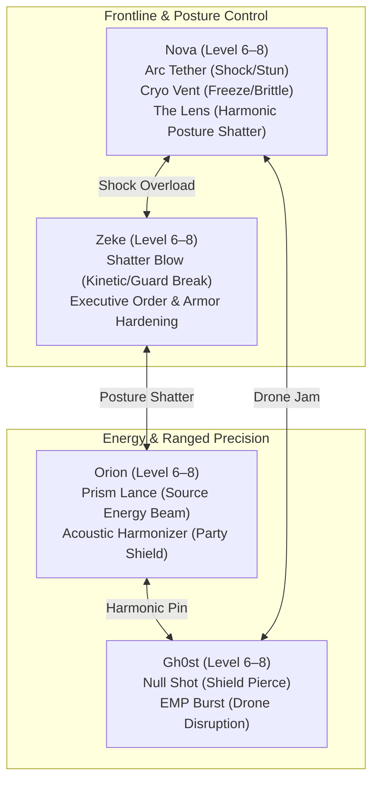

# World 3 Developer & Playtester Field Guide
**The Spire: Lower City, Upper City, The Archive & The Grand Heist**  
*Target Release:* `v1.3.74+ (versionCode 158+)`  
*Scope:* 100% Completionist Audit (Quests, Exploration, Lore, Audio/Visuals, Economy & Combat)

---

## 1. Executive Playtest Overview

This field guide is an authoritative 100% completionist walkthrough and adversarial QA verification checklist for **World 3: The Spire**. It tracks the narrative journey from the emergency sewer landing beneath the sprawling vertical metropolis, through assembling a high-stakes heist with Lower City fixers, infiltrating the gilded heights of the Upper City disguised as maintenance and executive guests, breaching the deep corporate Archive to liberate **The Lens** (Architect Echo #3), and fighting through rooftop lockdown against **The Administrator** to launch the *Astra* toward the Foundry.

Keep this document open on a secondary screen while running the game on a physical test device or emulator.

---

### Master Progression & Economy Benchmark Curve
Track your party status at each major milestone boundary. If your party levels, credits, or key items deviate substantially without deliberate testing deviations, log the anomaly in the Friction Log.

| Phase | Milestone Boundary | Target Level | Expected XP | Expected Credits | Active Party | Key Gear & Consumables |
| :--- | :--- | :---: | :---: | :---: | :--- | :--- |
| **Start** | Sewer Landing beneath Spire | **5–6** | ~2,850 | 1,400–1,800 | Nova, Zeke, Orion, Gh0st | Phase-Cutter, Bridge Echo, Source Resin Mod, Rapid Capacitor, 3x Medkit I |
| **Phase 1** | The Static Reached & Shielded | **6** | ~3,300 | 1,700–2,100 | Full Squad | Neon Sign Core, 2x Beast Meat, 2x Herb, Comet Gummies |
| **Phase 2** | The Heist Assembled (Lower City) | **6–7** | ~4,000 | 2,200–2,800 | Full Squad | Freight Badges, Disguise Linens, Wayfarer's Plectrum, Cheno's Carabiner, Meeko's Mafia Jack |
| **Phase 3** | Upper City Breached & Skypark Audited | **7** | ~4,700 | 2,900–3,500 | Full Squad | Skypark Guest Access, Mimi's Jazz Bloom, Robert's Buffer Core, Encrypted Ledger |
| **Phase 4** | Chrono-Flux Solved & The Lens Claimed | **7–8** | ~5,500 | 3,600–4,200 | Full Squad | **The Lens** (`the_lens`), SysAdmin Keycard, Restored Spire Infiltrator Core |
| **Phase 5** | The Administrator Defeated & Liftoff | **8** | ~6,200+ | 4,200–5,000+ | Full Squad | Overclocked Lens Mod, Power Cells x4, Full Consumable Stacks |

---

### Critical Points of No Return

> [!WARNING] **Point of No Return #1 (The Planning Table Commitment):**  
> Committing the heist plan at the planning table inside Zeke's safehouse (`spire_the_static`) locks in your crew assignments and triggers the transition into `hub_6_upper_city` via the Laundry Service chute. Complete all Lower City side quests (`w3_sq11`, `w3_sq13`), investigate the Old Subway Car (`spire_old_subway_car`), visit Cheno's Rigging Deck (`spire_rigging_deck`), and explore Jason's Hidden Studio (`spire_hidden_studio`) before launching the heist!

> [!WARNING] **Point of No Return #2 (Taking The Lens in the Archive Vault):**  
> Extracting **The Lens** (`the_lens`) from the containment field inside `spire_archive_vault` trips the Spire's master security grid, transitions Upper City into full red-alert lockdown, and permanently spawns hostile patrols (Aero Drones, Corporate Assassins). Finish your Skypark stroll, the Exec Lounge ledger theft (`w3_sq14`), and the Drone Test Alcove weapon trial (`w3_sq15`) before unsealing the relic!

> [!CAUTION] **Point of No Return #3 (Astra Liftoff to World 4):**  
> Defeating **The Administrator** on the Landing Pad Roof (`spire_landing_pad_roof`) and scanning the Shield Gap activates `w3_mq15_launch`. The *Astra* punches through the planetary shield into orbit toward **World 4: The Foundry** (`hub_7_slag_pits`). All uncompleted Spire side quests will be permanently locked out!

---

### ⚡ Playtest OP Mode & Instant Victory Verification Tools
The Combat Stage Backdrop features on-screen playtest controls to accelerate QA runs:
- `[ ⚡ OP ]` / `[ ⚡ OP: ON ]`: **Real-Time OP Mode Toggle**. Instantly grants the party invulnerability, sets outgoing basic and skill damage to 9,999, guarantees critical hits, bypasses ability cooldowns, and shatters enemy guard barriers on first touch.
  - *Usage Guideline:* Use OP Mode when testing exploration flow, dialogue tree continuity, and room transitions to bypass routine trash encounters in seconds.
  - *Balancing Guideline:* **Disable OP Mode** during designated combat audit checkpoints (e.g., Corporate Assassin in `spire_archive_vault` and the climax boss encounter against **The Administrator** on the Landing Pad Roof) to assess true ATB pace, summon control, and guard break balance.
- `[ 💥 Win ]`: **Insta-Win Kill Switch**. Immediately wipes all active enemy combatants and triggers the victory fanfare and rewards screen. Perfect for clearing test encounters without waiting for animation frames.

---

## 2. Recommended Party Progression, Skills & Tuning

### Party Roles in The Spire


- **Nova (Tactical Vanguard):** Central disruptor. Shock damage from `nova_arc_tether` is exceptionally potent in World 3 because every Dominion machine (Aero Drone, Sentinel Mk. I, Heavy Mech, and The Administrator) possesses a **-30% to -50% Shock vulnerability**. Once **The Lens** is acquired in Phase 4, Nova gains active harmonic scanning, revealing posture vulnerabilities and shield gaps.
- **Zeke (Kinetic Striker & Former Bureaucrat):** High emotional stakes in World 3. Zeke knows the Spire's corporate codes and security protocols. In combat, `zeke_shatter_blow` breaks heavy mech stabilizers and strips guard layers from Corporate Assassins.
- **Orion (Source Harmonizer):** Counters high-speed corporate evasion using `orion_prism_lance` to deal unblockable energy damage.
- **Gh0st (Covert Sniper):** Uses `ghost_null_shot` to punch directly through Sentinel and Administrator energy barriers, bypassing overshields.

---

## 3. Phase 1: Infiltration & The Lower City (Hub 5: Lower City)

### Phase 1 Objective Summary
- Land the *Astra* safely inside the subterranean drainage basin beneath the Spire (`spire_sewers_landing`).
- Fight through toxic run-off tunnels and clear hostile Sewer Crawlers (`w3_mq11`).
- Ascend via the Vent Output conduit into The Static block.
- Locate Zeke's old Lower City safehouse apartment (`spire_the_static`).
- Have Orion tune acoustic dampeners to shield the apartment from Dominion surveillance sweeps.
- Meet Jax at The Static bar counter, learn curfew timing, and establish the base of operations.

---

### Phase 1 Verification Matrix

| Room & ID | Actions & Interactions | Expected Engine State & Rewards | Visual, Audio & UX Checks |
| :--- | :--- | :--- :--- | :--- |
| **Sewer Landing**<br>`spire_sewers_landing` | 1. Disembark from the *Astra*<br>2. Inspect `sludge sluice`<br>3. ⚠️ **Combat: Sewer Crawler** | `w3_mq11` begins.<br>Combat victory.<br>Loot: **Wiring Bundle x1**, 80 XP. | • Toxic green sewer water shader.<br>• Distant hum of Spire atmospheric scrubbers.<br>• Verify Astra is anchored cleanly in background. |
| **Sewer Runoff**<br>`spire_sewer_runoff` | Inspect `deep runoff channel`.<br>Optional: Fish in the toxic run-off (`fish_spire_runoff`). | Catch: **Sludge Pike**, **Glow-Eel**.<br>Requires tuned fishing lure. | • Water surface ripple and reflection caustic overlays.<br>• Fishing tension bar responsiveness. |
| **Filter Grate**<br>`spire_filter_grate` | 1. ⚠️ **Combat: Sewer Crawler x2**<br>2. Action `inspect filter grate` | Grate unlatched.<br>Opens path east to Vent Output. | • Clanking metal latch audio effect.<br>• Acid spit telegraph clarity. |
| **Pump Gallery**<br>`spire_sewers_scale_01` | Inspect `pressure map` & `pump controls`. | Reveals maintenance bypasses for Hub 5. | • Hydraulic pump rhythmic thumping soundscape. |
| **Filter Sluice**<br>`spire_sewers_scale_02` | Action `retrieve caught badge` | Stash looted: **Old Dominion Badge x1**. | • Subtle shimmer indicator on submerged item. |
| **Ratline Nook**<br>`spire_sewers_scale_03` | Loot `maintenance locker` (`w3_loot_sewer_locker`) | Loot: **Scrap Metal x3**, **Medkit I x1**. | • Locker door squeak sfx. |
| **Vent Output**<br>`spire_vent_output` | Action `climb ventilation ladder` | Advances **`w3_mq11`**.<br>Exits sewers into Lower City streets. | • Ambient wind roar transitioning to city neon buzz. |
| **Condensate Run**<br>`spire_vent_output_scale_01` | Inspect `condensate run` & `scan drip`. | Ambient industrial moisture lore. | • Water droplet impact audio ticks. |
| **Maintenance Crawl**<br>`spire_vent_output_scale_02` | Inspect `old stencil` | Reads: *"BROADCAST TRUTH — CH. 440"*. | • Faded graffiti stencil decal contrast check. |
| **Rain Grate Overlook**<br>`spire_vent_output_scale_03` | Loot `smuggler stash` | Loot: **Credits x150**, **Comet Gummies x2**. | • Overlook panorama of neon city towers in rain. |
| **The Static**<br>`spire_the_static` | 1. Talk to **Jax** behind the bar<br>2. Action `examine neon sign` (`w3_sq11`)<br>3. Walk to Zeke's Apartment | `w3_mq11` advances.<br>`w3_sq11` (Neon Fix) offered.<br>Zeke safehouse discovered. | • Neon bar interior lighting with warm amber accents.<br>• Lo-fi synth radio track playing softly. |
| **Zeke's Apartment**<br>`spire_back_room` | 1. Action `establish shield` (Orion)<br>2. Inspect `workstation`<br>3. Inspect `planning table` | Completes **`w3_mq11`** (**300 XP**).<br>Unlocks **`w3_mq12`** (The Plan).<br>Apartment shielded (`ms_w3_safehouse_shielded`). | • Acoustic shield activation shimmer VFX.<br>• Quest complete banner animation. |

---

## 4. Phase 2: Assembling The Heist (Hub 5: Lower City)

### Phase 2 Objective Summary
- Talk to Jax at The Static to obtain patrol schedules and curfew times (`w3_mq12`).
- Case the Lower City: study the Underrail map in Transit Plaza (`spire_transit_plaza`).
- Interrogate/inspect the Security Kiosk for guard rotation logs (`spire_security_kiosk`).
- Copy freight badge patterns at the Elevator Service Gate (`spire_elevator_service_gate`).
- Source disguise linens from safehouse rooftop laundry lines (`spire_rooftop`).
- Return to Zeke's Apartment workstation to assemble the service route blueprints.
- Meet at the Planning Table to commit the squad and launch the heist!

---

### Phase 2 Verification Matrix

| Room & ID | Actions & Interactions | Expected Engine State & Rewards | Visual, Audio & UX Checks |
| :--- | :--- | :--- :--- | :--- |
| **The Static Alley**<br>`spire_alley` | ⚠️ **Combat: Sentinel Mk. I** | Sentinel defeated.<br>Loot: **Neon Sign Core** (Drops 100% if `w3_sq11` active!), **Battery x1**. | • Drone hover thruster hum.<br>• Shock vulnerability visual feedback. |
| **Old Subway Car**<br>`spire_old_subway_car`<br>*pos: [3, 1]* | 1. Talk to **Chris** & **Andrew**<br>2. Inspect `tour poster`<br>3. Action `tune acoustic broadcast` | **Personal Easter Egg Quest**.<br>Rewards: **Wayfarer's Resonance Plectrum** (+5 Focus, +3 Agility, +2 Vitality), **250 XP**! | • Warm acoustic guitar & tube amp audio bed.<br>• Authentic band history dialogue. |
| **Bridgman Rigging Deck**<br>`spire_rigging_deck`<br>*pos: [4, 1]* | 1. Talk to **Cheno**<br>2. Inspect `framed family holopic`<br>3. Action `turn in heavy gear & wiring` | **Personal Easter Egg Favor**.<br>Rewards: **Cheno's Heavy Carabiner** (+4 Def, +4 Stb, +2 Vit), **Credits x300**, **250 XP**! | • Hydraulic winch soundscape and crane cables.<br>• Emotional dialogue on Angela, Raegan, & Brody. |
| **Secret Signal Workshop**<br>`spire_hidden_studio`<br>*pos: [5, 1]* | 1. Talk to **Jason**<br>2. Talk to **Meeko** (`feline_meeko`)<br>3. Inspect `galaxy terminal`<br>4. Inspect `tube amplifier roost` | **Personal Easter Egg Workshop**.<br>Rewards: **The Builder's Harmonic Resonator** & **Meeko's Gold-Plated Audio Jack** (+5 Stb, +4 Def, +3 Vit)! | • CRT phosphor glow and glowing vacuum tubes.<br>• Meeko executive producer idle purr. |
| **Night Market**<br>`spire_night_market` | 1. Talk to **Mika** (`w3_sq13`)<br>2. Visit **Noodle Row** (`spire_noodle_row`)<br>3. Rest at cookfire | `w3_sq13` begins.<br>Noodle vendor **Ren** sells Hot Broth.<br>Rest restores 100% party HP. | • Sizzling wok audio and neon lantern glow.<br>• Ambient crowd murmurs. |
| **Lantern Roof**<br>`spire_night_market_scale_01` | Action `reroute sign power` (`w3_sq13`) | Advances `w3_sq13`.<br>Relights the Night Market lanterns. | • Circuit breaker spark and overhead light string power-on animation. |
| **Spice Alley**<br>`spire_night_market_scale_02` | Action `trade spices for supplies` | Trade: 1x Herb -> **Spicy Chili Paste x2**. | • Spice merchant market stalls. |
| **Rain Cache**<br>`spire_night_market_scale_03` | Unlock `black market safe` | Loot: **Film 05: The Black City** (`vhs_tape_05`), **Credits x250**. | • Great Frontier VHS discovery popup! |
| **Transit Plaza**<br>`spire_transit_plaza` | Inspect `elevator controls` & `patrol schedules` | `w3_mq12` intel gathered.<br>Elevator leads to Upper City. | • Massive transit board arrival/departure chime. |
| **Security Kiosk**<br>`spire_security_kiosk` | Action `pull case records` (`w3_mq12` / `w3_sq12`) | Security records downloaded.<br>Advances `w3_mq12` & `w3_sq12`. | • Terminal typing sfx and green text scroll. |
| **Elevator Service Gate**<br>`spire_elevator_service_gate` | Action `copy freight badges` (`w3_mq12`) | Freight badge encryption copied.<br>Advances `w3_mq12`. | • Holographic scanner copying beep. |
| **Safehouse Roof**<br>`spire_rooftop` | Action `gather disguise linens` (`w3_mq12`) | Disguise materials collected.<br>All 6 intel tasks completed! | • Rain whipping across clotheslines. |
| **Planning Table**<br>`spire_the_static` | Action `Commit to the Heist` | Completes **`w3_mq12`** (**400 XP**).<br>Launches **`w3_mq13`** (Social Engineering).<br>Transitions to Upper City! | • Dramatic heist commitment musical stinger.<br>• Full party approval dialogue. |

---

## 5. Phase 3: Breaching The Upper City (Hub 6: Upper City)

### Phase 3 Objective Summary
- Disguised in freshly pressed utility uniforms, emerge through the Laundry Service chute into `hub_6_upper_city` (`spire_laundry_service`).
- Navigate past automated uniform sorters, disable laundry sensors, and bypass the Staff Checkpoint (`w3_mq13`).
- Enter the Skypark Dome: pass through the Guest Registry and blend into high society without alerting executive security.
- Meet Evelyn (Jazz Botanist) tending jazz-tuned orchids and Robert (Industrial Mop Mogul) practicing mime choreography.
- Infiltrate the Exec Lounge: copy concierge credentials from the mirror and extract the encrypted ledger (`w3_sq14`).

---

### Phase 3 Verification Matrix

| Room & ID | Actions & Interactions | Expected Engine State & Rewards | Visual, Audio & UX Checks |
| :--- | :--- | :--- | :--- |
| **Laundry Service**<br>`spire_laundry_service` | 1. Emerge from chute<br>2. Action `disable sensors` (Zeke & Orion) | Sensory grid blinded.<br>Advances **`w3_mq13`**. | • High-pressure steam bursts & rhythmic pressing irons.<br>• Audio dampener activation sfx. |
| **Uniform Sorting**<br>`spire_uniform_sorting` | 1. Inspect `uniform racks`<br>2. Inspect `erased memorial name` (`w3_sq12`) | Case #8841-E recovered for Gh0st's cold case (`w3_sq12`). | • Conveyor belt clicking loops.<br>• Text clarity on small mobile displays. |
| **Service Lift**<br>`spire_service_lift` | Action `override lift panel` | Opens express lift to Skypark Dome. | • Heavy industrial elevator ascending rumble. |
| **Staff Checkpoint**<br>`spire_staff_checkpoint` | Action `scan freight badge` | Staff checkpoint cleared in disguise. | • Green badge confirmation chime. |
| **Skypark Dome**<br>`spire_skypark_dome` | 1. Action `blend in at registry`<br>2. Talk to **Evelyn** (`botanist_evelyn`)<br>3. Talk to **Robert** (`entrepreneur_robert`) | Completes **`w3_mq13`** (**350 XP**).<br>Starts **`w3_mq14`** (The Lens).<br>Awards: **Mimi's Jazz Bloom** & **Robert's Buffer Core**! | • Opulent glass dome with cascading waterfalls and flowers.<br>• Bebop jazz music drifting from magnetic speakers. |
| **Orchid Walk**<br>`spire_skypark_scale_01` | Inspect `hydroponic mist nozzle` | Lore on climate-controlled luxury flora. | • Fine mist particle effects. |
| **Registry Pavilion**<br>`spire_skypark_scale_02` | Action `Rest at Pavilion` | **Party Restored to 100% HP**.<br>Reward: **Painkillers x1**. | • Soft harp strings resting music bed. |
| **Glass Lawn**<br>`spire_skypark_scale_03` | Loot `botanical vault` | Loot: **Herb x3**, **Credits x200**. | • Vault opening animation. |
| **Exec Lounge**<br>`spire_exec_lounge_bar` | 1. Action `copy credential from mirror`<br>2. Action `open private safe` (`w3_sq14`)<br>3. Play **VIP Vector Arcade** | Encrypted Ledger recovered (`encrypted_ledger`).<br>Completes **`w3_sq14`** (**250 XP**).<br>Unlocks **Spire Infiltrator** minigame! | • Gilded velvet booths & clinking champagne flutes.<br>• Vector wireframe arcade screen glow. |
| **Ledger Office**<br>`spire_exec_lounge_scale_04` | Inspect `executive desk` | Documents on Director Thorne's secret mining quotas. | • Holographic desk terminal. |
| **Private Booth**<br>`spire_exec_lounge_scale_02` | ⚠️ **Combat: Sentinel Mk. I** | Sentinel neutralized before alarm triggers. | • Suppressed combat audio in luxury lounge. |
| **Skyline VIP Salon**<br>`spire_skyline_vip_suite` | 1. East from Donor Gallery<br>2. Inspect `crime-scene barrier`<br>3. Inspect `dispenser log`<br>4. Inspect `security terminal`<br>5. Interrogate 4 suspects | Initiates **`w3_sq16`** (Murder in the Skyline Salon).<br>Gathers dispenser and timestamp clues.<br>Exposes Vance's lie. | • Velvet stanchions & emergency flashing strobes.<br>• Four stranded suspects around locked salon. |
| **Syndicate Booth**<br>`spire_vip_private_booth` | 1. North from VIP Salon<br>2. Inspect `crystal glass`<br>3. Inspect `executive comms rig`<br>4. Inspect `auditor's datapad` | Chemical analysis: Cyano-Coolant 9.<br>Rig shows missing coolant core.<br>Datapad reveals Vance's embezzlement motive. | • Dead auditor slumped over crystal glass.<br>• High-tension noir detective background cue. |
| **Vance Confrontation**<br>`director_vance` | 1. Select dialogue option confronting Vance with timestamp and coolant clues<br>2. Extract confession | Completes **`w3_sq16`** (**450 XP**).<br>Rewards: **Cyano-Coolant Injector** & **Skyline Master Passkey**!<br>Lockdown lifted. | • Dramatic vocal breakdown from arrogant director.<br>• Quest complete fanfare & ambient sirens cease. |

---

## 6. Phase 4: The Archive Heist & The Lens (Hub 6: Upper City)

### Phase 4 Objective Summary
- Move from the Skypark across the service catwalks into the high-security Archive sector.
- Solve the Chrono-Flux tuning puzzle in the Prism Gallery (`spire_prism_gallery`) to align the optical shutters.
- Infiltrate the Archive Vault (`spire_archive_vault`).
- Overcome the stealth ambush by the **Corporate Assassin**.
- Deactivate the containment field and extract **The Lens** (`the_lens`).
- Trigger sector-wide lockdown alarm and fight through the Drone Test Alcove!

---

### Phase 4 Verification Matrix

| Room & ID | Actions & Interactions | Expected Engine State & Rewards | Visual, Audio & UX Checks |
| :--- | :--- | :--- | :--- |
| **Prism Gallery**<br>`spire_prism_gallery` | 1. Inspect `prism shutters`<br>2. Action `Synchronize Chrono Coils` | Launches **Chrono-Flux Tuning Puzzle**!<br>Alignment solved.<br>Opens Archive Vault door. | • Optical laser refraction prisms and blue crystal lenses.<br>• Frequency hum shifts pitch during slider calibration. |
| **Catalog Atrium**<br>`spire_archive_scale_01` | Inspect `index terminal` | Archive database on Architect artifacts. | • Monumental library holo-stacks. |
| **Prism Service Bay**<br>`spire_archive_scale_02` | Loot `lens polishing cloth` | Loot: **Focusing Lens x1**, **Scrap Metal x2**. | • Component discovery sound. |
| **Alarm Spine**<br>`spire_archive_scale_03` | Inspect `red conduits` | Note dormant security cables. | • Pulsing warning circuit lighting. |
| **Archive Vault**<br>`spire_archive_vault` | 1. ⚠️ **Combat: Corporate Assassin**<br>2. Inspect `containment field`<br>3. Action `Claim The Lens` | Boss combat victory.<br>**The Lens** recovered (`the_lens`)!<br>Completes **`w3_mq14`** (**500 XP**).<br>Starts **`w3_mq15`** (Burn Notice).<br>Full lockdown triggers! | • Assassin smoke step and stealth lunge telegraphs.<br>• Dramatic blinding flash when The Lens connects to Nova.<br>• Klaxon sirens and red emergency strobe lighting. |
| **Drone Test Alcove**<br>`spire_drone_test_alcove` | 1. ⚠️ **Combat: Aero Drone x2**<br>2. Action `scan prototype targeting` (`w3_sq15`)<br>3. Action `test weapon on drones`<br>4. Action `scrub telemetry` | Completes **`w3_sq15`** (**250 XP**).<br>Rewards: **SysAdmin Keycard**, **Power Cell x1**.<br>Opens path to rooftop landing pad! | • Flying drones launching from wall racks.<br>• EMP weapon discharge VFX. |

---

### The Prism Gallery Chrono-Flux Puzzle (Exact Solution)
Interact with the Chrono-Flux console in `spire_prism_gallery`:

```
[Slider 1] Damping Ratio (damping)    : Set to 45%     (Target: 45 | Tolerance: ±4)
[Slider 2] Harmonic Pitch (pitch)     : Set to 108 Hz   (Target: 108 | Tolerance: ±3)
[Slider 3] Phase Dilation (dilation)  : Set to 240 ms   (Target: 240 | Tolerance: ±6)
```
*Result:* The optical shutters lock in phase, the containment laser beams refract through the prism array, and the massive vault door slides open with an authoritative pneumatic hiss.

---

## 7. Phase 5: Climax, The Administrator & Liftoff (Hub 6: Upper City)

### Phase 5 Objective Summary
- Ascend from the Drone Test Alcove to the exterior Landing Pad Roof (`spire_landing_pad_roof`).
- Engage the Spire's apex machine authority: **The Administrator** supported by an Aero Drone and Heavy Mech.
- Exploit Shock vulnerabilities and The Lens's harmonic scanning to break the Administrator's shield lattice.
- Scan the planetary defense shield to identify the frequency launch window (`w3_mq15`).
- Board the *Astra*, disengage clamps, and launch through the shield gap toward **World 4: The Foundry**!

---

### Phase 5 Verification Matrix

| Room & ID | Actions & Interactions | Expected Engine State & Rewards | Visual, Audio & UX Checks |
| :--- | :--- | :--- | :--- |
| **Fuel Bridge**<br>`spire_landing_pad_scale_01` | ⚠️ **Combat: Aero Drone** | Drone destroyed.<br>Path cleared onto the gantry. | • High wind shear audio bed and rain streaks. |
| **Shield Sightline**<br>`spire_landing_pad_scale_02` | Inspect `shield gap shimmer` | Visual telegraph of shield pulse frequency. | • Massive sky-spanning shield hexagon grid shimmer. |
| **Drone Wreck Roof**<br>`spire_landing_pad_scale_03` | ⚠️ **Combat: Corporate Assassin** | Assassin neutralized.<br>Loot: **Medkit x1**, **Battery Pack x1**. | • Rooftop puddles reflecting lightning and neon signs. |
| **Boarding Causeway**<br>`spire_landing_pad_scale_04` | Inspect `avionics crate` | Loot: **Power Cell x2**, **Credits x300**. | • Crate hatch open animation. |
| **Landing Pad Roof**<br>`spire_landing_pad_roof` | 1. ⚠️ **CLIMAX BOSS BATTLE: The Administrator**<br>   *(supported by Aero Drone & Heavy Mech)*<br>2. Action `Scan Shield Gap` (The Lens)<br>3. Action `Launch Astra to Foundry` | **The Administrator Defeated**!<br>Rewards: **400 XP**, **300 Credits**, **2 AP**, **Power Cell x2**.<br>Shield gap identified.<br>Completes **`w3_mq15`** (**600 XP**).<br>**World 3 Cleared**! Warps to World 4. | • Climax boss battle orchestral track.<br>• Administrator laser lattice telegraph grid.<br>• Cinematic Astra liftoff cutscene into outer atmosphere! |

---

## 8. Complete Side Quests & Personal Easter Eggs Guide

### Side Quest 11: Neon Fix
- **Quest Giver:** Jax behind the bar at The Static (`spire_the_static`).
- **Objective:** Repair the buzzing, broken neon sign outside the bar to stop attracting Dominion security patrols.
- **Walkthrough:**
  1. Inspect the flickering sign outside in `spire_alley`.
  2. Defeat the patrolling **Sentinel Mk. I** in the alley to recover the **Neon Sign Core** (`neon_sign_core`).
  3. Install the replacement core into the sign housing.
- **Rewards:** **Credits x200**, **150 XP**, **Neon Band** (Accessory: +4 Focus, +5% Crit Rate).

### Side Quest 12: Cold Case
- **Quest Giver:** Gh0st (triggered upon examining the case files at `spire_security_kiosk`).
- **Objective:** Investigate what happened to Gh0st's sister Elara when she was disappeared by Spire security.
- **Walkthrough:**
  1. In `spire_uniform_sorting`, inspect the erased memorial name to recover Case #8841-E.
  2. Use the terminal at `spire_security_kiosk` to query Case #8841-E.
  3. Discover that Elara was transferred off-world to the Deep Ring anchor chamber.
- **Rewards:** **250 XP**, unlocks Gh0st's companion trust dialogue and reveals World 5 lore.

### Side Quest 13: Night Market Run
- **Quest Giver:** Mika in `spire_night_market`.
- **Objective:** Relight the market's festive string lanterns after a corporate power theft.
- **Walkthrough:**
  1. Ascend to `spire_night_market_scale_01` (Lantern Roof).
  2. Overload the corporate executive advertisement feed and splice power into the market grid.
  3. Return to Mika as the market lights up in brilliant red, gold, and turquoise.
- **Rewards:** **Credits x250**, **150 XP**, **Comet Gummies x3**, unlocks Ren's secret noodle recipes.

### Side Quest 14: Corporate Espionage
- **Quest Giver:** Discovered via the concierge mirror in `spire_exec_lounge_bar`.
- **Objective:** Steal an encrypted executive ledger containing evidence of illegal labor quotas and off-world bribes.
- **Walkthrough:**
  1. Examine the concierge credential mirror in the Exec Lounge to copy the master security key.
  2. Access the private safe in `spire_exec_lounge_bar`.
  3. Extract the **Encrypted Ledger** (`encrypted_ledger`).
  4. Choose whether to leak it to Lower City activists or blackmail the Administrator.
- **Rewards:** **Credits x350**, **250 XP**, **Cyber Visor** (+10% Crit Chance).

### Side Quest 15: Prototype Testing
- **Quest Giver:** Automated console in `spire_drone_test_alcove`.
- **Objective:** Test an experimental energy disruptor weapon on live target drones.
- **Walkthrough:**
  1. Scan the prototype's hidden targeting bias at `spire_drone_test_alcove`.
  2. Activate the combat simulation and destroy 2 waves of Aero Drones.
  3. Scrub Nova's biometric signature from the telemetry log.
- **Rewards:** **Power Cell x2**, **250 XP**, **SysAdmin Keycard**.

---

### Master Personal Easter Eggs Guide (World 3)

#### 1. The Wayfarer Acoustic Broadcast & Chris & Andrew
- **Location:** Old Subway Car (`spire_old_subway_car`) at coordinates `pos: [3, 1]`.
- **Characters:** **Chris** (`musician_chris`) and **Andrew** (`musician_andrew`).
- **Narrative Subtext:** Sincere side quest honoring Jason's youth band (*No Charge / The Wayfarer*). Chris (bass) and Andrew (lead guitar) share memories of late-night tours, carrying amps through snowstorms, and tuning frequencies.
- **Reward:** **Wayfarer's Resonance Plectrum** (`wayfarer_plectrum`: +5 Focus, +3 Agility, +2 Vitality).

#### 2. Chief Contractor Cheno & Bridgman Rigging Deck
- **Location:** Bridgman Rigging Deck (`spire_rigging_deck`) at `pos: [4, 1]`.
- **Character:** **Contractor Cheno** (`contractor_cheno`).
- **Inspectables:**
  - `rigging schematic`: Load blueprints marked with Cheno's red grease pencil note: *"HOLD FAST."*
  - `cider mug`: Smelling of spiced autumn cider (a nod to his wife Angela).
  - `framed family holopic`: Cheno smiling beside his wife Angela, daughter Raegan striking a dance pose singing *"hee-hee"*, and varsity football player son Brody.
- **Favor Turn-In:** Handing over 2x Heavy Gear and 2x Wiring Bundle reinforces the center truss.
- **Reward:** **Cheno's Heavy Carabiner** (`cheno_carabiner`: +4 Defense, +4 Stability, +2 Vitality).

#### 3. Jason's Secret Signal Workshop & Meeko the Mafioso Cat
- **Location:** Hidden Studio (`spire_hidden_studio`) at `pos: [5, 1]`, behind Bridgman Rigging Deck.
- **Characters:** **Creator Jason** (`creator_jason`) and **Meeko** (`feline_meeko`).
- **Inspectables:**
  - `galaxy terminal`: A CRT simulation displaying: *"Revision 2.0 — Keep the heart, polish the edges."*
  - `amplifier roost`: A 100W hand-wired vacuum tube guitar amplifier where Meeko perches as Studio Executive Producer.
- **Dialogue & Interaction:** Jason chuckles when asked what he is making (*"Which thing?"*). Meeko ignores baby talk, nods at respectful business peers, and sighs at soldering smoke.
- **Rewards:** **The Builder's Harmonic Resonator** & **Meeko's Gold-Plated Audio Jack** (`meekos_mafia_jack`: +5 Stability, +4 Defense, +3 Vitality).

#### 4. Evelyn (Mimi) & Robert in the Skypark Dome
- **Location:** Skypark Dome (`spire_skypark_dome`).
- **Characters:** **Evelyn** (`botanist_evelyn`) and **Robert** (`entrepreneur_robert`).
- **Interactions:**
  - Evelyn hums jazz riffs and tends blue-lipped orchids tuned to cool jazz frequencies, expressing love for grandsons Tyson and Ian. Awards **Mimi's Jazz Hummingbird Orchid** (`mimis_jazz_bloom`: +5 Vitality, +4 Focus, +3 Defense).
  - Robert demonstrates his custom industrial cleaning equipment with theatrical silent mime choreography. Awards **Robert's Gyroscopic Buffer Core** (`roberts_buffer_core`: +6 Stability, +4 Defense, +2 Agility).

---

## 9. Bestiary, Boss Mechanics & Enemy Strategy Guide

### Enemy Statistics Table

| Enemy | Tier | HP | Stability | Element | Weakness | Resistance | Primary Attacks | Key Drops |
| :--- | :--- | :---: | :---: | :---: | :---: | :---: | :--- | :--- |
| **Sewer Crawler** | Normal | 220 | 192 | Physical | Cryo / Shock | Physical +10% | Toxic Bite, Acid Splash | Wiring Bundle (30%) |
| **Sentinel Mk. I** | Elite | 200 | 130 | Shock | Physical (-10%) | Shock +30% | Arc Spark, Undermine | Neon Sign Core, Battery |
| **Aero Drone** | Standard | 120 | 80 | Shock | Physical (-10%) | Shock +30% | Stun Pulse, Evasive Maneuver | Power Cell, Wiring Bundle |
| **Corporate Assassin**| Elite | 260 | 100 | Physical | **Shock (-50%)** | Physical +10% | Critical Lunge, Smoke Step | Medkit, Battery Pack |
| **Heavy Mech** | Elite | 240 | 160 | Burn | **Shock (-30%)** | Burn +40%, Phys +20% | Flame Sweep, Guard Protocol | Scrap Metal, Power Cell |
| **The Administrator** | **Boss** | **420** | **220** | **Source** | **Shock (-50%)** | Source +30%, Phys +10%| Mandatory Happiness, Summon, Laser | Power Cell x2, 2 AP |

---

### Boss Guide: The Administrator (`administrator_boss`)

#### Encounter Dynamics
- **Location:** Landing Pad Roof (`spire_landing_pad_roof`).
- **Minions:** Enters combat accompanied by 1x **Aero Drone** (harrier/stunner) and 1x **Heavy Mech** (armored flamethrower tank).
- **Core Mechanics:**
  1. *Mandatory Happiness:* High-intensity psychic dampener that applies **Disorient** and delays party ATB bars. Counter by having Orion cast party shield and equipping high-focus accessories.
  2. *Laser Lattice:* A multi-target energy grid that charges over 1 full turn. Scan reveals safe coordinates—use Nova's guard break to interrupt the channel!
  3. *Drone Summon:* Re-summons Aero Drones if the field is cleared without breaking the Administrator's posture.

#### Optimal Battle Strategy
1. **Turn 1 (Drone Neutralization):** Immediately target the Aero Drone with physical kinetic strikes from Zeke to eliminate the threat of Stun Pulse.
2. **Turn 2 (Shock Overload on Heavy Mech):** Unleash Nova's `nova_arc_tether`. Heavy Mechs suffer -30% Shock resistance—the tether shatters its armor plates in two hits.
3. **Turn 3–4 (Administrator Shield Shatter):** The Administrator has a massive **-50% Shock vulnerability**. Nova's Arc Tether and Gh0st's EMP shots will melt its 220 stability gauge.
4. **Stagger Window (2 Broken Turns):** When broken, all attacks deal 200% critical damage. Chain Orion's `orion_prism_lance` and Zeke's `zeke_shatter_blow` to finish the fight!

---

## 10. Master Item, Weapon & Equipment Directory

### World 3 Unique Accessories & Relics

| Item ID | Item Name | Type | Rarity | Primary Stat Mods | Acquisition Source |
| :--- | :--- | :--- | :--- | :--- | :--- |
| `the_lens` | **The Lens** | Relic | Relic | Special: Revealing Harmonics | Main Quest `w3_mq14` (Archive Vault) |
| `cheno_carabiner` | **Cheno's Heavy Carabiner** | Accessory | Rare | +4 Def, +4 Stb, +2 Vit | Bridgman Rigging Deck favor quest |
| `wayfarer_plectrum` | **Wayfarer's Resonance Plectrum** | Accessory | Rare | +5 Foc, +3 Agi, +2 Vit | Old Subway Car acoustic quest |
| `meekos_mafia_jack` | **Meeko's Gold-Plated Audio Jack** | Accessory | Rare | +5 Stb, +4 Def, +3 Vit | Jason's Hidden Studio (Meeko) |
| `mimis_jazz_bloom` | **Mimi's Jazz Hummingbird Orchid** | Accessory | Rare | +5 Vit, +4 Foc, +3 Def | Skypark Dome (Evelyn) |
| `roberts_buffer_core`| **Robert's Gyroscopic Buffer Core** | Accessory | Rare | +6 Stb, +4 Def, +2 Agi | Skypark Dome (Robert) |
| `cyber_visor` | **ICE Breaker Cyber Visor** | Accessory | Rare | +10% Critical Hit Chance | Exec Lounge side quest `w3_sq14` |
| `cyano_coolant_injector`| **Cyano-Coolant Injector** | Accessory | Rare | +15 Freeze Dmg, +10% Stagger | Skyline VIP Murder Mystery `w3_sq16` |
| `skyline_master_passkey`| **Skyline Master Passkey** | Key Item | Epic | Unlocks Upper City Private Salons | Skyline VIP Murder Mystery `w3_sq16` |
| `neon_band` | **Neon Band** | Accessory | Uncommon | +4 Focus, +5% Crit Rate | Night Market side quest `w3_sq11` |
| `comet_gummies` | **Comet Gummies** | Snack | Uncommon | Heals 120 HP, +15% Speed (3 turns) | Night Market food stalls |
| `vhs_tape_05` | **Film 05: The Black City** | Key Item | Rare | Great Frontier screening media | Night Market rain cache safe |

---

## 11. Master NPC Directory & Dialogue Tree Reference

| NPC ID | Name | Voice Profile | Location | Key Dialogue Nodes |
| :--- | :--- | :--- | :--- | :--- |
| `contractor_cheno` | **Cheno** | male | `spire_rigging_deck` | `cheno_default_talk`, `cheno_who_reply`, `cheno_music_reply`, `cheno_friends_reply`, `cheno_family_reply`, `cheno_favor_offer`, `cheno_favor_turnin` |
| `musician_chris` | **Chris** | male | `spire_old_subway_car` | `chris_default_talk`, `chris_tour_reply`, `chris_music_reply`, `chris_cheno_reply`, `chris_tuning_offer`, `chris_tuning_turnin` |
| `musician_andrew` | **Andrew** | male | `spire_old_subway_car` | `andrew_default_talk`, `andrew_guitar_reply`, `andrew_warmth_reply` |
| `creator_jason` | **Jason** | male | `spire_hidden_studio` | `creator_jason_default_talk`, `jason_projects_reply`, `jason_meeko_reply` |
| `feline_meeko` | **Meeko** | none | `spire_hidden_studio` | `meeko_default_talk`, `meeko_inspect_reply` |
| `botanist_evelyn` | **Evelyn** | female | `spire_skypark_dome` | `evelyn_default_talk`, `evelyn_jazz_reply`, `evelyn_gardening_reply`, `evelyn_family_reply` |
| `entrepreneur_robert` | **Robert** | male | `spire_skypark_dome` | `robert_default_talk`, `robert_mime_reply`, `robert_mop_reply` |
| `noodle_cook_ren` | **Ren** | male | `spire_noodle_row` | `shop_noodle_row` (vendor interaction) |
| `bartender_dax` | **Dax** | male | `spire_skyline_vip_suite` | `dax_default_talk`, `dax_default_talk_2`, `dax_default_talk_3` |
| `director_vance` | **Director Vance**| male | `spire_skyline_vip_suite` | `director_vance_default_talk`, `vance_confession_1`, `vance_confession_2`, `vance_confession_3` |
| `dr_lyra` | **Dr. Lyra** | female | `spire_skyline_vip_suite` | `dr_lyra_default_talk` |
| `singer_selene` | **Selene** | female | `spire_skyline_vip_suite` | `singer_selene_default_talk` |

---

## 12. Adversarial Playtest QA Verification Checklist

Execute these validation checks during your manual playthrough:

- [ ] **Sewer Water Transition:** Entering `spire_sewers_landing` displays toxic green caustic water shader without clipping the *Astra* background art.
- [ ] **Acoustic Shielding Audio:** Activating Orion's safehouse shield in `spire_back_room` suppresses ambient city siren sound effects inside the room.
- [ ] **Personal Easter Egg Discovery:**
  - [ ] Moving east from `spire_rooftop` into `spire_old_subway_car` plays the acoustic guitar background track.
  - [ ] Moving east from `spire_old_subway_car` into `spire_rigging_deck` reveals Cheno and the family holopic inspectable.
  - [ ] Moving east from `spire_rigging_deck` into `spire_hidden_studio` reveals Jason, Meeko, and the CRT galaxy terminal.
  - [ ] Talking to Meeko displays dignified partner dialogue and grants `meekos_mafia_jack`.
- [ ] **Skyline VIP Murder Mystery (`w3_sq16`):**
  - [ ] Moving east from `spire_donor_gallery` enters `spire_skyline_vip_suite` at `pos: [4, 0]`.
  - [ ] Inspecting `dispenser log` confirms pure drink pour at 21:15.
  - [ ] Entering `spire_vip_private_booth` at `pos: [4, 1]` reveals Auditor Malick.
  - [ ] Inspecting `crystal glass`, `executive comms rig`, and `auditor's datapad` unlocks the confrontation branch.
  - [ ] Confronting Director Vance extracts the full confession, grants `cyano_coolant_injector`, `skyline_master_passkey`, and 450 XP, and completes `w3_sq16`.
- [ ] **Chrono-Flux Slider Alignment:** In `spire_prism_gallery`, setting sliders to 45 / 108 / 240 correctly unlatches the Archive Vault and persists across save/reload.
- [ ] **The Lens Acquisition Alarm:** Looting `the_lens` triggers immediate red-alert strobe overlay and transitions audio to high-tempo escape cue.
- [ ] **Administrator Boss Balance:** Without OP Mode, verify that Shock abilities deal +50% bonus damage and that staggering the boss lasts 2 full turns.
- [ ] **Liftoff Transition:** Triggering the Astra launch cleanly completes World 3, displays the chapter complete banner, and transitions the party into World 4 (`hub_7_slag_pits`).
