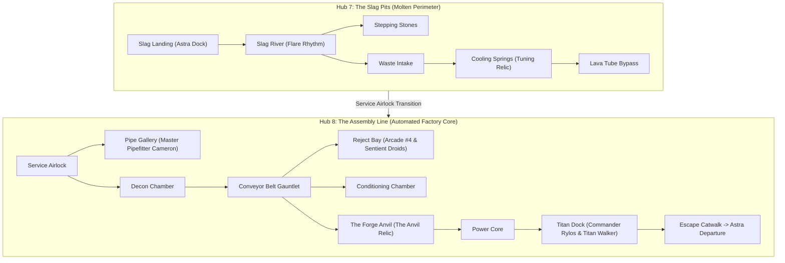
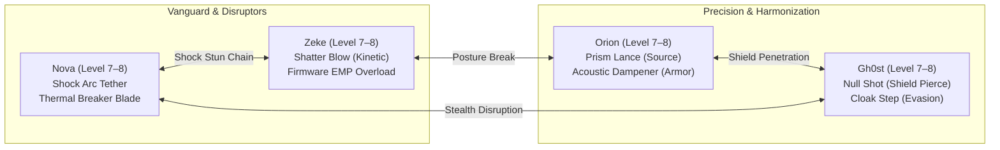
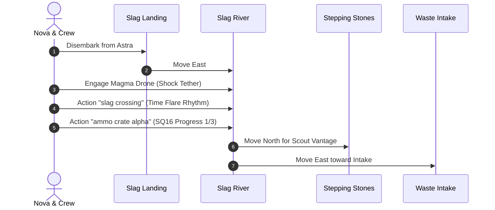
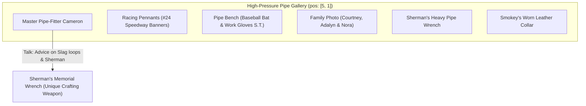
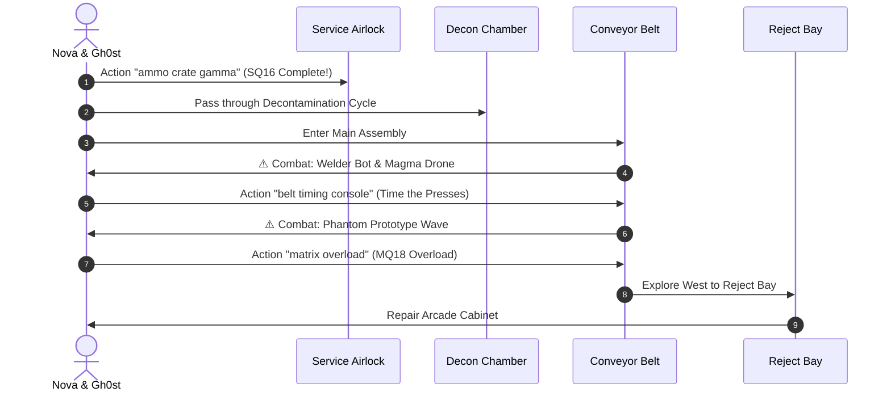
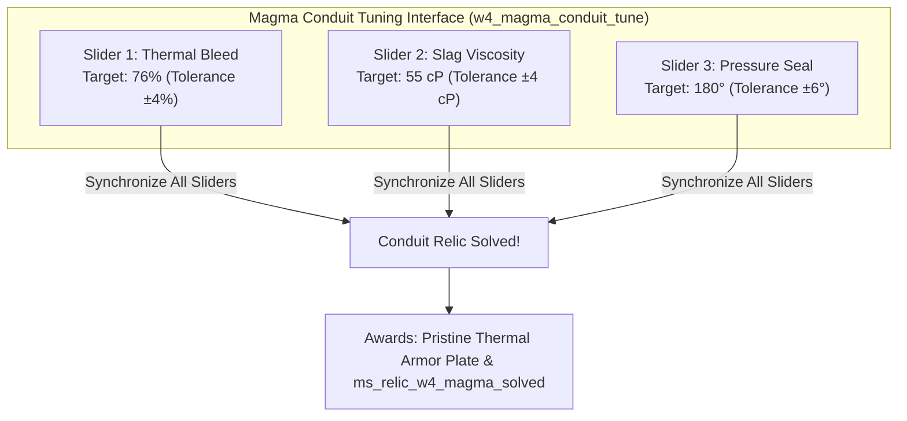
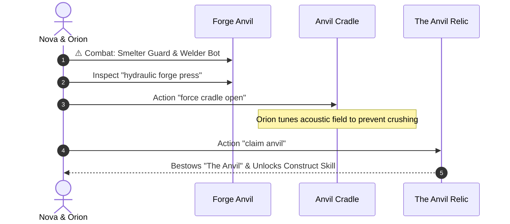
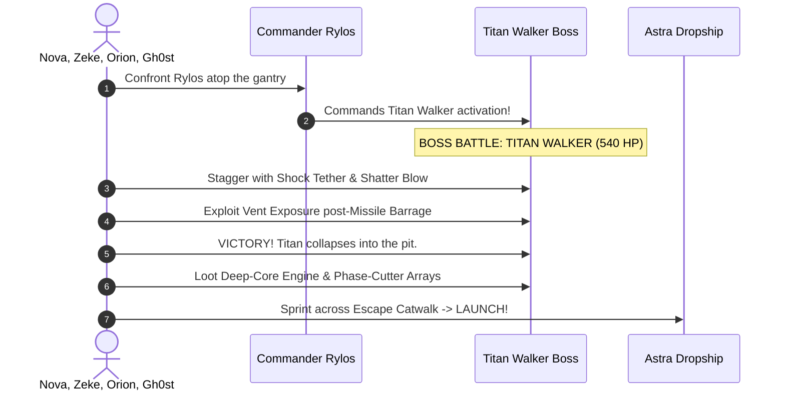
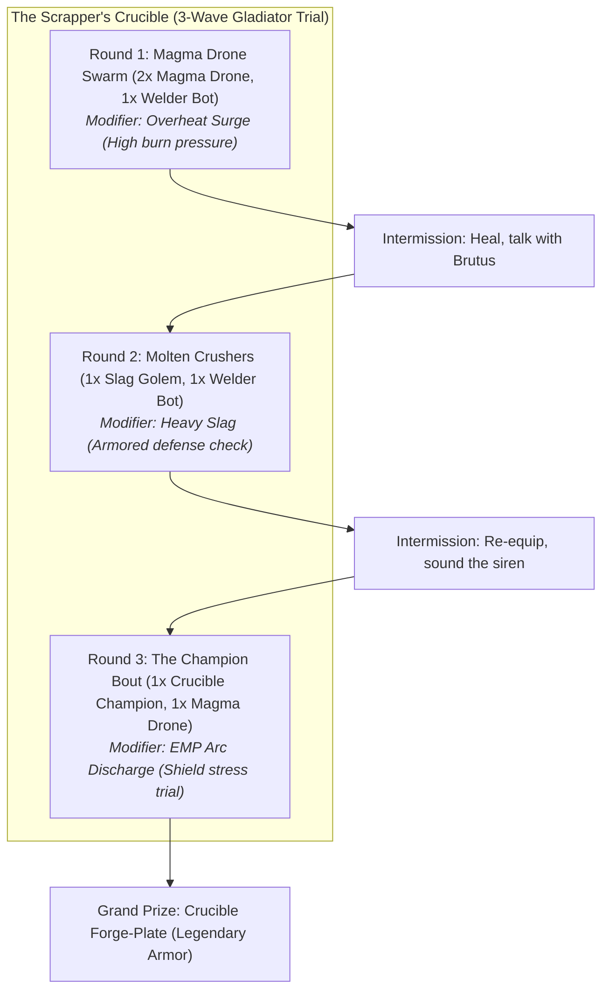
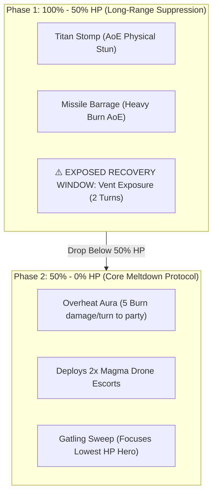

# Starborn: World 4 (The Foundry) 100% Completionist Walkthrough & Playtester Field Guide

> **Document Version:** 1.0.0 (Post-BurgQuest Golden Master Verification)  
> **Target World:** World 4 — The Foundry (*The Molten Machine*)  
> **Hubs Covered:** Hub 7 (Slag Pits) & Hub 8 (Assembly Line)  
> **Level Target:** Level 7 (Arrival) → Level 8+ (Titan Walker Victory)  
> **Estimated 100% Playtime:** 60–85 minutes  
> **Author:** Antigravity Playtest & Verification Directorate  

---

## Table of Contents
1. [Executive Summary & World Overview](#1-executive-summary--world-overview)
2. [Party Composition, Synergies & Tactical Loadout](#2-party-composition-synergies--tactical-loadout)
3. [Phase 1: Arrival & The Slag Pits (Hub 7: Slag Pits)](#3-phase-1-arrival--the-slag-pits-hub-7-slag-pits)
4. [Phase 2: Master Pipe-Fitter Cameron & The Pipe Gallery](#4-phase-2-master-pipe-fitter-cameron--the-pipe-gallery)
5. [Phase 3: The Assembly Line & Conveyor Gauntlet (Hub 8: Assembly Line)](#5-phase-3-the-assembly-line--conveyor-gauntlet-hub-8-assembly-line)
6. [Phase 4: The Cooling Springs & Harmonic Magma Conduit Puzzle](#6-phase-4-the-cooling-springs--harmonic-magma-conduit-puzzle)
7. [Phase 5: The Forge & Claiming The Anvil (MQ19)](#7-phase-5-the-forge--claiming-the-anvil-mq19)
8. [Phase 6: Titan Dock Showdown & Core Meltdown (MQ20)](#8-phase-6-titan-dock-showdown--core-meltdown-mq20)
9. [Side Quests Complete Compendium (SQ16–SQ20)](#9-side-quests-complete-compendium-sq16sq20)
10. [16-Bit JRPG Puzzle Blueprint & The Scrapper's Crucible](#10-16-bit-jrpg-puzzle-blueprint--the-scrappers-crucible)
11. [World 4 Bestiary & Enemy Stat Blocks](#11-world-4-bestiary--enemy-stat-blocks)
12. [Boss Masterclass: Titan Walker](#12-boss-masterclass-titan-walker)
13. [Master Loot, Crafting & Merchant Economy](#13-master-loot-crafting--merchant-economy)
14. [100% Playtest Verification Checklist & QA Edge Cases](#14-100-playtest-verification-checklist--qa-edge-cases)

---

## 1. Executive Summary & World Overview

The Foundry is the molten industrial heart of Dominion military production. Towering over subterranean magma rivers, this automated mega-factory smelts raw Source ore, manufactures Phantom prototype battleframes, and prepares the catastrophic Titan Walker.



### World 4 Core Thematic Hooks:
* **The Machine of War Printing Faces:** Gh0st confronts his origins as a prototype built to enforce corporate pacification.
* **Master Pipe-Fitter Cameron & Sherman Memorial:** Cameron keeps the pressurized steam and slag loops alive in honoring his grandfather Sherman and late pet Smokey.
* **Industrial Hazard Navigation:** Lava geysers, conveyor timing presses, rhythmic crusher hazards, and extreme heat penalties.
* **The Weakness Principle:** Almost all machinery in the Foundry is heavily vulnerable to **Shock (-20% to -50%)** and **Freeze/Coolant (-40%)**, while heavily resistant or immune to Burn.

---

## 2. Party Composition, Synergies & Tactical Loadout

Entering World 4 at **Level 7**, the full party of four operates as a coordinated industrial sabotage squad:



### Role Breakdown:
* **Nova (Tactical Shock & Plasma):** The primary vanguard. Her `nova_arc_tether` exploits the pervasive Shock vulnerabilities of Magma Drones, Welder Bots, Phantom Prototypes, and the Titan Walker. Equipping the newly crafted Thermal Shield dampens ambient slag damage.
* **Zeke (Kinetic Breaker):** Hits machines with `zeke_shatter_blow` to crack stability meters and stagger high-defense loaders like the Slag Golem and Flame Trooper.
* **Orion (Harmonic Support & Armor Buff):** Mitigates intense burn damage with `orion_harmonic_dampener`. His `orion_prism_lance` deals unblockable Source energy damage, ignoring heavy armor plates.
* **Gh0st (Stealth Sniper & Shield Piercer):** Uses `ghost_null_shot` to punch straight through high-tech force barriers. Crucial against Phantom Prototypes that attempt to cloak.

---

## 3. Phase 1: Arrival & The Slag Pits (Hub 7: Slag Pits)

### Phase 1 Objective Summary:
* Disembark safely at `foundry_slag_landing`.
* Navigate the treacherous basalt stepping stones across the molten lava river (`foundry_slag_river`).
* Time the Source flare rhythm to cross without taking heat damage (`w4_mq16`).
* Destroy the resistance-marked ammo crate alpha (`w4_sq16`).
* Clear the aggressive Magma Drones holding the crossing.



### Phase 1 Verification Table:
| Room & ID | Actions & Triggers | Expected Engine State & Rewards | Visual, Audio & UX Cues |
| :--- | :--- | :--- | :--- |
| **Slag Landing**<br>`foundry_slag_landing` | 1. Disembark Astra<br>2. Inspect `slag observation point` | Baseline state initialized.<br>Astra docked in background. | Orange atmospheric heat shimmer, heavy rhythmic forge pounding audio. |
| **Obsidian Overlook**<br>`foundry_obsidian_overlook` | Inspect `magma fall`<br>Inspect `thermal sensor` | Milestone `ms_w4_overlook_scouted` | Cascading molten rock particle shader. |
| **Slag River**<br>`foundry_slag_river` | 1. ⚠️ **Combat: Magma Drone**<br>2. Action `slag crossing`<br>3. Action `ammo crate alpha` | Victory (110 XP).<br>`ms_w4_slag_crossed` set.<br>`w4_sq16` stage 1 complete. | Searing hiss of lava, stone crumbling audio on crossing. |
| **Stepping Stones**<br>`foundry_slag_stepping_stones` | Action `flare rhythm` | Validates timing window.<br>Awards **Scrap Metal x2**. | Blue-white Source flare eruption VFX. |
| **Waste Intake**<br>`foundry_waste_intake` | 1. Action `ammo crate beta`<br>2. Action `intake brake` (`w4_sq18`)<br>3. ⚠️ **Combat: Slag Golem** | `w4_sq16` stage 2 complete.<br>`w4_sq18` intake halted.<br>Victory (220 XP, **Power Cell x1**). | Grinding industrial shredder gears stopping with a metallic jolt. |

---

## 4. Phase 2: Master Pipe-Fitter Cameron & The Pipe Gallery

Located off the Service Airlock decon chamber is the **High-Pressure Pipe Gallery** (`foundry_pipe_gallery` at `pos: [5, 1]`), where Cameron maintains the mega-conduits keeping the facility from exploding.



### Narrative & Easter Egg Integrations:
1. **Talk to Cameron:** Cameron explains that the Dominion views pipe-fitters as expendable grease, but his grandfather **Sherman** taught him that true craft outlasts tyrants.
2. **Inspect Racing Pennants (`inspect_racing_pennants`):** Twin checkered flags and a gold #24 decal celebrate late-night dirt-track speedway victories.
3. **Inspect Pipe Bench (`inspect_pipe_bench`):** Heavy tungsten flanging dies rest beside a composite baseball bat and worn work gloves stamped "S.T."
4. **Inspect Family Photo (`inspect_family_photo`):** A warm photo of Cameron with his beloved wife **Courtney** and joyful daughters **Adalyn** and **Nora**.
5. **Inspect Sherman's Pipe Wrench (`inspect_sherman_wrench`):** Awards **Sherman's Memorial Wrench** (`shermans_memorial_wrench`), a high-stamina kinetic club.
6. **Inspect Smokey's Leather Collar (`inspect_smokey_collar`):** A scuffed collar honoring Cameron's faithful family dog **Smokey**, littermate to Bella.

---

## 5. Phase 3: The Assembly Line & Conveyor Gauntlet (Hub 8: Assembly Line)

Transition through the Service Airlock (`foundry_service_airlock`) into the primary manufacturing core (`foundry_conveyor_belt`).



### Phase 3 Critical Steps:
* **The Welder Bot Priority Rule:** In any encounter featuring a `welder_bot`, target it down immediately! Its `field_weld` ability will restore 60+ HP to its allies. Use Nova's Shock Tether to stun it before it casts.
* **Phantom Prototype Cloaking:** The prototype cloaks on Turn 2, raising evasion by 40%. Have Gh0st cast `null_shot` or Nova use an AoE grenade to break the cloak state.
* **Reject Bay Secrets (`foundry_reject_bay`):**
  * Repair **Arcade Cabinet #4** (`scorched smelter console`) with 1 Power Cell and 2 Scrap Metal.
  * Talk to the twitching defective unit to initiate **`w4_sq19` (Quality Control)**.

---

## 6. Phase 4: The Cooling Springs & Harmonic Magma Conduit Puzzle

Hidden behind the slag runoff lies the **Cooling Springs** (`foundry_cooling_springs`), a rare serene cavern fed by mineral runoff.



### The Harmonic Puzzle Solution Matrix:
| Slider Parameter | Min / Max | Initial Position | Exact Target | Tolerance | Verification Result |
| :--- | :--- | :--- | :--- | :--- | :--- |
| **Thermal Bleed** | 0 – 100% | 30% | **76%** | ±4% | Pressure vents with heavy steam hiss. |
| **Slag Viscosity** | 10 – 100 cP | 85 cP | **55 cP** | ±4 cP | Molten slag thins into smooth laminar flow. |
| **Pressure Seal** | 0 – 360° | 0° | **180°** | ±6° | Locking clamps engage securely. |

* **Reward:** Completing the puzzle sets `ms_relic_w4_magma_solved` and unlocks the thermal armor plate.
* **Side Quest 17 (Lost Worker):** Collect the worker tablet wrapped in the coolant scarf, trace the ping, and vent the safe route to complete the quest.

---

## 7. Phase 5: The Forge & Claiming The Anvil (MQ19)

Advance south from the Conveyor Belt into the heart of the manufacturing core: **The Forge Anvil** (`foundry_forge_anvil`).



### Relic Power: The Anvil
* Claiming the Anvil completes **`w4_mq19`** (950 XP).
* Unlocks Nova’s field ability **Construct**, enabling on-the-fly fabrication of cover barricades and repair bridges across hazardous gaps.

---

## 8. Phase 6: Titan Dock Showdown & Core Meltdown (MQ20)

Proceed through the **Power Core** (`foundry_power_core`) and enter the colossal assembly bay: **Titan Dock** (`foundry_titan_dock`).



### Core Extraction & Meltdown Escape:
1. Defeat the Titan Walker.
2. Grab the **Deep-Core Engine** (`deep_core_engine`) from the shattered chassis.
3. Extract the **Phase-Cutter Arrays** (`phase_cutter_arrays`) from the secondary crane.
4. Sprint east along the **Escape Catwalk** (`foundry_escape_catwalk`) to the docked *Astra*.
5. Launch into orbit as the reactor seals behind you, completing **`w4_mq20`** (1200 XP) and concluding World 4!

---

## 9. Side Quests Complete Compendium (SQ16–SQ20)

| Quest ID & Name | Quest Giver & Location | Key Steps & Objectives | Rewards |
| :--- | :--- | :--- | :--- |
| **`w4_sq16`**<br>Sabotage | Resistance Mark<br>`foundry_slag_river` | 1. Destroy Ammo Crate Alpha (`foundry_slag_river`)<br>2. Destroy Ammo Crate Beta (`foundry_waste_intake`)<br>3. Destroy Ammo Crate Gamma (`foundry_service_airlock`) | **350 XP**<br>**Explosive Tip x1** (Ranged Mod) |
| **`w4_sq17`**<br>Lost Worker | Worker Tablet<br>`foundry_cooling_springs` | 1. Trace engineer's maintenance ping<br>2. Inspect hidden coolant shelter<br>3. Vent safe route for survivors | **300 XP**<br>**Coolant System x1** (Suit Mod) |
| **`w4_sq18`**<br>The Scrap Heap | Scrapper Drone<br>`foundry_waste_intake` | 1. Engage Waste Intake brake<br>2. Salvage intact actuators from wreck pile<br>3. Assemble cooling bypass at workbench | **300 XP**<br>**High-Grade Actuators x2** |
| **`w4_sq19`**<br>Quality Control | Rejected Droid<br>`foundry_reject_bay` | 1. Locate 5 waking defective units in queue<br>2. Reprogram logic cores (or disable cleanly)<br>3. Override disposal furnace feed | **400 XP**<br>**Optic Mod: Glitch Sight** |
| **`w4_sq20`**<br>Overclock Matrix | Cameron / Console<br>`foundry_conditioning_chamber`| 1. Purge thermal baffles in Conditioning Chamber<br>2. Re-route auxiliary cooling coolant<br>3. Stabilize generator output | **450 XP**<br>**Overclocked Core x1** |
| **`w4_sq_crucible`**<br>The Scrapper's Crucible | Pitmaster Brutus<br>`foundry_crucible_arena` (North of Intake Overlook) | 1. Speak with Pitmaster Brutus and enter the cage<br>2. Survive Wave 1: Magma Drone Swarm<br>3. Defeat Wave 2: Slag Golem & Welder Bot<br>4. Defeat Wave 3: Crucible Champion Juggernaut | **500 XP**, **350 Credits**<br>**Crucible Forge-Plate** (Legendary Armor) |

---

## 10. 16-Bit JRPG Puzzle Blueprint & The Scrapper's Crucible

In alignment with our master design playbook, World 4 houses two signature 16-bit gameplay systems:

### A. The Scrapper's Crucible (Combat Arena Challenge)
* **Location:** `foundry_crucible_arena` (`[2, 3]`), accessible directly north through `foundry_intake_overlook` (`[2, 2]`) in Hub 7.
* **Arena Operator:** **Pitmaster Brutus**, a grease-stained welder-turned-bookie orchestrating machine bouts for rogue loaders.
* **Instant QA Launch:** Select **`World 4: The Scrapper's Crucible`** (`campaign_w4_crucible`) from the Main Menu Debug Scenarios to drop directly into the arena pit.



#### Arena Combat Strategy Guide:
1. **Round 1 (The Swarm):**
   - *Target Priority:* Focus down the `welder_bot` first with physical or shock strikes before it can cast `Field Weld`.
   - *Vulnerability:* Use Freeze and Shock attacks to ground the aerial `magma_drone` units quickly.
2. **Round 2 (Molten Crushers):**
   - *Armor Breakdown:* The `slag_golem` boasts 380 HP and 60% Burn resistance. Use Freeze skills (-40% resistance) to shatter its thermal carapace.
   - *Recovery Window:* When the golem executes `Molten Slam`, exploit its subsequent 1-turn `slag_cooldown` opening.
3. **Round 3 (Crucible Champion Juggernaut):**
   - *Boss Stats:* 480 HP, 24 STR, 220 Stability. Twin blowtorch actuators hit with heavy burn and stagger.
   - *Tactic:* Dispel or evade its `Molten Slam` telegraph. Freeze abilities inflict massive damage while Shock attacks interrupt its `Torch Cut` channeling.
   - *Reward Collection:* Talk to Pitmaster Brutus on the victor's podium to claim the **Crucible Forge-Plate** (`crucible_forge_plate`: +10 Defense, +45 HP, +4 Vitality, +2 Strength) and 500 XP!

---

### B. The 3-Wing Industrial Relay Puzzle (Level Design Blueprint):
* **The Central Gate:** Sealed titanium blast door at `foundry_forge_anvil` with two unpowered conduit indicators.
* **West Wing (Coolant Valve Relay):** Pulling linked valves A & B establishes net-zero pressure, illuminating the West Conduit.
* **East Wing (The Ballast Crane):** Push a magnetic battery sled onto the hydraulic contact plate, closing the circuit and illuminating the East Conduit.
* **The Door Opens:** The central blast door slides open with a heavy pneumatic release, creating an instant shortcut back to the Astra landing!

---

## 11. World 4 Bestiary & Enemy Stat Blocks

```
+-------------------+-----+-----+-----+-----+---------------------------------------------------+
| Enemy Name        | HP  | STA | SPD | ELM | Vulnerabilities / Key Mechanics                   |
+-------------------+-----+-----+-----+-----+---------------------------------------------------+
| Magma Drone       | 90  | 60  | 14  | Brn | Shock: -30%, Physical: -10%. Fast burn harasser.  |
| Welder Bot        | 170 | 100 | 9   | Brn | Shock: -20%. High priority: casts Field Weld!     |
| Flame Trooper     | 260 | 140 | 7   | Brn | Source: -20%. Heavy armor-lock; cone flamethrower.|
| Phantom Prototype | 230 | 120 | 20  | Src | Shock: -30%. High speed; cloaks on Turn 2.        |
| Slag Golem        | 380 | 180 | 5   | Brn | Freeze: -40%, Shock: -20%. 1-turn recovery window |
| Crucible Champion | 480 | 220 | 8   | Brn | Freeze: -40%, Shock: -25%. Undefeated Arena Boss.  |
| Conveyor Crusher  | 999 | 999 | 1   | Phy | Stationary hazard. Hack console to bypass.        |
| Titan Walker      | 540 | 260 | 8   | Phy | Shock: -50%, Source: -10%. Stagger post-Barrage.  |
+-------------------+-----+-----+-----+-----+---------------------------------------------------+
```

---

## 12. Boss Masterclass: Titan Walker

The **Titan Walker** is a multi-ton siege platform equipped with twin thermal missile pods and hydraulic slam pistons.



### Tactical Step-by-Step Victory Protocol:
1. **Survive the Opening Barrage:** On Turn 1, Titan Walker unleashes `missile_barrage`. Have Orion cast `acoustic_harmonizer` to grant the entire squad temporary barrier shields.
2. **Exploit the Vent Exposure:** Immediately after firing missiles, the Titan enters `vent_exposure` status for 2 turns. **All defense drops by 50%**.
3. **Unload Shock Abilities:**
   * Nova: Cast `nova_arc_tether` (deals 180+ critical Shock damage).
   * Zeke: Execute `zeke_shatter_blow` to completely shatter its 260 stability bar.
4. **Phase 2 Drone Control:** At 50% HP, the Titan summons two `magma_drone` escorts. Have Gh0st deploy an EMP grenade or Nova use an arc sweep to delete the drones before they overwhelm the party.
5. **Final Execution:** Keep Nova's Shock Tether active to prevent the Titan from cycling back into missile firing mode. Finish the remaining HP with Gh0st’s Null Shot.

---

## 13. Master Loot, Crafting & Merchant Economy

### 1. Unique Collectibles & Relics:
* **Sherman's Memorial Wrench:** Awarded by Cameron in `foundry_pipe_gallery`. (+18 Atk, +15% Posture Damage vs Machines).
* **The Anvil:** Main quest relic from `foundry_forge_anvil`. Unlocks the **Construct** ability.
* **Deep-Core Engine:** Core quest item from `foundry_titan_dock`. Enables Astra high-orbit travel.
* **Phase-Cutter Arrays:** Secondary engine component from `foundry_titan_dock`.

### 2. Scrap Economy & Crafting Costs:
* Average scrap yield per World 4 run: **380–520 Scrap Metal**.
* **Thermal Shield Mod:** 120 Scrap, 2 Power Cells, 1 Slag Core. (Reduces Burn damage taken by 40%).
* **Shock Tether Overclock:** 150 Scrap, 3 Wiring Bundles. (Raises Nova’s Shock tether stun chance by 25%).

---

## 14. 100% Playtest Verification Checklist & QA Edge Cases

Use this checklist during manual or automated playtest runs:

- [ ] **Astra Docking:** Confirm Astra model renders cleanly in `foundry_slag_landing` background.
- [ ] **Flare Rhythm:** Verify flare timing window at `foundry_slag_river` prevents instant party wipes.
- [ ] **Cameron's Gallery:** Ensure `foundry_pipe_gallery` is accessible from `foundry_decon_chamber` at `pos: [5, 1]`.
- [ ] **Easter Eggs Verification:**
  - [ ] Check `#24` racing banners inspection text.
  - [ ] Check Cameron's family photo inspection text (Courtney, Adalyn, Nora).
  - [ ] Verify `shermans_memorial_wrench` is deposited into inventory upon speaking with Cameron.
  - [ ] Check Smokey's worn leather collar inspection text.
- [ ] **Magma Conduit Tuning:** Verify sliders at `foundry_cooling_springs` solve at `76% / 55 cP / 180°` and award `ms_relic_w4_magma_solved`.
- [ ] **Arcade Cabinet #4:** Confirm `scorched smelter console` repairs successfully in `foundry_reject_bay`.
- [ ] **Titan Walker Vent Recovery:** Confirm Titan enters `vent_exposure` state immediately following `missile_barrage`.
- [ ] **Meltdown Evacuation:** Confirm `foundry_escape_catwalk` smoothly transitions to Astra liftoff without navigation soft-locks.
- [ ] **Compass Geometry:** Ensure `python navigation_audit.py --check` passes with zero discrepancies across Hubs 7 and 8.
