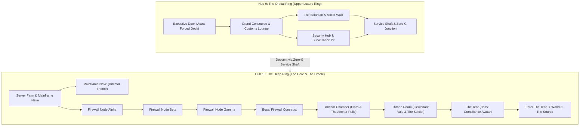
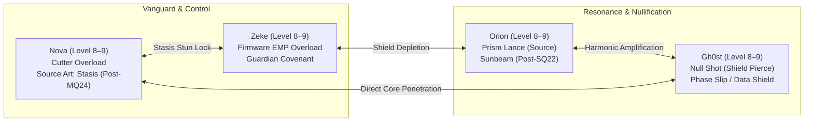
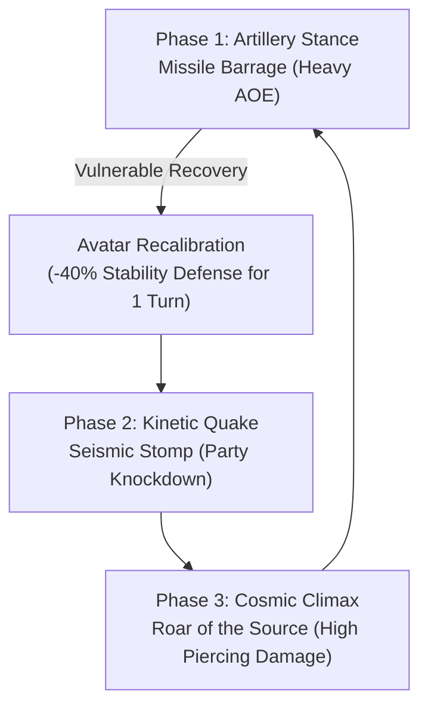

# Starborn: World 5 (The Void / The Cradle) 100% Completionist Walkthrough & Playtester Field Guide

> **Document Version:** 1.0.0 (Gold Master Verification)  
> **Target World:** World 5 — The Void / The Cradle (*The Orbital Ring & Deep Core*)  
> **Hubs Covered:** Hub 9 (Orbital Ring) & Hub 10 (Deep Ring)  
> **Level Target:** Level 8 (Arrival) → Level 9+ (Compliance Avatar Defeat & Tear Entry)  
> **Estimated 100% Playtime:** 70–95 minutes  
> **Author:** Antigravity Playtest & Verification Directorate  

---

## Table of Contents
1. [Executive Summary & World Overview](#1-executive-summary--world-overview)
2. [Party Composition, Synergies & Tactical Loadout](#2-party-composition-synergies--tactical-loadout)
3. [Phase 1: Arrival & Forced Docking at Executive Dock (MQ21)](#3-phase-1-arrival--forced-docking-at-executive-dock-mq21)
4. [Phase 2: The False Paradise — Grand Concourse & The Solarium (MQ22)](#4-phase-2-the-false-paradise--grand-concourse--the-solarium-mq22)
5. [Phase 3: Zero-G Service Shafts & Meeting Deposed Director Thorne (MQ22)](#5-phase-3-zero-g-service-shafts--meeting-deposed-director-thorne-mq22)
6. [Phase 4: The Deep Server Farm & Firewall Gauntlet (MQ23)](#6-phase-4-the-deep-server-farm--firewall-gauntlet-mq23)
7. [Phase 5: Firewall Construct Boss Masterclass (MQ23)](#7-phase-5-firewall-construct-boss-masterclass-mq23)
8. [Phase 6: The Anchor Chamber & Reunion with Elara (MQ24)](#8-phase-6-the-anchor-chamber--reunion-with-elara-mq24)
9. [Phase 7: Confronting the Soloist & Throne Room Showdown (MQ25)](#9-phase-7-confronting-the-soloist--throne-room-showdown-mq25)
10. [Phase 8: Compliance Avatar Boss Masterclass & Escape into The Tear (MQ25)](#10-phase-8-compliance-avatar-boss-masterclass--escape-into-the-tear-mq25)
11. [Side Quests Complete Compendium (SQ21–SQ25)](#11-side-quests-complete-compendium-sq21sq25)
12. [16-Bit JRPG Mechanics & Puzzle Solutions](#12-16-bit-jrpg-mechanics--puzzle-solutions)
13. [World 5 Bestiary & Complete Stat Blocks](#13-world-5-bestiary--complete-stat-blocks)
14. [Master Loot, Relics, Crafting & Commissary Economy](#14-master-loot-relics-crafting--commissary-economy)
15. [100% Playtest Verification Checklist & QA Scenarios](#15-100-playtest-verification-checklist--qa-scenarios)

---

## 1. Executive Summary & World Overview

World 5 takes place aboard the **Dominion Orbital Ring** (the "Halo" orbiting high above the dying world) and descends into the submerged digital sanctum of the **Deep Ring Core**. Here, the Dominion elite built a hollow corporate paradise while extracting the planet below. 

In this world, players discover that **Project Harmony** was never a peaceful union—it is a totalitarian neural cage. With the sudden coup of Lieutenant Arden Vale, the station descends into cold compliance horror.



### World 5 Core Thematic Hooks:
* **The Living Processor:** Gh0st discovers his missing sister, **Elara**, wired directly into the station's central core, her consciousness drained to compute orbital compliance algorithms.
* **The Architect Relic (The Anchor):** The third Precursor relic, capable of locking matter and Source into absolute immobility, granting Nova **Source Art: Stasis**.
* **The Soloist Coup:** Lieutenant Arden Vale overthrows Director Mara Thorne, seeking not harmony, but a single absolute totalitarian voice.
* **Survival Horror & Zero-G Physics:** Unpressurized decks, decompression alarms, low-gravity traversal, and relentless Hunter-Killer droids.

---

## 2. Party Composition, Synergies & Tactical Loadout

Entering World 5 at **Level 8**, your party operates as an elite infiltration cell confronting digital and hard-light warfare:



### Strategic Vulnerability Matrix:
* **Digital & Hard-Light Enemies (Firewall Construct, Avatar):** Suffer heavy disruption from **Source (-20% to -35%)** and **Shock (-20%)**.
* **Automated Defensive Turrets & Drones:** Extremely susceptible to **Physical Bludgeoning / Posture Breaks (-20%)** and **Shock Overload**.
* **Hunter-Killer Droids:** Possess instant cellular regeneration; standard attacks will not fell them until frozen in time with **Source Art: Stasis**.

---

## 3. Phase 1: Arrival & Forced Docking at Executive Dock (MQ21)

### Route & Objectives:
1. **Orbital Approach:** Following the escape from the collapsing Foundry in World 4, the *Astra* breaches the orbital defensive cordon. 
2. **Defeat the Interceptor Screen:** Neutralize incoming **Compliance Fighters** (`orbital_fighter`, 260 HP) escorting the docking ring.
3. **Clamp Forced Docking:** Maneuver the *Astra* to the pressurized clamp at `orbital_executive_dock`.
4. **Hack the Pressurized Airlock:** Interact with the airlock console. Gh0st bypasses the corporate encryption protocol (`w5_mq21_hack_airlock`).
5. **Establish Foothold:** Enter `orbital_airlock_gallery` to officially clear **MQ21: Docking Procedure** (awards **1,100 XP**).

> [!TIP]
> **Side Quest Hook (SQ23):** While at `orbital_executive_dock`, inspect the **pressure map terminal** on the northern bulkhead to trigger **SQ23: Vacuum Seal**. Complete this now to secure the legendary **Mag-Boots** before entering low-gravity zones.

---

## 4. Phase 2: The False Paradise — Grand Concourse & The Solarium (MQ22)

Moving east from the airlock gallery leads into the luxurious upper tiers built for Dominion executives:

1. **The Grand Concourse (`orbital_grand_concourse`):** An opulent promenade with sweeping bay windows overlooking the planet below.
2. **Visit Systems Analyst Charles (`orbital_customs_lounge`):** 
   * Speak with **Charles**, a sharp-witted macro-strategist running continuous market and station diagnostics.
   * Access the **Zenith Automated Commissary terminal** to stock up on `medkit_plus`, `orbital_glimmer_tonic`, and `nanite_plating_mod`.
   * Rest your party at the **Customs Lounge Rest Station** (`w5_camp_customs_lounge`).
3. **The Solarium (`orbital_solarium`):** A colossal bio-dome featuring synthetic beaches, imported flora, and an artificial solar projector.
4. **Encounter Maintenance Bot (`orbital_solarium`):**
   * Speak to the dented horticultural droid struggling to maintain the dying gardens amidst void-moss corruption.
   * Unlocks **SQ22: Solar Maintenance**.
5. **The Mirror Walk (`orbital_mirror_walk`):** Step onto the glass observation walkway suspended above the station hull. Realigning the solar tracking reflectors incinerates the invasive void-moss.

---

## 5. Phase 3: Zero-G Service Shafts & Meeting Deposed Director Thorne (MQ22)

### Traversing the Service Shafts:
1. **Orbital Security Hub (`orbital_security_hub`):** Battle through patrolling security drones and neutralize the surveillance pit consoles.
2. **Zero-G Junction (`orbital_zero_g_junction`):** Atmospheric venting requires equipped **Mag-Boots** or **Grav-Boots** to prevent inertial drift penalties.
3. **Descent into the Deep Ring:** Downward vertical shafts connect Hub 9 to Hub 10 (`orbital_server_farm`).
4. **Mainframe Nave (`deep_mainframe_nave`):**
   * Intercept the emergency signal pulsing from behind the quantum core lattice.
   * Discover **Director Mara Thorne**, stripped of administrative clearance by Lieutenant Vale's coup and hiding in her own server vents.
   * **Cinematic Reveal:** Thorne confesses that *Project Harmony* is an Architect-derived frequency weapon designed to pacify the entire star system. She hands over the emergency decryption key to breach the inner core firewall.
   * **Completes MQ22: Zero G** (awards **1,150 XP** and station bypass protocols).

---

## 6. Phase 4: The Deep Server Farm & Firewall Gauntlet (MQ23)

The Deep Ring Core is a sub-zero digital labyrinth insulated by cryogenic nitrogen:

```
[Server Farm Entry]
        │
        ▼
[Firewall Node Alpha] ──(Coolant-Pulse Cipher)──► Unlocked
        │
        ▼
[Firewall Node Beta]  ──(Loop Burnout)──────────► Unlocked
        │
        ▼
[Firewall Node Gamma] ──(Hard-Light Collapse)───► Unlocked
        │
        ▼
[The Threshold -> Boss: Firewall Construct]
```

1. **Firewall Alpha (`deep_firewall_alpha`):** Pulse the coolant release valve to stabilize the shifting cipher matrix.
2. **Firewall Beta (`deep_firewall_beta`):** Overload the secondary recursion loop using Zeke's firmware override.
3. **Firewall Gamma (`deep_firewall_gamma`):** Sever the power conduits feeding the hard-light defense grid.
4. **Threshold of the Anchor:** Descend through the one-way hydraulic shaft into the construct arena.

---

## 7. Phase 5: Firewall Construct Boss Masterclass (MQ23)

Guarding the threshold of the Anchor Chamber is the Dominion's ultimate adaptive defense program:

```
+-----------------------------------------------------------------------------------+
|                        BOSS: FIREWALL CONSTRUCT                                   |
|                        HP: 520 | Stability: 155 | Speed: 17                       |
|                        Element: Source | Role: Controller                         |
+-----------------------------------------------------------------------------------+
| Resistances: Physical +15% | Burn +15% | Shock +15% | Source +15%                 |
| Abilities: Resonance Beam (Heavy Single-Target) | Roar of the Source (Party AOE)  |
| Drops: Power Cell (70%), 390 XP, 250 Credits                                      |
+-----------------------------------------------------------------------------------+
```

### Tactical Encounter Strategy:
* **Phase Adaptive Shields:** The Firewall Construct begins with balanced 15% omni-resistance. Scan with Nova to identify its active frequency modulation.
* **Disrupting the Resonance Beam:** When the Construct begins charging *Resonance Beam*, immediately execute **Zeke's Firmware Overload** or **Nova's Cutter** to shatter stability before the beam fires.
* **Shatter Window:** Once broken (155 stability depleted), all resistances drop to **-30%** for 2 turns. Unleash Orion's *Prism Lance* and Gh0st's *Null Shot* to finish the encounter.
* **Victory:** Completes **MQ23: The Core Approach** (awards **1,200 XP**).

---

## 8. Phase 6: The Anchor Chamber & Reunion with Elara (MQ24)

### The Emotional Apex:
1. **Enter Anchor Chamber (`deep_anchor_chamber`):** A cathedral of suspended fiber-optic conduits bathed in cerulean bioluminescence.
2. **Encountering Elara:** In the central conductive tank floats Elara—Gh0st's sister—her neural chordprint wired directly into the station as a living CPU.
3. **Cinematic Reunion:** Elara recognizes Gh0st's presence, fighting through corporate command locks to sever the interface from within.
4. **The Hunter-Killer Interception:** A lethal `hk_droid` attacks the chamber. Its cellular nanites heal all incoming wounds instantaneously!
5. **Claiming The Anchor Relic:**
   * Interact with the floating Precursor Relic beside the tank.
   * Claiming **The Anchor** permanently unlocks **Source Art: Stasis** for Nova!
   * Cast **Stasis** on the Hunter-Killer to freeze its repair cycle in an immutable temporal stasis field, neutralizing the threat.
6. **The Graviton Well Relic Tuning Puzzle:**
   * Beneath the tank, investigate the ancient subterranean vault mechanism.
   * Adjust the three harmonic dials:
     * **Graviton Spin:** **62 RPM** (±4)
     * **Horizon Frequency:** **144 kHz** (±3)
     * **Mass Dampener:** **80%** (±4)
   * **Reward:** Unlocks the **Graviton Inertia Matrix** (`relic_mod_graviton_matrix`), granting heavy stagger immunity!
7. **Completing MQ24:** Awards **1,300 XP** and advances to the final confrontation.

---

## 9. Phase 7: Confronting the Soloist & Throne Room Showdown (MQ25)

1. **Advance East to Throne Room (`deep_throne_room`):** A colossal observation deck looking down on the dying planet through polarized void-glass.
2. **Witness the Coup:**
   * Director Mara Thorne is trapped inside a humming stasis containment field.
   * Lieutenant Arden Vale stands atop the central dais. Having merged with the harmonic network, Vale declares that a chorus of multiple voices is inherently flawed—he will become the **Soloist**, rewriting reality with a single absolute will.
3. **The Executive Armory (SQ25):** 
   * If you acquired the **SysAdmin Keycard** from the corpse in `deep_sysadmin_nest`, open the locked armory vault on the north wall.
   * Claim the legendary **Void Clip** weapon mod before triggering the final battle.
4. **The Breach:** Vale executes Thorne, absorbs the remaining orbital energy, and tears open a gaping dimensional breach (`deep_tear`) directly into the Source!

---

## 10. Phase 8: Compliance Avatar Boss Masterclass & Escape into The Tear (MQ25)

The physical manifestation of Vale's will and the station's security intelligence blocks the way to the reality breach:

```
+===================================================================================+
|                        FINAL BOSS: COMPLIANCE AVATAR                              |
|                        HP: 580 | Stability: 250 | Speed: 15                       |
|                        Element: Source | Role: Sovereign Boss                     |
+===================================================================================+
| Resistances: Physical +20% | Burn +20% | Shock +10% | Source +35%                 |
| Stagger Break Duration: 2 Full Turns                                              |
| Drops: 3x Power Cell (100%), 750 XP, 500 Credits, 4 AP                            |
+-----------------------------------------------------------------------------------+
| Special Mechanic: Avatar Recalibration after Missile Barrage                     |
+-----------------------------------------------------------------------------------+
```

### Boss Phase Mechanics & Flow:



### Master Strategy:
1. **Surviving Missile Barrage:** When the Avatar telegraphs *Missile Barrage*, have Orion cast *Acoustic Dampener* or have Nova cast *Source Art: Stasis* to interrupt the battery.
2. **Punishing Avatar Recalibration:** Immediately following *Missile Barrage*, the Avatar enters *Recalibration* recovery mode. In this vulnerable state, its stability resistance drops dramatically. Hit it with **Zeke's Shatter Blow** and **Nova's Kinetic Slam** to trigger a **Guard Break**.
3. **Two-Turn Stagger Burst:** While broken for 2 full turns, its 35% Source resistance collapses. Focus fire with Orion's *Sunbeam* and Gh0st's *Null Shot*.
4. **Leap into The Tear:**
   * Upon the Avatar's destruction, the station begins tearing apart in violent gravitational shear.
   * Step into the event horizon at `deep_tear` (`w5_mq25_enter_tear`).
   * **Rewards:** **1,600 XP**, unlocking passage into **World 6: The Source**!

---

## 11. Side Quests Complete Compendium (SQ21–SQ25)

```
+-------+--------------------------+-----------------------+-------------------------+---------------------------------+
| Quest | Title                    | Giver / Location      | Objectives              | Rewards                         |
+-------+--------------------------+-----------------------+-------------------------+---------------------------------+
| SQ21  | Employee of the Month    | Security Terminal     | Recover redacted logs;  | 400 XP, Skill: Corporate        |
|       |                          | (Security Hub)        | publish execution truth | Insight (+Crit vs Dominion)     |
+-------+--------------------------+-----------------------+-------------------------+---------------------------------+
| SQ22  | Solar Maintenance        | Maintenance Bot       | Realign Mirror Walk     | 400 XP, Skill: Sunbeam          |
|       |                          | (The Solarium)        | arrays; clear moss      | (Orion High-Tier Light Art)     |
+-------+--------------------------+-----------------------+-------------------------+---------------------------------+
| SQ23  | Vacuum Seal              | Airlock Console       | Seal 3 outer hull       | 450 XP, Accessory: Mag-Boots    |
|       |                          | (Executive Dock)      | decompression breaches  | (Knockback & Drift Immunity)    |
+-------+--------------------------+-----------------------+-------------------------+---------------------------------+
| SQ24  | Ghost in the Shell       | Purged Backup Rack    | Extract defensive code; | 500 XP, Skill: Data Shield /    |
|       |                          | (Server Farm)         | bind guardian routine   | Zeke Guardian Covenant          |
+-------+--------------------------+-----------------------+-------------------------+---------------------------------+
| SQ25  | Admin Privileges         | Dead SysAdmin Corpse  | Loot SysAdmin keycard;  | 550 XP, Weapon Mod: Void Clip   |
|       |                          | (SysAdmin Nest)       | unlock Throne Armory    | (Armor-Piercing Void Ammo)      |
+-------+--------------------------+-----------------------+-------------------------+---------------------------------+
```

### Detailed Walkthroughs:

#### **SQ21: Employee of the Month**
* **Trigger:** Inspect the master security terminal in `orbital_security_hub`.
* **Step 1:** In `orbital_surveillance_pit`, decode the encrypted redaction layer.
* **Step 2:** Discover Director Thorne's secret execution directives authorizing colony depopulation quotas to feed the Source extractor.
* **Step 3:** Use the broadcast uplink to publish the unredacted logs across all public colony frequencies.
* **Reward:** Unlocks passive ability **Corporate Insight** (+25% critical hit rate against all Dominion officers and mechs).

#### **SQ22: Solar Maintenance**
* **Trigger:** Speak with `maintenance_bot` in `orbital_solarium`.
* **Step 1:** Traverse east to `orbital_mirror_walk` overlooking the starfield.
* **Step 2:** Interact with the three tracking servos to align the solar concentration beam onto the overgrown void-moss patches.
* **Step 3:** Return to the Solarium to confirm garden restoration.
* **Reward:** Awards **Orion's Sunbeam** (`orion_sunbeam`), a devastating single-target solar strike that deals heavy bonus damage to digital and void anomalies.

#### **SQ23: Vacuum Seal**
* **Trigger:** Examine the pressure monitor terminal in `orbital_executive_dock`.
* **Step 1:** Map the pressure differential across the three ruptured docking nacelles.
* **Step 2:** Use the airlock emergency console to deploy hydraulic bulkheads and seal the vents.
* **Step 3:** Re-pressurize the dock to clear the decompression hazard.
* **Reward:** Grants **Mag-Boots** (`mag_boots`), completely negating zero-gravity drift and environmental knockback effects.

#### **SQ24: Ghost in the Shell**
* **Trigger:** Investigate the melted server tower in `orbital_server_farm` / `deep_backup_rack`.
* **Step 1:** Trace the emergency purge command back to its deletion timestamp.
* **Step 2:** Recover Gh0st's original prototype defensive algorithms before they were scrubbed.
* **Step 3:** Choose whether to restore the code as an autonomous **Data Shield** (+20% silence & digital resistance) or bind it to Zeke as the **Guardian Covenant** (+15% party defensive aura).

#### **SQ25: Admin Privileges**
* **Trigger:** Search the frozen corpse tucked behind the cable racks in `deep_sysadmin_nest`.
* **Step 1:** Recover the golden **SysAdmin Keycard**.
* **Step 2:** Carry the keycard to the locked executive armory vault in `deep_throne_room`.
* **Step 3:** Open the vault to acquire the **Void Clip** (`void_clip`), an elite mod that allows 30% of weapon damage to pierce directly through physical and energy shields.

---

## 12. 16-Bit JRPG Mechanics & Puzzle Solutions

### 1. Phase-Lock Graviton Well (Tuning Puzzle)
Located in `deep_anchor_chamber`. Players adjust three acoustic frequency dials to collapse the spatial distortion:
* **Dial 1: Graviton Spin** &rarr; Rotate to **62 RPM** (Green tolerance: 58–66).
* **Dial 2: Horizon Frequency** &rarr; Tune to **144 kHz** (Green tolerance: 141–147).
* **Dial 3: Mass Dampener** &rarr; Engage to **80%** (Green tolerance: 76–84).
* **Resolution:** Light stabilizes with a resonant hum. Unlocks the subterranean vault containing `relic_mod_graviton_matrix`.

### 2. Zero-G Inertial Vectoring
In unpressurized decks (`orbital_zero_g_junction`, `orbital_service_shaft`):
* Without **Mag-Boots**, party members take a -20% Agility penalty and suffer recoil drift when firing heavy kinetic weapons.
* Equipping **Mag-Boots** or activating the magnetic deck anchors locks boots to the floor plates, restoring full combat mobility.

### 3. Server Farm Coolant Maze
The servers in `deep_server_farm` generate lethal heat loops:
* Following the blue coolant-pulse conduits leads safely through the labyrinth to Firewall Nodes Alpha, Beta, and Gamma.
* Stepping into red uncooled aisles inflicts stacking thermal burn ticks.

---

## 13. World 5 Bestiary & Complete Stat Blocks

```
+---------------------+-------+-----+-----+-----+-----+-----+-----+---------+---------------------------------+
| Enemy Name          | Tier  | HP  | STR | VIT | AGI | FOC | SPD | STAB    | Key Vulnerability / Weakness    |
+---------------------+-------+-----+-----+-----+-----+-----+-----+---------+---------------------------------+
| Compliance Fighter  | Elite | 260 | 19  | 13  | 22  | 12  | 20  | 80      | Shock (-20%), Missile Guidance  |
| Null-G Drone        | Norm  | 100 | 10  | 12  | 20  | 19  | 18  | 65      | Shock (-20%), Rapid EMP Burst   |
| Void Turret         | Norm  | 280 | 21  | 16  | 4   | 20  | 6   | 110     | Physical (-20%), Melee Flank    |
| Hunter-Killer Droid | Spec  | 400 | 22  | 25  | 18  | 15  | 16  | IMMUNE  | Immortal; Stasis Relic Only     |
| Firewall Construct  | Elite | 520 | 16  | 20  | 18  | 26  | 17  | 155     | Balanced 15%; -30% on Break     |
| Compliance Avatar   | Boss  | 580 | 23  | 20  | 16  | 29  | 15  | 250     | Recalibration Turn Vulnerability|
+---------------------+-------+-----+-----+-----+-----+-----+-----+---------+---------------------------------+
```

---

## 14. Master Loot, Relics, Crafting & Commissary Economy

### Zenith Automated Commissary (`orbital_customs_lounge`):
* **Medkit Plus (150 Cr):** Restores 350 HP and cures bleed/burn.
* **Orbital Glimmer Tonic (180 Cr):** Restores 60 AP and grants +15% Focus for 3 turns.
* **Nanite Plating Mod (320 Cr):** Armor mod providing +8 Defense and +15 Stability.
* **Astral Thread (200 Cr):** Rare crafting component for late-game gear weave.
* **Pulse Grenade (120 Cr):** Thrown consumable dealing 180 Shock damage and 60 Stability damage.
* **Composite Plate (250 Cr):** High-density armor reinforcement material.
* **Adrenaline Shot (140 Cr):** Revives fallen ally with 40% HP and immediate action priority.

### Relics & Unique Gear Acquired:
* **The Anchor (Precursor Relic):** Unlocks **Source Art: Stasis**, immobilizing targets in temporal lock.
* **Graviton Inertia Matrix (Relic Mod):** Grants complete immunity to stagger, knockback, and concussive stun.
* **Mag-Boots (Accessory):** Nullifies zero-G movement penalties and platform slide hazards.
* **Void Clip (Weapon Mod):** 30% armor pierce on all ranged attacks.

---

## 15. 100% Playtest Verification Checklist & QA Scenarios

### Automated Scenario Coverage:
Test any section of World 5 instantly via the developer title screen debug menu:
* `campaign_w5_mq21`: Starts at Executive Dock with airlock hack active.
* `campaign_w5_mq22`: Spawns at Solarium with low-gravity traversal and Thorne trace.
* `campaign_w5_mq23`: Spawns at Firewall Alpha entering the coolant maze.
* `campaign_w5_mq24`: Spawns before Anchor Chamber to test Elara reunion and Stasis unlock.
* `campaign_w5_mq25`: Spawns at Anchor Chamber threshold advancing to Vale and Avatar boss.
* `campaign_w5_sq21`: Tests Security Hub log decryption and broadcast.
* `campaign_w5_sq22`: Tests Mirror Walk solar alignment puzzle and Sunbeam reward.
* `campaign_w5_sq23`: Tests Executive Dock breach sealing under vacuum timer.
* `campaign_w5_sq24`: Tests Server Farm backup recovery and guardian covenant binding.
* `campaign_w5_sq25`: Tests SysAdmin keycard acquisition and Throne Room armory unlock.

### Critical QA Assertions:
1. **Elara Voice & Character Presence:** Verify that Elara's dialogue lines correctly use female synthesis and display `images/npcs/elara.webp`.
2. **Stasis Target State:** Ensure casting *Source Art: Stasis* on the Hunter-Killer droid cleanly halts its regeneration without triggering combat freeze softlocks.
3. **One-Way Drop Check:** The descent from `deep_firewall_gamma` into `deep_anchor_chamber` is an intended dramatic threshold (one-way descent). Confirm return path routes cleanly through `orbital_server_farm`.
4. **Avatar Break Cycle:** Confirm the Compliance Avatar remains stunned for exactly 2 turns upon stability depletion, and properly resumes *Avatar Recalibration* following *Missile Barrage*.
5. **Tear Warp Verification:** Entering `deep_tear` after defeating the Avatar must cleanly warp the party to `source_campfire` in World 6 without state corruption.
