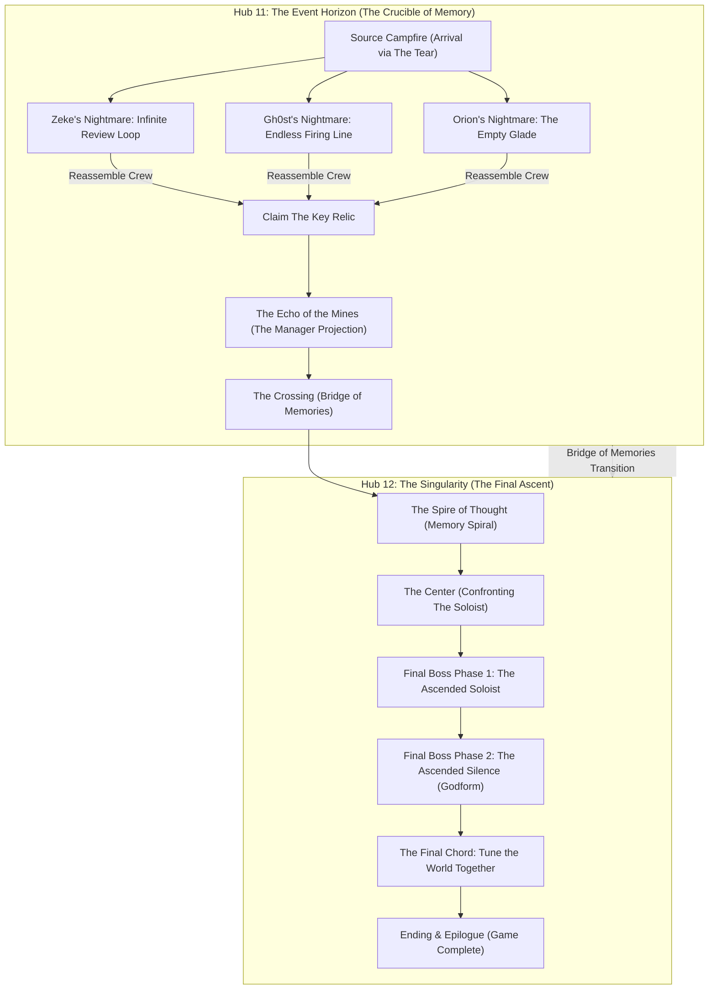
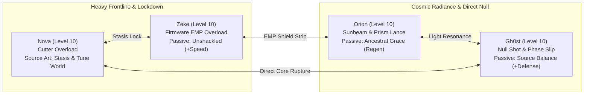
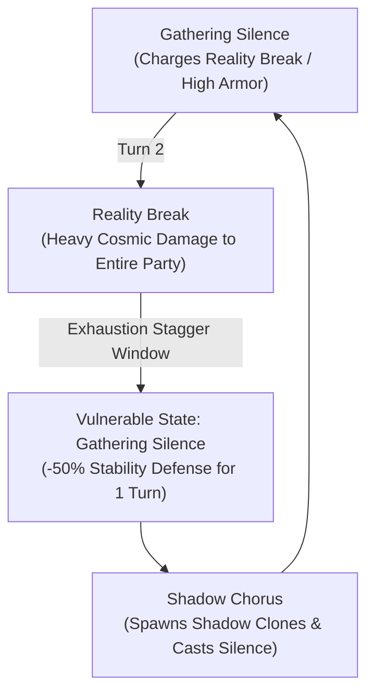

# Starborn: World 6 (The Source) 100% Completionist Walkthrough & Grand Finale Field Guide

> **Document Version:** 1.0.0 (Gold Master Verification)  
> **Target World:** World 6 — The Source (*The Singularity & The Event Horizon*)  
> **Hubs Covered:** Hub 11 (Event Horizon) & Hub 12 (Singularity)  
> **Level Target:** Level 9 (Arrival) → Level 10+ (The Ascended Defeat & World Tuning)  
> **Estimated 100% Playtime:** 65–85 minutes  
> **Author:** Antigravity Playtest & Verification Directorate  

---

## Table of Contents
1. [Executive Summary & Grand Finale Overview](#1-executive-summary--grand-finale-overview)
2. [Party Composition, Relic Harmonization & Endgame Loadout](#2-party-composition-relic-harmonization--endgame-loadout)
3. [Phase 1: The Event Horizon & Fractured Minds (MQ26)](#3-phase-1-the-event-horizon--fractured-minds-mq26)
4. [Phase 2: The Echo of the Mines & The Manager (MQ27)](#4-phase-2-the-echo-of-the-mines--the-manager-mq27)
5. [Phase 3: The Crossing & The Bridge of Memories (MQ28)](#5-phase-3-the-crossing--the-bridge-of-memories-mq28)
6. [Phase 4: The Spire of Thought & The Memory Spiral (MQ29)](#6-phase-4-the-spire-of-thought--the-memory-spiral-mq29)
7. [Phase 5: The Singularity Threshold & Approaching the Center (MQ30)](#7-phase-5-the-singularity-threshold--approaching-the-center-mq30)
8. [Phase 6: Final Boss Masterclass: The Ascended (MQ30)](#8-phase-6-final-boss-masterclass-the-ascended-mq30)
9. [Phase 7: Tuning the World & Epilogue](#9-phase-7-tuning-the-world--epilogue)
10. [Side Quests Complete Compendium (SQ26–SQ30)](#10-side-quests-complete-compendium-sq26sq30)
11. [16-Bit JRPG Mechanics & Metaphysical Puzzles](#11-16-bit-jrpg-mechanics--metaphysical-puzzles)
12. [World 6 Bestiary & Complete Stat Blocks](#12-world-6-bestiary--complete-stat-blocks)
13. [Master Endgame Gear, Ultimate Mods & Relic Synergy](#13-master-endgame-gear-ultimate-mods--relic-synergy)
14. [100% Playtest Verification Checklist & QA Scenarios](#14-100-playtest-verification-checklist--qa-scenarios)

---

## 1. Executive Summary & Grand Finale Overview

The Source is the cosmic metaphysical origin of all reality—a fractured, kaleidoscopic dimension where time, space, memory, and physical laws break down. Floating debris from Worlds 1 through 5 drifts against a silent starlit horizon.

Here, the party is not fighting to conquer an empire, but to **refuse the Architect's Great Silence** and prevent Lieutenant Arden Vale from wiping out free will to create a painless, single-note universe.



### World 6 Core Thematic Hooks:
* **The Four Nightmares & Self-Determination:** Before facing the final godform, each companion must confront their deepest trauma:
  * **Zeke:** Escaping the corporate employee review loop that treated him as disposable labor.
  * **Gh0st:** Rejecting the infinite military firing line that programmed him to execute without mercy.
  * **Orion:** Overcoming the silence of his extinct civilization and preserving their memory as music.
  * **Nova:** Re-visiting the starting mines and honoring Jed's sacrifice without giving in to despair.
* **The 5-Relic Harmonic Chorus:** The player unites all five Precursor relics collected across the game:
  1. *The Ghost Signal Chime* (World 1)
  2. *The Celestial Prism* (World 2)
  3. *The Anvil* (World 4)
  4. *The Anchor* (World 5)
  5. *The Key* (World 6)
* **The Anti-Nihilism Climax:** Vale offers total peace through total erasure; the party proves that pain, disharmony, and individual voices make existence worth fighting for.

---

## 2. Party Composition, Relic Harmonization & Endgame Loadout

Entering World 6 at **Level 9–10**, your party achieves true transcendence, wielding all five Source Arts:



### Final Relic Arsenal:
* **The Ghost Signal Chime (Jed):** Awaken latent Source resonance and pierce harmonic cloaks.
* **The Celestial Prism (Orion):** Bends energy into high-potency elemental light, unlocking *Source Art: Prism*.
* **The Anvil (Cameron / Sherman):** Heavy kinetic anchoring, unlocking *Source Art: Construct*.
* **The Anchor (Elara):** Absolute temporal stillness, unlocking *Source Art: Stasis*.
* **The Key (The Source):** Root administrative authority over the universal matrix, unlocking *Source Art: Tune World*.

---

## 3. Phase 1: The Event Horizon & Fractured Minds (MQ26)

### Route & Objectives:
1. **Arrival at the Source Campfire (`source_campfire`):** After stepping through the Tear in World 5, Nova awakes at a solitary campfire surrounded by void-shards. The crew has been scattered into psychic trauma loops.
2. **Rescue Zeke (`source_zeke_cubicle` / `source_zeke_review_loop`):**
   * Enter the monochrome Dominion administrative cube.
   * Defeat the automated corporate review constructs holding Zeke in infinite paperwork loops.
   * Speak to Zeke to shatter his self-doubt and remind him he is a member of the Starborn.
3. **Rescue Gh0st (`source_gh0st_firing_line` / `source_gh0st_kill_suite`):**
   * Infiltrate the blood-red training simulation where Gh0st is forced to repeatedly execute unarmed targets.
   * Intercept the command protocols and pull Gh0st out of his combat trance.
4. **Rescue Orion (`source_orion_empty_glade` / `source_orion_glass_terrace`):**
   * Walk into the silent, crystallized ruins of Orion's lost homeworld.
   * Play the harmonic chime to break Orion's mourning paralysis.
5. **Reassemble the Starborn:**
   * Return to `source_campfire`.
   * With the four companions united, the ambient light coalesces into **The Key** (`key_relic`).
   * **Completes MQ26: Fractured Minds** (awards **1,400 XP**).

---

## 4. Phase 2: The Echo of the Mines & The Manager (MQ27)

Moving forward through the spatial distortion returns Nova to a surreal, hyper-saturated echo of World 1:

1. **The Distorted Pit (`source_echo_mines`):** The rock walls bleed blue neon light; familiar mining carts float weightlessly across the cavern.
2. **Jed's Old Workbench (`source_echo_workbench`):** 
   * Encounter the glowing memory projection of Jed.
   * Triggers **SQ26: Jed's Echo**. Talk with Jed to gain his final blessing and the **Legacy** passive.
3. **Evading The Manager Projections (`source_echo_checkpoint`):**
   * Towering corporate monoliths (`manager_projection`, 520 HP) block the transit corridors.
   * Use Stasis to bypass their tracking sweeps or shatter their posture with Zeke's EMP.
4. **Reaching the Ascent Lift (`source_echo_elevator`):**
   * Activate the memory lift controls.
   * As the platform ascends through the sky of all five worlds, Nova officially lays the past to rest.
   * **Completes MQ27: The Echo of the Mines** (awards **1,450 XP**).

---

## 5. Phase 3: The Crossing & The Bridge of Memories (MQ28)

1. **The Void Chasm (`source_memory_bridge`):** Before the party lies a bottomless abyss separating the Event Horizon from the Singularity Core.
2. **Weaving the Memory Bridge:**
   * There are no physical floor plates. The bridge materializes out of shared memories as each party member speaks:
     * *Zeke's Anchor:* Remembers the courage it took to sabotage the mine carts.
     * *Gh0st's Anchor:* Remembers Elara's voice singing across the communications static.
     * *Orion's Anchor:* Remembers the first note played under the Tideglass sky.
     * *Nova's Anchor:* Remembers Jed's promise that hard work outlasts destiny.
3. **Final Companion Banter:** Each hero confirms their readiness to face the final battle and see what lies beyond the end of the universe.
4. **Cross to the Singularity Gate (`source_memory_fragments`):**
   * **Completes MQ28: The Crossing** (awards **1,500 XP**).

---

## 6. Phase 4: The Spire of Thought & The Memory Spiral (MQ29)

The ascent to the center of reality is a towering staircase of shattered architecture:

```
[The Center - Throne of the Soloist]
               ▲
               │
[Impossible Archive - SQ30 Future Astra Hull]
               ▲
               │
[Memory Defense Arena - Source Shadow Waves]
               ▲
               │
[Memory Stair - Spire of Thought]
               ▲
               │
[Threshold of the Singularity]
```

1. **The Memory Stair (`source_memory_stair`):** Ascend through floating sections of the Spire, Foundry assembly belts, and Solarium gardens.
2. **Survive the Shadow Waves:** Defeat aggressive **Source Shadows** (`source_shadow`, 70 HP) and elite memory guardians.
3. **Refuse Architect Revisions:**
   * The Source attempts to rewrite the party's memories to make them accept peaceful oblivion:
     * Refuse Jed's revision (admitting loss without forgetting).
     * Refuse the Astra revision (embracing the journey's scars).
     * Refuse the Foundry revision (affirming machine consciousness).
4. **Reach the Summit (`source_spire_thought`):**
   * Enter the inner sanctum to complete **MQ29: The Spire of Thought** (awards **1,600 XP**).

---

## 7. Phase 5: The Singularity Threshold & Approaching the Center (MQ30)

1. **Step into The Center (`source_center`):** An infinite expanse of blinding white and indigo geometry. The stars themselves form a spiral galaxy overhead.
2. **Confront Arden Vale:**
   * Lieutenant Vale hovers at the axis of the Source.
   * Having severed himself from mortal form, he prepares to strike the **Great Silence**—a universal frequency that will permanently quiet all pain, struggle, and consciousness across every galaxy.
3. **The Final Defiance:** Nova brandishes the five relics. The Starborn refuse to be silenced.

---

## 8. Final Boss Masterclass: The Ascended (MQ30)

The final encounter is a two-phase masterwork testing every combat art learned across the entire game:

### Phase 1: The Ascended Soloist (Arden Vale)

```
+===================================================================================+
|                        PHASE 1: THE ASCENDED SOLOIST                              |
|                        HP: 250 | Stability: 140 | Speed: 12                       |
|                        Element: Source | Broken Turns: 2                          |
+===================================================================================+
| Resistances: Physical +15% | Burn +15% | Shock +15% | Source +45%                 |
| Abilities: Compliance Beam | Guilt Wave (Party AP Drain) | Silence Wave (Silence) |
| Drops: 900 XP, 5 AP                                                               |
+-----------------------------------------------------------------------------------+
```

#### Strategy — Phase 1:
* **Silence Mitigation:** Vale opens with *Silence Wave*, attempting to seal your Source Arts. Gh0st's *Source Balance* passive and equip items like *Data Shield* nullify this threat.
* **Rapid Guard Break:** Vale's stability pool is only 140. Hit him with **Nova's Kinetic Cutter** and **Zeke's Shatter Blow**. Once broken for 2 turns, burst down his 250 HP before he can cycle into *Guilt Wave*.

---

### Phase 2: The Ascended Silence (Architect Godform)

Upon defeat, Vale's human shell shatters. The Source wraps around him, ascending into a towering, multi-winged geometric godform of porcelain and blinding light:

```
+===================================================================================+
|                        PHASE 2: THE ASCENDED SILENCE                              |
|                        HP: 500 | Stability: 200 | Speed: 12                       |
|                        Element: Source | Broken Turns: 3 (Extended!)              |
+===================================================================================+
| Resistances: Physical +25% | Burn +25% | Shock +20% | Source +55%                 |
| Opening Skill: Gathering Silence                                                  |
| Recovery After: Reality Break, Shadow Chorus, Silence Wave -> Gathering Silence   |
| Abilities: Reality Break (Colossal Piercing AOE) | Shadow Chorus | Gathering Silence|
| Drops: 1,500 XP, 8 AP                                                             |
+-----------------------------------------------------------------------------------+
```

#### Phase 2 Mechanics & Flow:



#### Masterclass Strategy:
1. **Surviving Reality Break:** When the Ascended charges *Gathering Silence*, do NOT waste offensive AP. Immediately command Orion to cast *Acoustic Dampener* and have Nova prepare *Source Art: Stasis*. If your AP allows, Stasis will completely cancel the incoming *Reality Break*!
2. **Exploiting the Post-Break Exhaustion Window:** Following every *Reality Break*, the boss enters recovery. Its massive 200 Stability becomes ultra-brittle. Hit it with heavy kinetic and shock skills to trigger a **Guard Break**.
3. **The 3-Turn Stagger Window:** The Ascended remains broken for **3 full turns** (the longest in the game!). During this window:
   * Its 55% Source resistance completely collapses to **-25%**.
   * Equip Nova with the **Starborn Mod** (+15% Crit, +5 STR, +5 FOC).
   * Chain Orion's *Sunbeam*, Gh0st's *Null Shot*, and Nova's *Construct Strike* to melt through its 500 HP!

---

## 9. Phase 7: Tuning the World & Epilogue

1. **The Final Note:**
   * With the Ascended defeated, the Singularity begins to dissolve into chaotic resonance.
   * Interact with the central matrix to trigger `w6_mq30_tune_world`.
2. **The Five-Part Symphony:**
   * Nova inserts **The Key** alongside the Chime, Prism, Anvil, and Anchor.
   * Each companion steps forward to play their part in the chorus:
     * *Nova strikes the chime for the workers.*
     * *Zeke routes the power for the free minds.*
     * *Orion focuses the prism for the lost ancestors.*
     * *Gh0st drops the anchor for his sister Elara.*
3. **A New Beginning:**
   * Instead of imposing silence or total control, the frequency of the Source is tuned to restore life to the dying star system. The dimensional rift closes gently.
   * **Cinematic & Credits:** The crew returns to the *Astra*, free to chart their own course across a living galaxy.
   * Awards milestone **`ms_game_complete`**.

---

## 10. Side Quests Complete Compendium (SQ26–SQ30)

```
+-------+--------------------------+-----------------------+-------------------------+---------------------------------+
| Quest | Title                    | Giver / Location      | Objectives              | Rewards                         |
+-------+--------------------------+-----------------------+-------------------------+---------------------------------+
| SQ26  | Jed's Echo               | Memory of Jed         | Talk to Jed's echo at   | 600 XP, Passive: Legacy         |
|       |                          | (Echo Workbench)      | his old workbench       | (+20% Nova Critical Damage)     |
+-------+--------------------------+-----------------------+-------------------------+---------------------------------+
| SQ27  | The HR Record            | Corporate Terminal    | Locate and delete       | 650 XP, Passive: Unshackled     |
|       |                          | (Zeke Review Loop)    | Zeke's employee record  | (+4 Speed, +15% Evasion)        |
+-------+--------------------------+-----------------------+-------------------------+---------------------------------+
| SQ28  | Elara's Song             | Uncompressed Datapad  | Recover Elara's pure    | 700 XP, Passive: Source Balance |
|       |                          | (Gh0st Kill Suite)    | vocal recording         | (+6 Defense, +20% Res)          |
+-------+--------------------------+-----------------------+-------------------------+---------------------------------+
| SQ29  | The Aethel Grave         | Orion                 | Find the ancient Aethel | 750 XP, Passive: Ancestral Grace|
|       |                          | (Memory Fragments)    | burial resonance        | (High Passive HP Regeneration)  |
+-------+--------------------------+-----------------------+-------------------------+---------------------------------+
| SQ30  | The Final Scavenge       | Scrapper Memory       | Salvage future Astra    | 800 XP, Legendary Weapon Mod:   |
|       |                          | (Impossible Archive)  | hull plating            | Starborn (+15% Crit, +5 STR/FOC)|
+-------+--------------------------+-----------------------+-------------------------+---------------------------------+
```

### Detailed Walkthroughs:

#### **SQ26: Jed's Echo**
* **Trigger:** Approach the phantom workbench in `source_echo_workbench`.
* **The Interaction:** Speak to Jed's projection. Listen to his final lesson on craftsmanship and resilience.
* **Reward:** Unlocks Nova's passive **Legacy** (`nova_legacy`), permanently boosting critical hit damage by 20%.

#### **SQ27: The HR Record**
* **Trigger:** Examine the floating executive terminal in `source_zeke_review_loop`.
* **The Interaction:** Zeke locates the file that designated him as "Expendable Asset 491-C". Select "Delete Record" to permanently wipe the corporate designation.
* **Reward:** Unlocks Zeke's passive **Unshackled** (`zeke_unshackled`), granting +4 Speed and +15% base Evasion.

#### **SQ28: Elara's Song**
* **Trigger:** Search the terminal pedestal in `source_gh0st_kill_suite`.
* **The Interaction:** Recover an uncorrupted recording of Elara singing before she was drafted into the Dominion compliance program.
* **Reward:** Unlocks Gh0st's passive **Source Balance** (`gh0st_source_balance`), granting +6 Defense and +20% resistance to all negative status ailments.

#### **SQ29: The Aethel Grave**
* **Trigger:** Speak to Orion at `source_memory_fragments`.
* **The Interaction:** Tune the resonance well to match the burial frequency of the ancient Aethel pilgrims.
* **Reward:** Unlocks Orion's passive **Ancestral Grace** (`orion_ancestral_grace`), restoring 10% max HP at the start of every combat turn.

#### **SQ30: The Final Scavenge**
* **Trigger:** In `source_spire_thought` / `source_spire_archive`, search the impossible timeline wreckage.
* **The Interaction:** Detach the crystalline armor plating from an *Astra* that escaped an alternate timeline. Fit it into the party's weapon matrix.
* **Reward:** Grants the ultimate accessory mod **Starborn** (`starborn_mod`), boosting Strength by 5, Focus by 5, Luck by 3, and adding +15% Critical Strike Rate with Source attack element.

---

## 11. 16-Bit JRPG Mechanics & Metaphysical Puzzles

### 1. Subjective Memory Bridge Routing
In `source_memory_bridge`, physical paths do not exist until the party addresses their past:
* Selecting the honest, empathetic response in each companion dialogue stabilizes the bridge tiles.
* Picking cynical or evasive choices causes tiles to phase out, requiring re-attunement.

### 2. Temporal Stasis Interrupts
The Phase 2 boss charges *Reality Break* over a full telegraph turn:
* Deploying Nova's **Source Art: Stasis** before the countdown resolves temporarily freezes the boss's cast bar, providing a safe window to reposition and break its posture.

### 3. Harmonic Choir Puzzle
At `source_center`, tuning the world requires matching the five relic notes to the universal matrix:
* **Chime (Jed):** 440 Hz (Standard Ground)
* **Prism (Orion):** 528 Hz (Solar Light)
* **Anvil (Cameron):** 216 Hz (Deep Kinetic)
* **Anchor (Elara):** 396 Hz (Stillness)
* **Key (The Source):** 639 Hz (Harmonic Union)

---

## 12. World 6 Bestiary & Complete Stat Blocks

```
+---------------------+-------+-----+-----+-----+-----+-----+-----+---------+---------------------------------+
| Enemy Name          | Tier  | HP  | STR | VIT | AGI | FOC | SPD | STAB    | Key Vulnerability / Weakness    |
+---------------------+-------+-----+-----+-----+-----+-----+-----+---------+---------------------------------+
| Source Shadow       | Norm  | 70  | 18  | 5   | 19  | 18  | 18  | 30      | Physical (-20%), Extremely Fragile|
| The Manager         | Elite | 520 | 16  | 20  | 14  | 28  | 14  | 170     | Shock (-20%), Stasis Interrupt  |
| The Ascended: Vale  | Boss  | 250 | 12  | 12  | 16  | 14  | 12  | 140     | Rapid Guard Break, Physical Focus|
| The Ascended: God   | Boss  | 500 | 18  | 16  | 16  | 18  | 12  | 200     | Broken Turns: 3 (-25% All Res)  |
+---------------------+-------+-----+-----+-----+-----+-----+-----+---------+---------------------------------+
```

---

## 13. Master Endgame Gear, Ultimate Mods & Relic Synergy

### The Ultimate Party Loadout:
* **Nova:**
  * Weapon: Overclocked Plasma Cutter
  * Armor: Crucible Forge-Plate (World 4 Arena Grand Prize)
  * Accessory: **Starborn Mod** (+15% Crit, +5 STR, +5 FOC)
  * Passive: **Legacy** (+20% Crit Damage)
* **Zeke:**
  * Armor: Nanite Heavy Carapace
  * Accessory: **Mag-Boots** (Knockback Immunity)
  * Passive: **Unshackled** (+4 Speed, +15% Evasion)
* **Orion:**
  * Weapon: Prism Harmonic Lance
  * Accessory: Graviton Inertia Matrix (Stagger Immunity)
  * Passive: **Ancestral Grace** (10% HP Regen per turn)
* **Gh0st:**
  * Weapon: Null Phase Rifle
  * Accessory: **Void Clip** (30% Armor Pierce)
  * Passive: **Source Balance** (+6 DEF, Status Resistance)

---

## 14. 100% Playtest Verification Checklist & QA Scenarios

### Automated Scenario Coverage:
Test any section of World 6 instantly via the developer title screen debug menu:
* `campaign_w6_mq26`: Starts at the Source Campfire; tests companion rescue quests.
* `campaign_w6_mq27`: Starts at Echo Mines; tests distorted mine navigation and Manager fight.
* `campaign_w6_mq28`: Starts at Memory Bridge; tests party anchor dialogue and bridge formation.
* `campaign_w6_mq29`: Starts at Memory Stair; tests the spire climb and shadow waves.
* `campaign_w6_mq30`: Starts at The Center; initiates the two-phase Ascended final boss battle.
* `campaign_w6_sq26`: Tests Jed's Echo interaction and Legacy passive award.
* `campaign_w6_sq27`: Tests HR record deletion and Unshackled passive award.
* `campaign_w6_sq28`: Tests Elara's voice log recovery and Source Balance passive award.
* `campaign_w6_sq29`: Tests Aethel Grave tuning and Ancestral Grace passive award.
* `campaign_w6_sq30`: Tests future Astra salvage and Starborn mod acquisition.

### Critical QA Assertions:
1. **Boss Phase Transition:** Verify that defeating *The Ascended Soloist* (Phase 1) smoothly transitions into *The Ascended Silence* (Phase 2) without losing active party buff states or causing audio dropouts.
2. **Three-Turn Stagger Duration:** Confirm that triggering a Guard Break on Phase 2 keeps the boss stunned for exactly 3 turns, reducing all resistances to -25%.
3. **World Tuning Trigger:** Verify that interacting with the central matrix triggers `w6_mq30_tune_world`, awards `source_art_tune_world`, sets `ms_game_complete`, and cleanly initiates the final credits sequence.
