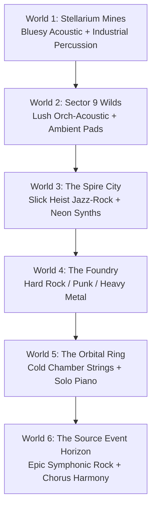

# Starborn — Audio Design Guide
**Status:** Core Concept & ElevenLabs Production Blueprint  
**Tone:** Cosmic Resonance | JRPG Rock + Orchestral | Working-Class Sci-Fi to Psionic Horror

---

## 1. Acoustic Philosophy: The Sound of Veyra
In *Starborn*, the universe is structured around two layers of existence. The audio design must reflect this dichotomy at a fundamental level, turning the lore's metaphors into tangible soundscapes:

*   **The Skin (Physical Reality / "Ice"):** Solid, rigid, and cold. Dominated by the Dominion Corporation's steel infrastructure. 
    *   *Acoustic Treatment:* Dry, muffled, localized, and mechanical. Low-frequency industrial humming, sharp clicks, and dry metal-on-metal impacts. Reverbs are tight and metallic, representing enclosed, sterile spaces.
*   **The Source (Veyra / "The Ocean / Currents"):** The psionic fluid current of memory and frequency. 
    *   *Acoustic Treatment:* Wet, resonant, wide-stereo, and evolving. Shimmering delays, chorused pads, sub-bass pressure, and "singing" geometric frequencies. Reverbs are vast, smooth, and cathedral-like.
*   **The Transition (Resonance):** When Nova and the crew channel the Source, the dry, sterile acoustics of the Skin are overtaken by a rushing pressure—like diving underwater—followed by the swelling, harmonic resonance of the Chorus.

---

## 2. Soundtrack Mapping: The Rock + Orchestral Vibe
The soundtrack utilizes a hybrid **Rock + Orchestral** foundation, layered with distinct genre influences representing the narrative and physical environment of each world. 

### Dynamic Track Layering
For each zone, the engine supports two distinct mixes to accommodate gameplay transitions:
1.  **Exploration Layer (`music_primary`):** Atmospheric, slower tempo, focusing on acoustics, pads, and environment-specific instruments.
2.  **Combat/Tension Layer (`music_combat`):** High energy, driving rhythm section (drums, bass), electric guitar riffs, and heavy symphonic backing.

---

### World-by-World Music Catalog



#### World 1: The Mines (Stellarium Colony 4)
*   **Theme:** Industrial, lived-in, dusty, working-class struggle.
*   **Genre/Vibe:** Dirty Bluesy Acoustic Guitar + Industrial Percussion.
*   **Instrumentation:** Resonator guitar (Dobro), slide acoustic guitar, dry clanking metal rhythm, heavy bass thump.
*   **Exploration:** A slow, lonely blues acoustic riff repeating over a low metal vent hum and distant drills.
*   **Combat:** The acoustic guitar turns to a heavily distorted blues-rock riff, backed by aggressive drums and clanging pipes.

#### Interlude: The Crash (The Skies)
*   **Theme:** Panic, freefall, structural failure.
*   **Genre/Vibe:** Rising Orchestral Tension + Glitchy Electronic Alarm Chords.
*   **Instrumentation:** Screaming string sections, blaring brass, electronic alarms pitched to musical chords, rushing wind noise.
*   **Music Cue:** `music_crash_flight` - A short, high-stress track that accelerates in tempo until it abruptly cuts on impact.

#### World 2: The Wilds (Sector 9)
*   **Theme:** Ancient mystery, lush foliage, forgotten history.
*   **Genre/Vibe:** Orchestral-Acoustic + Tribal Percussion + Atmospheric Wind.
*   **Instrumentation:** 12-string acoustic guitar, wood flutes, ambient synth pads, slow frame drums, soaring solo violin.
*   **Exploration:** Ethereal woodwind melodies floating over warm acoustic picking and gentle forest birds.
*   **Combat:** Heavy tribal percussion kicks in, with double-bass grooves and sweeping orchestral strings driving the tempo.

#### World 3: The Spire (Sector 0)
*   **Theme:** Corporate utopia, neon-drenched night, high-stakes infiltration.
*   **Genre/Vibe:** Cool Jazz-Rock / Infiltration Funk.
*   **Instrumentation:** Slick electric fretless bass, saxophone, Rhodes electric piano, clean electric guitar chords, crisp hi-hat jazz drums.
*   **Exploration (Lower City / Skypark):** Moody jazz lounge atmosphere, smooth sax riffs, and a rhythmic, pulsing synth-bass.
*   **Combat (The Heist):** Speeds up into a high-energy funk-rock chase, with snapping bass slapping and aggressive organ stabs.

#### World 4: The Foundry (Geo-Thermal Plant)
*   **Theme:** Oppression, mechanical rage, Gh0st's birthplace.
*   **Genre/Vibe:** Harder Rock / Punk / Heavy Metal.
*   **Instrumentation:** Distorted electric rhythm guitars, heavy double-kick metal drums, screeching industrial synthesis, grinding bass.
*   **Exploration:** A low-pitched, grinding industrial guitar drone, dripping with feedback and heat.
*   **Combat:** Full-throttle metal assault. Aggressive guitar riffs, pounding drums, and brass stabs that signal Rylos's defense systems.

#### World 5: The Void (Orbital Ring)
*   **Theme:** Sterile luxury, clinical isolation, Vale's regime.
*   **Genre/Vibe:** Eerie Solo Piano + Cold Chamber Strings.
*   **Instrumentation:** High-register solo piano, cold cello and violin lines, mechanical clock-like percussion.
*   **Exploration:** A sparse, melancholic solo piano melody with a lot of space between notes, echoing in a hollow, sterile hall.
*   **Combat:** A frantic, complex chamber string ostinato building in layers, driven by a cold, robotic snare pattern.

#### World 6: The Source (Event Horizon)
*   **Theme:** The melting of reality, Veyra's embrace, the final choice.
*   **Genre/Vibe:** Epic Symphonic Rock + Choral Resonance (Veyra's Chorus).
*   **Instrumentation:** Full symphonic orchestra, grand pipe organ, soaring electric guitar leads, massive operatic choir.
*   **Exploration:** Ethereal choral voices weaving together in standing waves of harmony, shifting and warping with acoustic distortions.
*   **Combat:** A massive hybrid of classic melodic rock and epic orchestra. Fast-tempo drums, blazing guitar solos, and the entire choir chanting in resonance.

---

## 3. Character Voice Profiles: ElevenLabs TTS Settings
To ensure consistent character voices during generation using the ElevenLabs API, voice profiles are defined with specific voice characteristics, age/accent parameters, style sliders, and sample lines.

```
+-------------------------------------------------------------------------------+
|                             ElevenLabs Settings Guide                         |
|                                                                               |
|  * Stability: 45% - 55%  -> Allows natural emotional range and breathiness.   |
|  * Clarity: 75% - 85%    -> Keeps dialogue crisp without artificial buzz.    |
|  * Style Exaggeration: 0% -> Prevents over-the-top theatrical performances.   |
+-------------------------------------------------------------------------------+
```

### Core Party Cast

#### Nova — "The Catalyst"
*   **Vocal Description:** Young adult (early 20s), gritty, determined, slightly breathless. Sounds like she has inhaled a lot of mining dust. A natural working-class accent, rough around the edges, but carries a hidden warmth.
*   **ElevenLabs Base Voice Selection:** Female, young, gravelly/husky, conversational.
*   **Prompting Style Keywords:** `gritty`, `determined`, `breathless`, `young adult`, `husky voice`, `defiant`.
*   **Sample Dialogue Line:** "I’m done running. You don’t own me, and you don’t get to touch my family."
*   **API Tuning:** Stability: 45% | Clarity: 75% | Style Exaggeration: 10%

#### Zeke — "The Insider"
*   **Vocal Description:** Warm, rough, down-to-earth. Sounds older than Nova, but tired. A deep baritone that cracks slightly when he gets passionate. Natural, direct, no-nonsense delivery.
*   **ElevenLabs Base Voice Selection:** Male, middle-aged, warm baritone, rough/textured.
*   **Prompting Style Keywords:** `warm baritone`, `tired`, `textured voice`, `matter-of-fact`, `rugged`.
*   **Sample Dialogue Line:** "Your 'harmony' is just silence. I’m not hiding in the noise anymore—I’m facing it."
*   **API Tuning:** Stability: 55% | Clarity: 80% | Style Exaggeration: 0%

#### Orion — "The Ancient"
*   **Vocal Description:** Deep, gravelly, highly resonant, with a faint natural echo or hollow quality. He sounds like a physical shell holding a massive ocean. Speeds up and slows down rhythmically, like waves.
*   **ElevenLabs Base Voice Selection:** Male, elderly, resonant, deep gravelly.
*   **Prompting Style Keywords:** `resonant`, `deep gravelly`, `ancient`, `hollow`, `rhythmic`, `wise`.
*   **Sample Dialogue Line:** "We are not ice to be melted. We are not currents to be steered. No. We are Starborn."
*   **API Tuning:** Stability: 50% | Clarity: 85% | Style Exaggeration: 15%

#### Gh0st — "The Hunter"
*   **Vocal Description:** Metallic, flat, heavily filtered, yet strained. His human voice box has been modified by Dominion engineering. Speaks in clipped, logical phrases, but carries a subtle, tragic undercurrent.
*   **ElevenLabs Base Voice Selection:** Male, flat, metallic/robotic tone, gravelly undertones.
*   **Prompting Style Keywords:** `flat tone`, `robotic filter`, `clipped speech`, `strained`, `husk`.
*   **Sample Dialogue Line:** "Override failed. My directive is self-determined. I am the shield, not the sword."
*   **API Tuning:** Stability: 65% | Clarity: 70% | Style Exaggeration: 0%

### Antagonist Cast

#### Director Mara Thorne — "The Monopoly"
*   **Vocal Description:** Mid-40s, clean, sharp, corporate, highly manipulative. Sounds like she’s pitching a high-value IPO in a boardroom. Cold eyes, warm voice—polished to a mirror finish.
*   **ElevenLabs Base Voice Selection:** Female, professional, mid-aged, sharp/articulate.
*   **Prompting Style Keywords:** `corporate`, `articulate`, `polished`, `manipulative`, `clear tone`, `cold-hearted`.
*   **Sample Dialogue Line:** "Harmony isn't a miracle, Vale. It's a product. And a product must have a proprietor."
*   **API Tuning:** Stability: 60% | Clarity: 90% | Style Exaggeration: 0%

#### Lieutenant Arden Vale — "The Soloist"
*   **Vocal Description:** Late 20s, pure, clear, melodic, and hauntingly calm. Never raises his voice. Sounds like a priest speaking to a congregation, completely convinced of his own mercy. Highly articulate.
*   **ElevenLabs Base Voice Selection:** Male, young adult, melodic, smooth, whispering calm.
*   **Prompting Style Keywords:** `melodic`, `smooth`, `whispering calm`, `pure tone`, `visionary`, `haunting`.
*   **Sample Dialogue Line:** "Suffering is a dissonance in the signal. I will silence the fracture. I will tune the world."
*   **API Tuning:** Stability: 50% | Clarity: 85% | Style Exaggeration: 5%

---

## 4. ElevenLabs Sound Effects (SFX) Prompting Catalog
For generating sound effects that fit the tactile, acoustic nature of Starborn, use the following prompt templates:

### Vertical Slice Quest & Story Feedback
World 1 uses short one-shot cues to make the room text and quest beats feel authored rather than silent UI state changes.

* **Quest Detail Popups:** `quest_new_stinger`, `quest_complete_stinger`, and `quest_update_tick` are bound through `audio_bindings.json` and should fire when the popup becomes visible, not when it is queued.
* **Room-State Actions:** state-changing room actions should use `audio_layer` event actions for tactile feedback. Example cues: `sfx_bunk_light_on`, `sfx_bunk_light_off`, `sfx_terminal_boot`, and `sfx_workshop_success`.
* **Major Story Stingers:** high-stakes World 1 beats should use short `stinger`/battle-layer cues such as `sfx_security_lockdown`, `sfx_warden_entry`, `sfx_chime_splice`, `sfx_pod_launch`, and `sfx_crash_impact`.
* **Tone Rule:** World 1 SFX should stay dry, dusty, mechanical, and close-miked unless Source resonance is explicitly involved.

### UI / System Cues
*   **Menu Navigation Click:**  
    `"A short, dry, high-pitched mechanical wood-and-metal click, transient spike, clean tail, user interface sound"`
*   **Success / Confirmation Chime:**  
    `"A clean acoustic wooden chime note, resonant frequency, warm, positive feedback, 300ms decay"`
*   **Error / Access Denied:**  
    `"A dry, low-frequency double buzz, metallic buzzer sound, corporate security alarm, short tail"`
*   **Sanctuary Console Boot:**  
    `"A low, rumbling hum rising in pitch, followed by an ancient acoustic stone chime, dusty air release, science fiction startup"`

### Combat SFX
*   **Nova's "Blast" Relic Power:**  
    `"A massive acoustic shockwave, air shearing violently, resonant glass shattering, low sub-bass explosion, powerful wave"`
*   **Zeke's "Guard" (Shield Block):**  
    `"A heavy metal plate slamming shut, high-impact clank, metallic resonance ringing out, solid barrier"`
*   **Zeke's "Guard Break" (Shield Break):**  
    `"A violent shearing sound of metal buckling and breaking under immense pressure, sharp shrapnel scatter"`
*   **Orion's "Link" (Acoustic Healing):**  
    `"A beautiful, warm orchestral chord swelling, shimmering starlight, singing crystal bowl, liquid movement, soothing"`
*   **Gh0st's "Tear" (Assassination Strike):**  
    `"A sudden wet blade slash, high-speed metallic whistle, air tearing, clean slice, immediate silence"`

### Environmental & Weather SFX
*   **Stellarium Dust Storm:**  
    `"Low, rushing wind whistling through hollow pipes, dry sandy dust scratching metal walls, industrial hum, loopable"`
*   **Tideglass Beach Ambience:**  
    `"Slow, heavy waves crashing on glass-like sand, crystalline tinkling water retreat, soft acoustic wind, distant low hum"`

---

## 5. Implementation & Runtime Integration
These sound designs are structured directly to integrate with the Kotlin engine. 

### Audio Catalog Mapping (`audio_catalog.json`)
Every sound file generated via ElevenLabs must be mapped into `audio_catalog.json` with appropriate volume offsets and envelopes:

```json
{
  "tracks": [
    {
      "id": "music_world1_explore",
      "type": "music",
      "loop": true,
      "fade_in_ms": 1200,
      "fade_out_ms": 1000,
      "gain": 0.85,
      "tags": ["w1", "exploration", "blues", "acoustic"]
    },
    {
      "id": "music_world1_combat",
      "type": "music",
      "loop": true,
      "fade_in_ms": 600,
      "fade_out_ms": 800,
      "gain": 1.0,
      "tags": ["w1", "combat", "rock", "heavy"]
    }
  ]
}
```

### Room bindings (`audio_bindings.json`)
The music and ambience loops are automatically triggered via room movements inside `AudioRouter.kt` by mapping room ids to catalog items:

```json
{
  "music": {
    "hub_1_homestead": "music_world1_explore",
    "hub_1_mines": "music_world1_explore"
  },
  "ambience": {
    "room_homestead_quarters": "amb_vent_low",
    "room_mine_shaft_4": "amb_mine_drills"
  }
}
```
