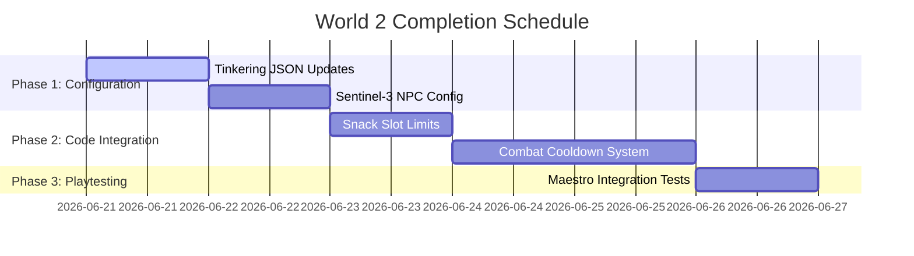

# Starborn — World 2 Completion Plan

This document outlines the roadmap and task list to finish and polish World 2 (Sector 9) to match the high standards of World 1, while adhering to the **Cosmic Resonance** lore and the **Cooldown** combat mechanics.

---

## 1. Completed Modifications

### 🛠️ Minimap Connectivity Fix
* **Issue:** The minimap was completely blank / not rendering adjacent rooms or connections when loading debug scenarios or starting World 2.
* **Resolution:** Modified `ExplorationViewModel.kt#updateMinimap` to automatically discover all adjacent connected rooms whenever the current room is loaded or traveled to (if they are not dark). 
* **Effect:** The minimap now correctly draws connection lines and adjacent dots for unexplored exits, giving players clear directional guidance. Dark rooms correctly remain hidden behind the fog of war.

---

## 2. Pacing & Narrative Density Plan (2.5-Hour Target)

With a massive 91-room network, World 2 runs the risk of feeling barren compared to the dense city blocks of World 1. To hit the target play duration of **2.0 to 2.5 hours**, we must increase the narrative density.

### 🤖 Introduction of a Third NPC: Tuner Drone (Sentinel-3)
* **Concept:** An ancient, glitchy Architect drone that speaks in acoustic tuning terminology.
* **Role:** A local scrap-merchant and lore-guide found at the **Temple Gate Courtyard** (acting as a transition point between Hub 3 and Hub 4) or in the Hangar.
* **Quest Association:** Offers a small side quest or barter option to help you piece together the **Thermal Cutter** or trade salvaged jungle plants for **Neural Stabilizers**.
* **Dialogue Style:** Intermittent frequency noise, repeating fragments of ancient choral melodies.
  * *Bark:* `"[Chime Status: C# Minor]... Scanning traveler's resonant frequency... Warning: High static erosion detected."`

---

## 3. Configuration & Content Integration Checklist

### 🧪 Tinkering Recipes Update (`recipes_tinkering.json`)
We need to register the custom World 2 tinkering upgrades in [recipes_tinkering.json](file:///C:/Users/jctho/StudioProjects/StarbornAndroid/app/src/main/assets/recipes_tinkering.json):
* **Source Resin Mod:** Requires `beast_meat` and `herb`. Reduces status vulnerability or applies organic shielding.
* **Rapid Capacitor Mod:** Requires `scrap_metal` and `wiring_bundle`. Boosts combat cooldown recovery by 15%.

### 🎒 Snack Slot & Cooldown System Implementation
Transition the combat system code to match the cooldown design document:
1. **Snack Slot Limit:** Constrain all characters' consumable usage to **1 Snack Slot** on their equipment list, with a strict **5-turn combat cooldown** and self-targeting restrictions.
2. **Combat Cooldowns:** Update abilities inside the combat engine to function via cooldown timers (0-5 turns) instead of Source Points (SP).

### 🖼️ Asset Verification & Fallbacks
Verify that all room background images in [rooms.json](file:///C:/Users/jctho/StudioProjects/StarbornAndroid/app/src/main/assets/rooms.json) for World 2 exist under `app/src/main/assets/images/rooms/world_2/`:
* If specific high-fidelity images are missing, map them to a shared set of beautiful background gradients/templates mapped to the `swamp` environment to prevent blank screen renders.

---

## 4. Execution Roadmap



---

## 5. Verification Steps

1. Run standard unit tests:
   ```powershell
   .\gradlew.bat test
   ```
2. Launch the Maestro playtest flow on World 2:
   ```powershell
   .\scripts\maestro.ps1 -Scenario debug_world2_hub.yaml
   ```
3. Verify visually that all 91 rooms transition smoothly, the minimap displays connections correctly, and Sentinel-3 loads as intended.
